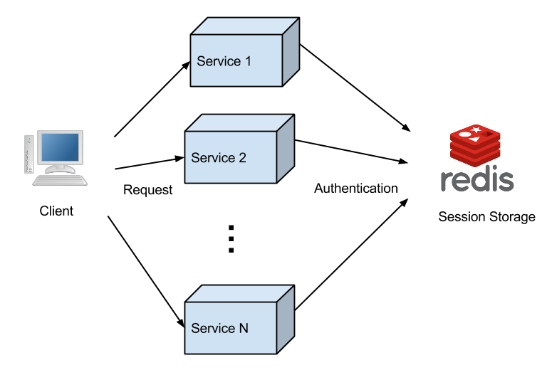
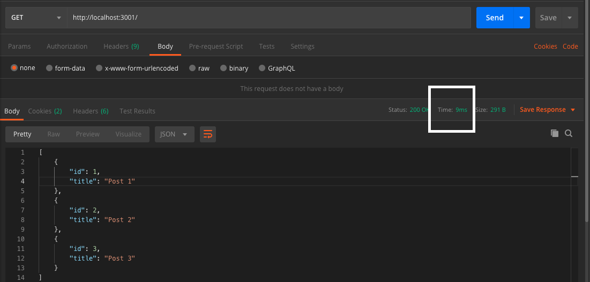

# Caching



## 1. Penjelasan

Cache adalah proses yang digunakan oleh browser dan aplikasi untuk menyimpan informasi. Kamu pasti pernah menghapus history di browser, kan? Waktu menghapus history, pasti ada frasa “Bersihkan Cache”. Misalnya di Chrome, kalau ingin menghapus history akan diberikan pilihan untuk menghapus gambar dan file yang disimpan dalam cache.

## 2. Mengapa Menggunakan Caching

Kita dapat menggunakan cache agar dapat meningkatkan kecepatan, mengurangi penggunaan bandwith dan server load. Dengan menggunakan cache kita dapat meningkatkan kecepatan akses data.

## 3. Keuntungan Menggunakan Caching

1. **Struktur data fleksibel**
2. **Sederhana dan mudah digunakan**
3. **Sangat cepat** : Redis sangat cepat dan bisa melakukan sekitar 110000 SET per detik, sekitar 81000 GET per detik.

## 4. Pengenalan Redis

Redis, singkatan dari Remote Dictionary Server, adalah penyimpanan data nilai utama di dalam memori yang super cepat dengan sumber terbuka untuk digunakan sebagai database, cache, broker pesan, dan antrean. Redis adalah database temporary dan bersifat No SQL.

### 4.1. Install MongoDB

Silahkan ikuti tutorial berikut berdasarkan platform yang digunakan

[Install Redis pada Ubuntu](https://www.digitalocean.com/community/tutorials/how-to-install-and-secure-redis-on-ubuntu-18-04)

[Install Redis pada Mac](https://medium.com/@petehouston/install-and-config-redis-on-mac-os-x-via-homebrew-eb8df9a4f298)

[Install Redis pada Windows](https://www.c-sharpcorner.com/article/installing-redis-cache-on-windows/)

### 4.2. Masuk ke Terminal
Ubuntu :
```bash
redis-cli
```
Mac :
```bash
redis-server
```

Windows :
```bash
redis-server.exe
```

### 4.3. Installasi Despendensi

```bash
# Install framework express
npm install express
```
```bash
# Install despendensi redis
npm install redis
```
```bash
# Install despendensi superagent 
npm install redis
```

### 4.4. Fungsi fetch data dan menyimpan di redis

```bash
function getUserRepos(req, res) {
    request.get(`https://my-json-server.typicode.com/typicode/demo/posts`, function (err, response) {
        if (err) throw err;
        var data = response.text

        client.setex(REDISKEY, 3600, data); // menyimpan data di redis dengan format string

        res.json(JSON.parse(data));
    });
};
```

Untuk menyimpan data ke redis menggunakan command client.setex(key, time, data)
https://redis.io/commands/setex

### 4.5. Rungsi mengambil data dari redis

```bash
function cache(req, res, next) {
    client.get(REDISKEY, function (err, data) {
        if (err) throw err;

        if (data != null) {
            res.send(JSON.parse(data));
        } else {
            next();
        }
    });
}
```

Untuk mengambil data dari redis menggunakan command client.get(key, function(err, data))
https://redis.io/commands/get

### 4.6. Full source code

```bash
const express = require('express');
const app = express();
const request = require('superagent');
const redis = require('redis');
const client = redis.createClient();
const REDISKEY = 'WRI:dummy'

function getUserRepos(req, res) {
    request.get(`https://my-json-server.typicode.com/typicode/demo/posts`, function (err, response) {
        if (err) throw err;
        var data = response.text

        client.setex(REDISKEY, 3600, data); // menyimpan data di redis dengan format string

        res.json(JSON.parse(data));
    });
};

// middleware
function cache(req, res, next) {
    client.get(REDISKEY, function (err, data) {
        if (err) throw err;

        if (data != null) {
            res.send(JSON.parse(data));
        } else {
            next();
        }
    });
}

app.get('/', cache, getUserRepos);

app.listen(3001, function () {
    console.log('express-redis listen on port 3001!')
});
```
https://github.com/alfaben12/express-redis-caching

### 4.7. Perbandingan

Sebelum menggunakan redis


Sesudah menggunakan redis
