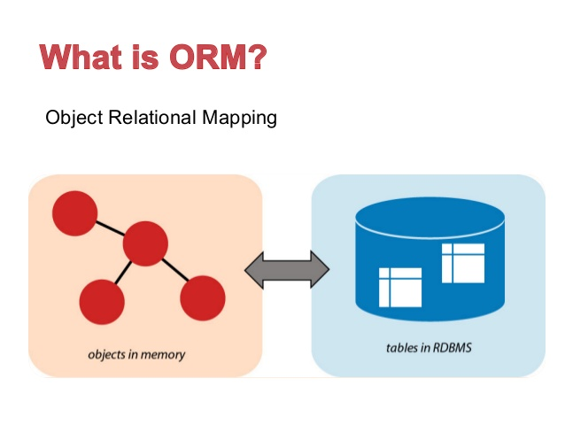

# Pengenalan ORM


## Penjelasan ORM
___

**Object Relational Mapping** (ORM) adalah sebuah teknik untuk mengkonversi data antara objek model dan database berelasi.

## Permasalahan
___

SQL sangat sulit sekali untuk ditulis maupun dibaca, sehingga akan sering menimbulkan error, misalnya 
```
SELECT * FROM film_list WHERE category="Horror"
```

## Solusi
___

Solusi dari permasalahan tersebut adalah dengan menggunakan **Object Relational Mapping** (ORM), dari contoh SQL di atas, Sebelumnya kita harus membuat class dari tabel `film_list` tersebut (**Ingat** setiap tabel harus dibuat classnya terlebih dahulu), misalnya 
``` javascript
    class film_list {
        id: number,
        name: string,
        category: string
    }
```
Setelah itu kita baru dapat mengimplementasikan ORM-nya seperti berikut 
```
film_list.where('category', 'Horror')
```

**Untuk lebih jelasnya silahkan lihat tutorial berikut** https://www.youtube.com/watch?v=dHQ-I7kr_SY