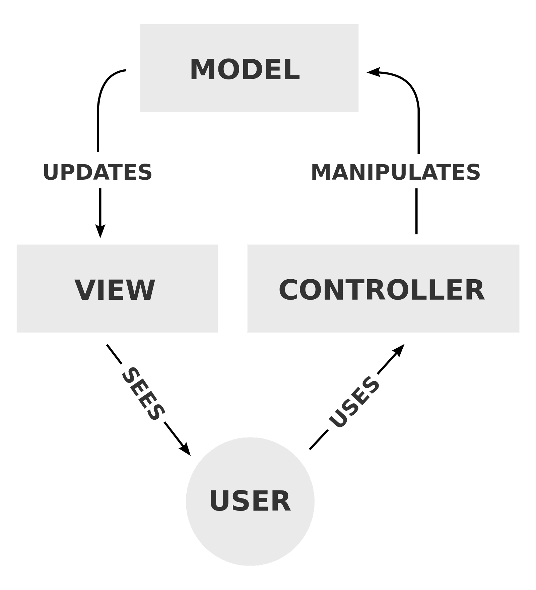

# Pengenalan Arsitektur MVC

**MVC** atau Model View Controller merupakan suatu pola arsitektur software yang membagi suatu objek menjadi 3 bagian, yaitu Model, View, dan Controller.

**Model** merupakan data dalam suatu aplikasi.

**View** digunakan untuk menampilkan data dari model untuk kemudian dilihat oleh user.

**Controller** merupakan penghubung yang meneruskan perintah dari **View** ke **Model**.

**Untuk lebih jelasnya, silahkan pelajari link berikut :**

**Youtube : **[understanding-MVC-architecture](https://www.youtube.com/watch?v=eTdVkgF_Slo)

**Artikel : ** [mengenal-arsitektur-MVC](https://blog.framework.id/mengenal-arsitektur-mvc-bdbdc7e28e86)