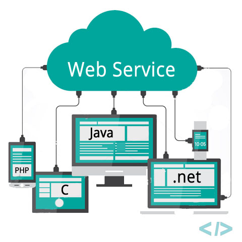
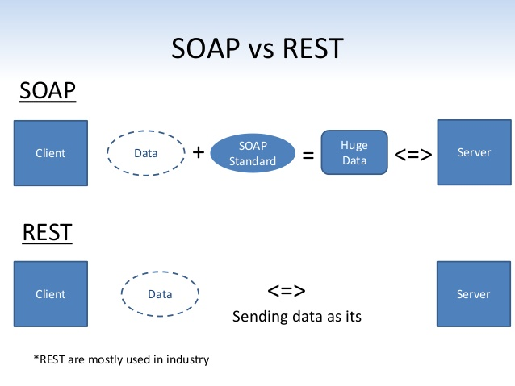
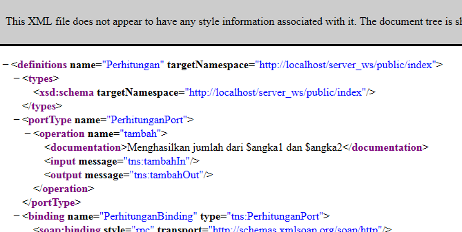
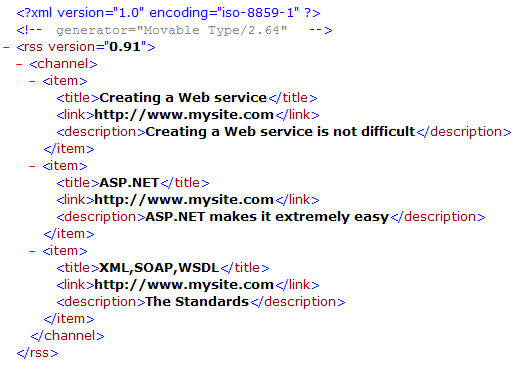
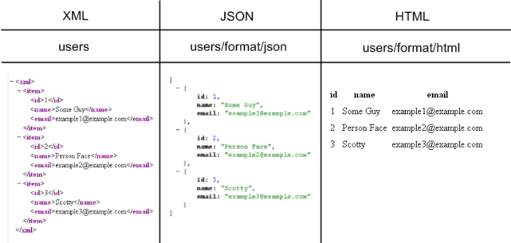

# Web Service

## Penjelasan Web Service
**Web Service** secara singkat merupakan sebuah web page yang dapat dipanggil melalui aplikasi lain (entah itu web page lain atau desktop app), caller perlu mengirimkan request lalu web service akan mengirimkan data yang diminta sesuai request.

**Web Service** juga dapat diartikan sebagai sistem software yang didesain untuk mendukung interaksi/komunikasi antar "machine" melalui sebuah network

## Perbandingan SOAP dan REST sebagai Web Service

SOAP Standart disini adalah standart penulisan XML dalam penggunaan SOAP Web Service. contohnya:

### Apa Bedanya?
Salah satu perbedaan yang signifikan adalah:
- **SOAP** menggunakan Extensible Markup Language (XML) dengan spesifikasi SOAP sebagai format pesannya. Contoh bentuk respon SOAP:
 

- **REST** mmenggunakan XML, JSON, atau format plain teks lainnya. Contoh bentuk respon REST:

___
**Untuk penjelasan mengenai Web Service dapat mengunjungi** https://medium.com/@umerfarooq_26378/web-services-in-python-ef81a9067aaf

**Untuk mengetahui perbedaan SOAP dan REST dapat mengunjungi** http://pusdiklat.bps.go.id/index.php?r=artikel/view&id=206