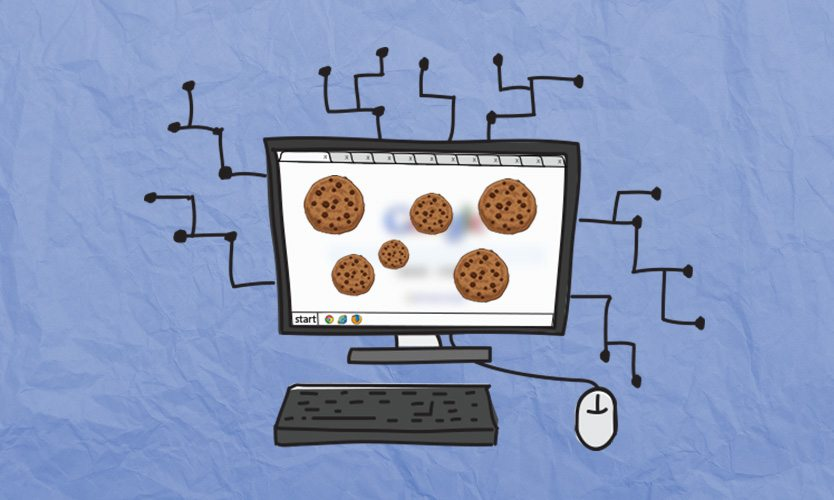

# Metode Autentikasi Cookie

## Penjelasan Cookie

**Cookie** (biasa disebut internet atau web cookie) merupakan sebuah istilah yang diberikan untuk mendeskripsikan sebuah pesan yang diberikan kepada **Web Browser** oleh **Web Server**. Cookie berguna untuk mengidentifikasi user atau dapat menyimpan informasi login.

## Autentikasi dengan Cookie (Session)

HTTP adalah **_stateless_**, **_stateless_** disini berarti HTTP tidak mengetahui request - request yang sebelumnya telah dilakukan, sebagai contoh user melakukan log in dan melakukan request, ketika request tersebut telah dilaksanakan dan user ingin melakukan request lagi, user harus melakukan proses login sekali lagi.

**Solusi** : Menggunakan autentikasi dengan Session/Cookie. Cookie akan menyimpan informasi log in dari user sehingga ketika melakukan request baru, user tidak perlu melakukan log in lagi

## Langkah - langkah Autentikasi dengan Cookie (Session)

1.  User melakukan Log in, dan request pergi dari web browser ke server.
2.  Server mengecek informasi login user, mengotentikasikannya, dan mengirim token ke web browser. (Server juga menyimpan token tadi di memory/database)
3.  Token disimpan ke dalam cookie, dan mengembalikannya saat melakukan request.
4.  Server menerima request dan menggunakan token tadi untuk mnegotentikasi user dan mengembalikan data yang direquest.
5.  Ketika user log out, web browser akan menghapus token.

**Untuk belajar mengenai cookie lebih dalam dapat mengunjungi** https://www.webopedia.com/DidYouKnow/Internet/all_about_cookies.asp

**Untuk belajar tentang autentikasi lebih dalam dapat mengunjungi** https://hackernoon.com/how-do-you-authenticate-mate-f2b70904cc3a
