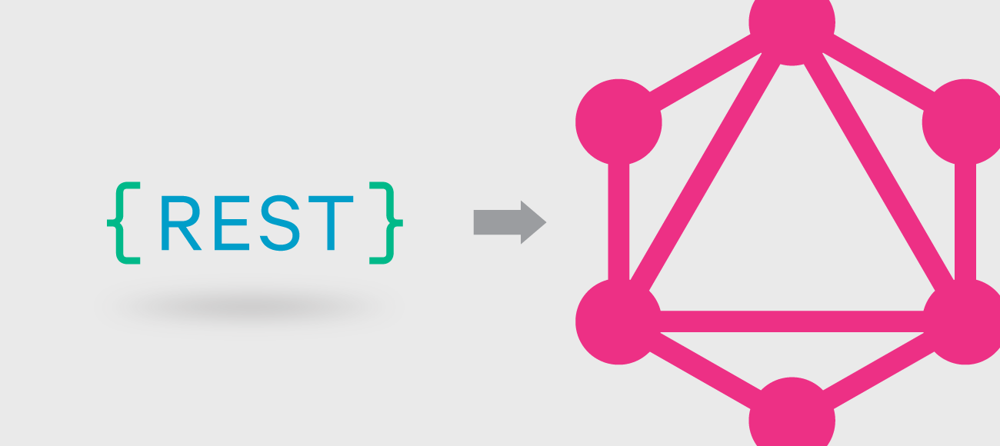
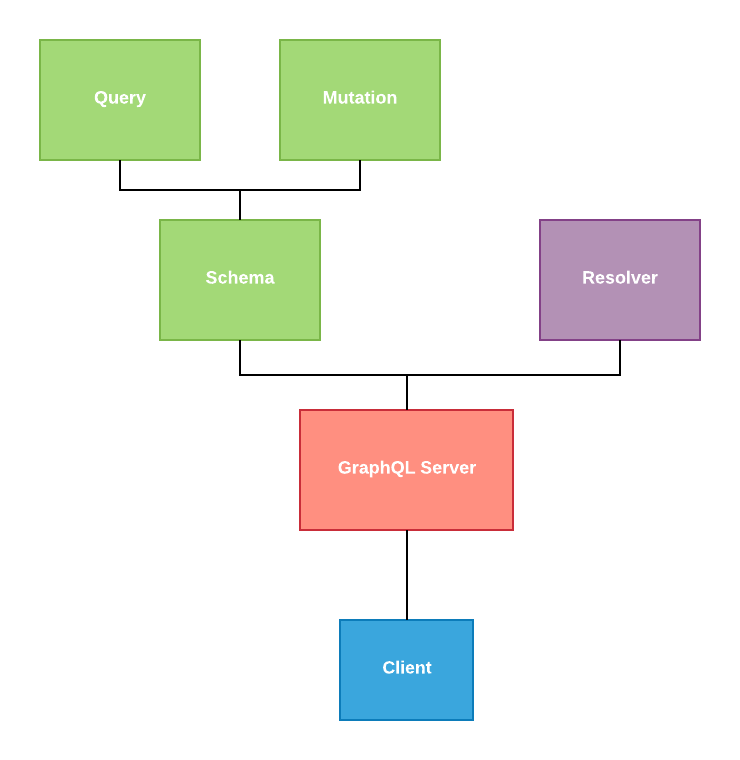

# GraphQL Web Service



## 1. Penjelasan GraphQL

GraphQL merupakan query language seperti SQL, namun perbedaannya adalah SQL bertugas untuk melakukan query ke database, sedangkan GraphQL bertugas untuk melakukan query ke suatu web service yang menjalankan GraphQL server

## 2. Mengapa Menggunakan GraphQL

Dengan menerapkan GraphQL pada webservice maka kita akan mendapatkan beberapa kelebihan berikut, yaitu :

### 2.1. Satu Endpoint

Apabila kita menggunakan GraphQL pada web service, maka kita cukup memberikan satu endpoint kepada client, misalnya `/graphql`, dengan menggunakan satu endpoint ini maka client sudah bisa mendapatkan data apapun yang disediakan

Berbeda dengan REST yang membutuhkan banyak endpoint untuk mendapatkan berbebagi jenis data, misalnya data biodata menggunakan endpoint `/biodata`, data produk menggunakan endpoint `/produk`, dan sebagainya

### 2.2. Client Bebas Menentukan Bentuk Data

Permasalahan yang sering terjadi saat client meminta data ke REST adalah data yang diterima terlalu kompleks, sedangkan yang dibutuhkan hanya beberapa field saja, misalnya data biodata memiliki struktur seperti berikut

```javascript
const Biodata = {
  id: string,
  nama: string,
  alamat: string,
  jenisKelamin: boolean
}
```

Misalnya dari data biodata diatas, client hanya membutuhkan `nama` saja, hal ini tidak dapat kita lakukan karena REST akan memberikan seluruh field yang dimiliki dan membuat kita menjadi boros

Dengan menggunakan GraphQL maka client bisa menentukan field apa saja yang ia butuhkan, sehingga tidak boros resource

### 2.3. Dokumentasi Otomatis

Permasalahan lain yang sering dijumpai oleh client adalah tidak tau bagaimana cara menggunakan suatu web service karena tidak dilengkapi dengan dokumentasi penggunaan, dengan menerapkan GraphQL maka GraphQL akan secara otomatis membuatkan dokumentasi penggunaan sehingga mempermudah client saat menggunakan web service tersebut

## 3. Contoh GraphQL Web Service

Berikut contoh beberapa web service yang menggunakan GraphQL, silahkan dicoba agar lebih memahami cara menggunakan GraphQL

https://countries.trevorblades.com

https://graphql-pokemon.now.sh

https://fakerql.com/

## 4. Cara Kerja GraphQL Server

Sebelum membuat GraphQL server, mari kita pahami dulu cara kerja dari GraphQL server serta beberapa istilah yang perlu kita pahami



### 4.1. GraphQL Server

GraphQL server merupakan server yang dapat menerima query GraphQL dan memberikan data berdasarkan permintaan client, untuk membuat GraphQL server kita bisa menggunakan package yang bernama `graphql` ditambah dengan framework web seperti `express`

### 4.2. Schema

Schema merupakan bagian dari GraphQL server yang menentukan bentuk dari data dan operasi apa saja yang dapat dilakukan

### 4.3. Query

Query merupakan bagian dari schema yang menentukan operasi apa saja yang bisa dilakukan yang berhubungan dengan pengambilan suatu data ( fetching data ) misalnya `getBiodata`, `getBiodataByIndex` dan sebagainya

### 4.4. Mutation

Mutation merupakan bagian dari schema yang menentukan operasi apa saja yang bisa dilakukan yang berhubungan dengan perubahan suatu data, misalnya penambahan data, perubahan data, serta penghapusan data

### 4.5. Resolver

Kalau schema hanya menentukan operasi apa saja yang dapat dilakukan, maka disini resolver bertugas untuk menyediakan data yang dibutuhkan oleh schema, misalnya dengan mengambil data dari database atau meminta data ke web service lain

## 5. Membuat GraphQL Server

Pada tutorial berikut kita akan membuat sebuah GraphQL Server yang menyediakan data Biodata, dimana kita bisa mengambil dan melakukan perubahan pada data tersebut

### 5.1. Install GraphQL Server

```bash
npm install express graphql express-graphql
```

`graphql` merupakan package yang berisi library utama dari graphql, disini kita menggunakan express untuk membuat GraphQL server, maka dari itu kita perlu package `express-graphql` untuk menghubungkan graphql dan express

### 5.2. Membuat Schema

Kita bisa membuat sebuah schema dengan menggunakan fungsi `buildSchema`, kita tinggal memasukkan [GraphQL Schema Definition Language](https://raw.githubusercontent.com/sogko/graphql-shorthand-notation-cheat-sheet/master/graphql-shorthand-notation-cheat-sheet.png) untuk membuat schema GraphQL

```javascript
// schema.js

const { buildSchema } = require('graphql')

const schema = buildSchema(`
  type Biodata {
    nama: String
    alamat: String
  }

  input BiodataInput {
    nama: String!
    alamat: String!
  }

  type Query {
    getBiodata: [Biodata]
    getBiodataByIndex(index: Int!): Biodata
  }

  type Mutation {
    createBiodata(biodata: BiodataInput!): Biodata
    updateBiodata(index: Int!, biodata: BiodataInput!): Biodata
    deleteBiodata(index: Int!): Biodata
  }
`)

module.exports = schema
```

### 5.3. Membuat Resolver

Kali ini kita akan membuat sebuah variabel yang berisi data biodata untuk mensimulasikan data dari database untuk mempermudah tutorial ini

```javascript
// resolver.js

const biodata = [
  {
    nama: 'Budi',
    alamat: 'Probolinggo'
  },
  {
    nama: 'Yanto',
    alamat: 'Malang'
  }
]

const resolver = {
  getBiodata: function() {
    return biodata
  },

  getBiodataByIndex: function(args) {
    return biodata[args.index]
  },

  createBiodata: function(args) {
    biodata.push(args.biodata)
    return args.biodata
  },

  updateBiodata: function(args) {
    biodata[args.index] = args.biodata
    return args.biodata
  },

  deleteBiodata: function(args) {
    biodata.splice(args.index, 1)
    return null
  }
}

module.exports = resolver
```

### 5.4. Membuat Server

Terakhir kita tinggal menggabungkan schema dan resolver dengan membuat sebuah server

```javascript
// index.js

const express = require('express')
const expressGraphql = require('express-graphql')
const schema = require('./schema')
const rootValue = require('./resolver')

const app = express()
app.use(
  '/graphql',
  expressGraphql({
    schema,
    rootValue,
    graphiql: true
  })
)

app.listen(3000)
```

Selesai, maka sekarang kita bisa menggunakan GraphQL server tersebut dengan mengunjungi `/graphql`
