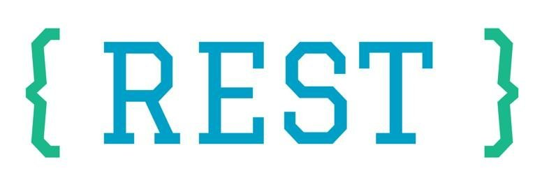

# REST Web Service

## 1. Penjelasan REST

REST merupakan jenis web service yang sering digunakan. REST menggunakan format json untuk melakukan pertukaran data

## 2. Standard Routing pada REST

Berikut merupakan standar routing untuk melakukan CRUD pada website

| Verb   | URI              | Action  | Description                        |
| ------ | ---------------- | ------- | ---------------------------------- |
| GET    | /biodata         | index   | Menampilkan semua biodata          |
| GET    | /biodata/id      | show    | Menampilkan biodata berdasarkan ID |
| GET    | /biodata/create  | create  | Menampilkan form tambah biodata    |
| POST   | /biodata         | store   | Menambahkan biodata                |
| GET    | /biodata/id/edit | edit    | Menampilkan form ubah biodata      |
| PUT    | /biodata/id      | update  | Mengubah biodata berdasarkan ID    |
| DELETE | /biodata/id      | destroy | Menghapus biodata berdasarkan ID   |
