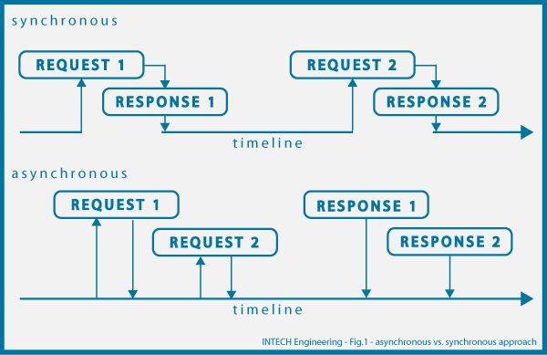

# Synchronous vs Asynchronous

Disini kita akan membahas tentang alur eksekusi program, yaitu synchronous dan asynchronous, hal ini penting untuk dipahami karena banyak bahasa pemrograman yang menggunakan konsep synchronous, sedangkan node js sendiri lebih banyak menerapkan konsep asynchronous.



## 1. Penjelasan

### 1.1. Synchronous

Merupakan alur eksekusi program yang dilakukan secara seri atau berurutan, sehingga suatu statement atau request akan menunggu hingga responsenya terjawab dahulu, baru kemudian request lain dapat dieksekusi.

Hal tersebut akan menjadi permasalahan apabila ada sebuah request yang membutuhkan waktu eksekusi yang cukup lama, misalnya meload sejuta data di database atau mengirimkan request ke server, hal ini akan membloking request lain karena harus menunggu request sebelumnya selesai.

### 1.1. Asynchronous

Merupakan alur eksekusi program yang dilakukan secara pararel, artinya suatu statement atau request tidak perlu menunggu request sebelumnya selesai terlebih dahulu, sehingga dalam satu waktu akan ada banyak request yang dapat dilakukan secara bersamaan. Hal ini akan mempercepat eksekusi suatu program.

## 2. Contoh Asynchronous

Berikut ada beberapa contoh fungsi yang secara default menggunakan konsep asynchronous

### 2.1. Set Timeout

`setTimeout` merupakan salah satu contoh fungsi yang berjalan secara asynchronous

```javascript
// tampilkan hello
console.log('Hello.')

// tampilkan Goodbye dua detik dari sekarang
setTimeout(function() {
  console.log('Goodbye!')
}, 2000)

// tampilkan hello lagi
console.log('Hello again!')
```

Apabila kita terbiasa dengan synchronous, kita pasti berfikir bahwa alur programnya akan seperti berikut :

- Tampilkan Hello
- Diam selama dua detik
- Tampilkan Goodbye
- Tampilkan Hello again

Namun `setTimeout` berjalan secara asynchronous dan tidak melakukan pause saat dijalankan, dia hanya mengeset sesuatu agar dijalankan setelah dua detik, sehingga urutannya akan menjadi seperti berikut :

- Tampilkan Hello
- Tampilkan Hello again
- Diam selama dua detik
- Tampilkan Goodbye

### 2.2. Ajax Call

`XMLHttpRequest` secara default juga menggunakan asynchronous untuk mengirimkan request ke server. Misalnya disini kita mempunyai fungsi bernama `getData()` yang akan mengirimkan request ke server dan mereturn responsenya

```javascript
function getData() {
  const xhttp = new XMLHttpRequest()

  // deklarasi variable response
  var response

  // mengisi variable response berdasarkan response dari server
  xhttp.onreadystatechange = function() {
    if (xhttp.readyState == 4 && xhttp.status == 200) {
      response = xhttp.responseText
    }
  }

  xhttp.open('GET', 'https://api.github.com/users/wrideveloper/repos')
  xhttp.send()

  // mereturn variable response
  return response
}
```

Kemudian dengan memanfaatkan fungsi `getData()` yang sudah dibuat kita berfikir untuk menggunakannya seperti berikut

```javascript
var data = getData()
console.log(data)
```

Harusnya variable data akan berisi response text dari server yang didapatkan dari pemanggilan fungsi `getData()`

Namun apabila script diatas kita jalankan maka kita akan tau bahwa variable data berisi undefined, ini terjadi karena variable response pada fungsi `getData()` akan langsung direturn sebelum statement `response = xhttp.responseText` selesai dijalankan

## 3. Handling Asynchronous dengan Javascript

Dari penjelasan diatas kita tau bahwa untuk menggunakan fungsi yang asynchronous seperti `XMLHttpRequest` kita tidak bisa menghandle dengan cara biasa. Berikut beberapa metode untuk melakukan handling async, yaitu :

### 3.1. Callback

Callback merupakan suatu fungsi yang akan dijalankan apabila suatu proses asyncrhonous telah selesai dijalankan. Berikut penerapannya pada `getData()`

```javascript
// tanpa callback
var data = getData()
console.log(data) // undefined

// dengan callback
getData(function(data) {
  // kode yang dijalankan ketika getData selesai
  console.log(data) // response server
})
```

Kemudian kita perlu merubah isi dari `getData()` sebagai berikut :

```javascript
function getData(callback) {
  const xhttp = new XMLHttpRequest()

  // jalankan callback ketika request selesai
  xhttp.onreadystatechange = function() {
    if (xhttp.readyState == 4 && xhttp.status == 200) {
      callback(xhttp.responseText)
    }
  }

  xhttp.open('GET', 'https://api.github.com/users/wrideveloper/repos')
  xhttp.send()
}
```

Disana kita menambahkan sebuah parameter berupa fungsi yang bernama `callback` dimana fungsi ini akan dijalankan ketika request selesai, callback juga akan menerima parameter berupa response dari server

### 3.2. Promise

Promise merupakan cara yang paling populer untuk menghandle asynchronous, caranya adalah dengan membuat sebuah fungsi yang akan mereturn object promise. Object promise merupakan object yang nantinya akan berisi value di masa depan setelah proses asynchronous terjadi

**Membuat Promise**

Untuk menerapkan promise maka kita perlu memodifikasi fungsi `getData()` agar mereturn object promise

```javascript
function getData() {
  return new Promise(function(resolve, reject) {
    const xhttp = new XMLHttpRequest()

    xhttp.onreadystatechange = function() {
      if (xhttp.readyState == 4) {
        if (xhttp.status == 200) {
          // resolve promise apabila request berhasil
          resolve(xhttp.responseText)
        } else {
          // reject promise apabila request gagal
          reject()
        }
      }
    }

    xhttp.open('GET', 'https://api.github.com/users/wrideveloper/repos')
    xhttp.send()
  })
}
```

Pada fungsi `getData()` kita mereturn promise dengan perintah `new Promise(callback)` dimana `callback` merupakan fungsi yang memiliki dua argument yaitu `resolve` dan `reject`. Kita akan memanggil `resolve` setelah kita berhasil mendapatkan response dari server, dan `reject` ketika kita gagal mendapatkan response dari server

**Menjalankan Promise**

Setelah kita mengubah `getData()` dengan konsep promise, maka kita bisa menggunakannya seperti berikut :

```javascript
getData()
  .then(function(data) {
    // lakukan sesuatu ketika promise resolve
    console.log(data) // response server
  })
  .catch(function() {
    // lakukan sesuatu ketika promise reject
    console.log('gagal')
  })
```

`then` berisi callback yang menentukan apa yang akan kita lakukan ketika promise berhasil di resolve, sedangkan `catch` berisi callback yang menentukan apa yang akan kita lakukan ketika promise di reject

**catatan :** penggunaan `catch` pada pemanggilan promise bersifat optional, boleh disertakan dan boleh tidak
