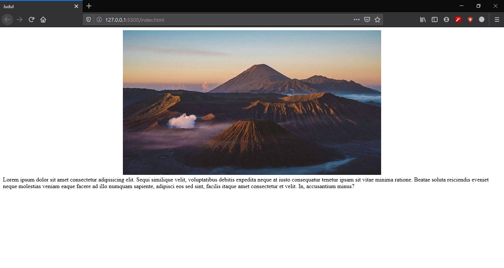
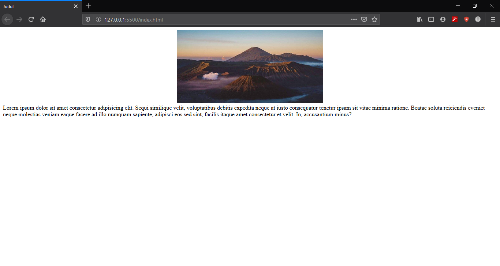
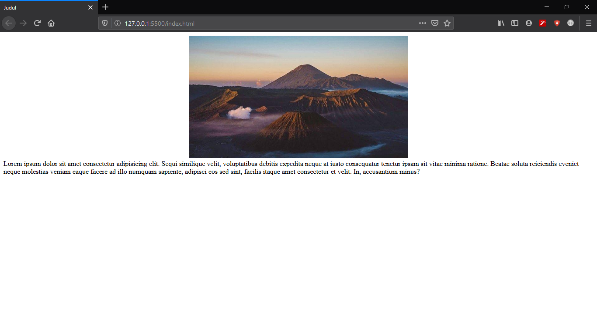
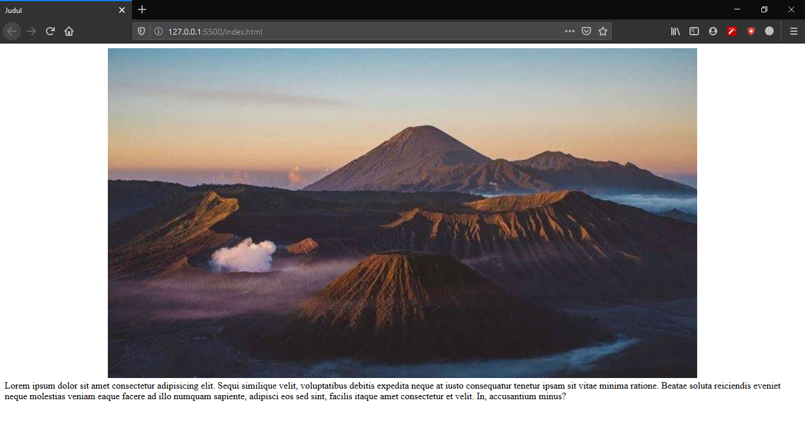

# Height dan Width

## 1. Permasalahan

Pada pembuatan website, terkadang kita harus menentukan tinggi dan lebar suatu elemen agar sesuai dengan desain yang sudah ditentukan oleh desainer. Misalnya pada suatu website kita harus menampilkan image dengan tinggi `200px` dan `400px`, sedangkan image yang kita punya ukurannya tidak sesuai dengan kondisi diatas. Bagaimana cara merubah ukuran image tersebut menggunakan CSS ?

## 2. Penjelasan Height dan Width

Kita bisa mengatur tinggi dan lebar suatu elemen tersebut menggunakan property `height` dan `width`. Contohnya :

```css
img {
  height: 200px;
  width: 300px;
}
```

Pada contoh diatas, semua `img` yang berada pada website akan memiliki tinggi 200px dan lebar 400px.

## 3. Contoh Kasus

Disini kita akan membuat halaman web yang menampilkan sebuah artikel dan gambar. Namun gambar yang ditampilkan terlalu besar, sehingga perlu diubah ukurannya menggunakan property `height` dan `width` pada CSS.

### 3.1. Membuat struktur website pada HTML

Kita buat struktur HTML untuk halaman artikel seperti dibawah, lalu kita buka file tersebut pada web browser.

```html
<!-- index.html -->
<html>
  <head>
    <title>Judul</title>
  </head>
  <body>
    
    <p>
      Lorem ipsum dolor sit amet consectetur adipisicing elit. Sequi similique
      velit, voluptatibus debitis expedita neque at iusto consequatur tenetur
      ipsam sit vitae minima ratione. Beatae soluta reiciendis eveniet neque
      molestias veniam eaque facere ad illo numquam sapiente, adipisci eos sed
      sint, facilis itaque amet consectetur et velit. In, accusantium minus?
    </p>
  </body>
</html>
```

Berikut tampilan dari web tersebut



### 3.2. Menentukan Height dan Width Gambar

Gambar tersebut terlalu besar, sehingga tampilan artikel tidak proporsional, dimana paragrafnya terlalu sedikit sedangkan gambarnya terlalu besar. Sehingga ukuran gambar perlu diperbaiki menggunakan width dan height pada CSS. Ukuran gambar sebelum kita ubah memiliki `height` sebesar 393px dan `width` 700px

Maka dari itu kita membutuhkan 1 file CSS baru dengan nama `index.css` untuk memperbaiki ukuran gambar.

```css
/* index.css */

img {
  height: 200px;
  width: 400px;
}
```

Lalu kita masukkan file CSS tersebut kedalam HTML kita. Panggil file CSS menggunakan tag `<link>` di dalam tag `<head>`

```html
<!-- index.html -->
<html>
  <head>
    <title>Judul</title>
    <link rel="stylesheet" href="index.css" />
  </head>
  <body>
    
    <p>
      Lorem ipsum dolor sit amet consectetur adipisicing elit. Sequi similique
      velit, voluptatibus debitis expedita neque at iusto consequatur tenetur
      ipsam sit vitae minima ratione. Beatae soluta reiciendis eveniet neque
      molestias veniam eaque facere ad illo numquam sapiente, adipisci eos sed
      sint, facilis itaque amet consectetur et velit. In, accusantium minus?
    </p>
  </body>
</html>
```



### 3.3. Menentukan Maksimal Height dan Width

Untuk menentukan ukuran maksimal dari suatu elemen, kita dapat menggunakan property `max-height` dan `max-width`. Sehingga ukuran maksimal dari elemen `img` tidak bisa melewati batas yang telah kita tetapkan. Kita beri batas untuk `height` maksimal `500px` dan `width` maksimal `300px`

```css
img {
  max-height: 500px;
  max-width: 300px;
}
```



### 3.4. Menentukan Minimal Height dan Width

Untuk menentukan ukuran minimal dari suatu elemen, kita dapat menggunakan property `min-height` dan `min-width`. Sehingga apabila gambar kita memiliki ukuran lebih kecil dari batas minimal yang kita tentukan, akan disesuaikan dengan `min-height` dan `min-width` pada styling kita. Pada contoh kita beri ukuran minimal untuk `img` adalah `height` `400px` dan `width` `1000px`.

```css
img {
  min-height: 400px;
  min-width: 1000px;
}
```


