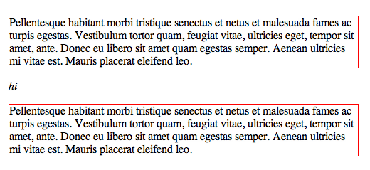
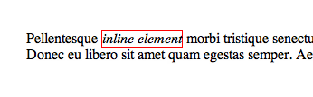
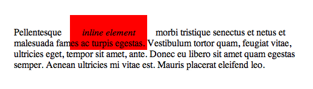
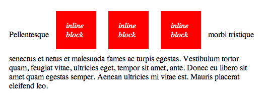

# Layouting

Untuk membuat desain website yang rapi, kita perlu belajar melakukan layouting menggunakan CSS. Untuk melakukan hal tersebut kita dapat menggunakan property `display` untuk menentukan layout suatu elemen, ada beberapa jenis layout yang bisa kita gunakan, yaitu `block`, `inline`, `inline-block`, dan `flexbox`

## 1. Block

Block merupakan layout default yang diterapkan ke beberapa elemen seperti `div`, `ul`, `ol`, `p`, `h1` dan sebagainya. Ciri khas dari layout ini yaitu selalu membuat baris sendiri

## 2. Inline

Inline merupakan layout default yang diterapkan ke beberapa elemen seperti `span`, `b`, `i` dan sebagainya. Ciri khas dari layout ini yaitu mengikuti baris yang sudah ada

Apabila kita memberikan `margin` dan `padding` terhadap inline layout, maka ia hanya akan mendorong elemen disekitarnya secara horizontal dan tidak secara vertical

## 3. Inline Block

Inline block mirip dengan inline, yaitu akan selalu mengikuti baris yang sudah ada. Namun apabila kita memberikan `margin` dan `padding`, maka ia akan mendorong elemen disekitarnya secara horizontal dan juga vertical

## 4. Flexbox

Flexbox (Flexible Box) merupakan cara terbaru untuk melakukan layouting pada web yang mendukung design responsive

Ciri khas dari flexbox yaitu kita dapat mendesain layout berdasarkan containernya, sedangkan child elementnya dapat memiliki size yang berbeda - beda namun tetap responsive

**Beberapa referensi untuk belajar layouting dengan css grid :**

1. [Dasar CSS Flexbox](https://css-tricks.com/snippets/css/a-guide-to-flexbox/)
2. [Layouting dengan CSS Flexbox](https://www.youtube.com/playlist?list=PL4cUxeGkcC9i3FXJSUfmsNOx8E7u6UuhG)
3. [Cheatsheet flexbox](flexboxsheet.png)
4. [Membuat UI dengan flexbox](https://www.flexboxpatterns.com/)
