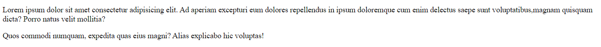
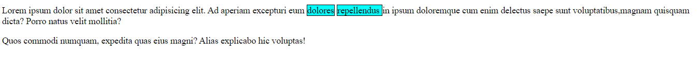
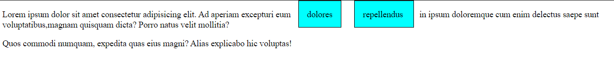
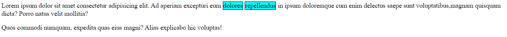
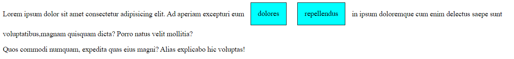
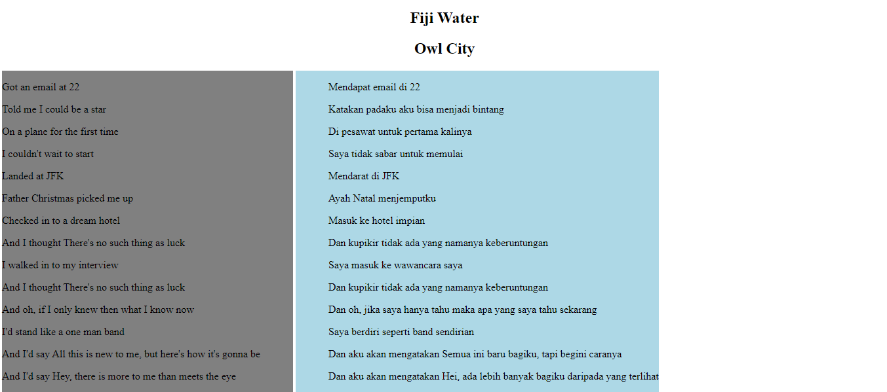

# Layouting

## 1. Permasalahan 

Sejauh ini, kita telah belajar bagaimana cara membuat tampilan web dan memberikan beberapa property pada tampilan tersebut. Kali ini, kita akan belajar tentang layouting atau tata letak. Sebelumnya, semua elemen seperti `text`, `gambar`, `gif`, dan lain lain hanya tersusun secara vertikal. Lalu bagaimanakah caranya jika kita ingin menyusun secara horizontal ? 

## 2. Penjelasan Property Display

Untuk membuat desain website seperti yang telah kita tanyakan tadi, kita perlu belajar melakukan layouting menggunakan CSS. Untuk melakukan hal tersebut kita dapat menggunakan property `display` untuk menentukan layout suatu elemen, ada beberapa jenis layout yang bisa kita gunakan, yaitu `block`, `inline`, `inline-block`, dan `flexbox`. Namun kali ini kita hanya belajar `block`, `inline`, dan `inline-block` saja.

## 3. Jenis - Jenis Property Display

### 3.1. Block
Pernahkah kalian bertanya-tanya, mengapa susunan tampilan web yang dibuat sebelumnya tidak pernah tersusun secara horizontal ? Alasannya adalah ada `tag` yang memiliki display property default block. Atau tag tersebut memiliki lebar selebar layar. Bagaimana maksudnya? Mari kita lihat contoh berikut.

```html
<!-- index.html -->
<p class="p-example">Lorem ipsum dolor sit amet consectetur adipisicing elit. 
        Ad aperiam excepturi eum dolores repellendus in ipsum doloremque cum enim
        delectus saepe sunt voluptatibus,magnam quisquam dicta? Porro natus velit mollitia?</p> 
<p class="p-example">Quos commodi numquam, expedita quas eius magni? Alias explicabo hic voluptas!</p>
```

Tampilannya akan menjadi seperti ini



Textnya akan terisi hingga sepanjang layar bukan? Jadi bisa dikatakan bahwa block merupakan layout default yang diterapkan ke beberapa elemen seperti `div`, `ul`, `ol`, `p`, `h1` dan sebagainya. Ciri khas dari layout ini yaitu selalu membuat baris sendiri

Untuk tag lain, kita ambil contoh tag `ul`. 

```html
<!-- index.html -->
 <p class="p-example">List of miniclass in WRI : </p>
    <ul>
        <li>Web</li>
        <li>Mobile</li>
        <li>Game</li>
        <li>IoT</li>
        <li>UX</li>
    </ul>
```

Untuk pembuktian bagaimana display block bekerja, kita beri warna pada background pada tag `p` yang memiliki class `p-example` dan tag `ul`.

```css
/* index.css */
.p-example {
    background-color: cyan ;
}

ul {
    background-color: darksalmon;
}
```

Tampilannya akan menjadi seperti ini :


Dari background kedua tag tersebut kita bisa membuktikan bahwa display `block` membuat baris baru karena display tersebut memiliki lebar selebar layar sehingga kita tidak bisa memberi elemen apapun di samping elemen dari tag yang memiliki display `block`.

### 3.2. Inline

Inline merupakan layout default yang diterapkan ke beberapa elemen seperti `span`, `b`, `i` dan sebagainya. Ciri khas dari layout ini yaitu mengikuti baris yang sudah ada. 


```html
<!-- index.html -->
<p class="p-example">Lorem ipsum dolor sit amet consectetur adipisicing elit. Ad aperiam excepturi eum <span class="inl">dolores</span> <span class="inl">repellendus </span> in ipsum doloremque cum enim delectus saepe sunt voluptatibus,magnam quisquam dicta? Porro natus velit mollitia?</p> 

<p class="p-example">Quos commodi numquam, expedita quas eius magni? Alias explicabo hic voluptas!</p>

```
Untuk memudahkan kita dalam melihat tag `span` yang kita buat, kita akan menambahkan background tag dan border pada tag `span` tersebut.  

```css
/* index.css */
.inl {
    background-color:cyan;
    border : 1px solid black;
}
```

Tampilannya akan menjadi seperti ini :



Apabila kita memberikan `margin` dan `padding` terhadap inline layout, maka ia hanya akan mendorong elemen disekitarnya secara horizontal dan tidak secara vertical. Sebagai pembuktian, kita tambahkan properti `margin` dan `padding` pada file css yang telah kita buat. 

```css
/* index.css */
.inl{
    background-color:cyan;
    border : 1px solid black;
    margin: 10px;
    padding : 15px;
}
```
Tampilannya akan menjadi seperti ini :



Terbukti bahwa `margin` dan `padding` hanya mendorong elemen secara horizontal karena text di baris kedua tidak terdorong ke bawah.

### 3.3. Inline Block

Inline block mirip dengan inline, yaitu akan selalu mengikuti baris yang sudah ada. 

Mari kita ubah file css yang telah kita buat dengan menambahkan properti display `inline-block` dan menghapus `margin` dan `padding`.

```css
/* index.css */
.inl{
    background-color:cyan;
    display : inline-block;
    border : 1px solid black;
}
```

Tampilannya akan menjadi seperti ini :



Tampak sama bukan? Namun, apabila kita memberikan `margin` dan `padding`, maka ia akan mendorong elemen disekitarnya secara horizontal dan juga vertical.

```css
/* index.css */
.inl{
    background-color:cyan;
    display : inline-block;
    border : 1px solid black;
    margin: 10px;
    padding : 15px;
}
```



## 4. Case Study

Sebagai contoh studi kasus untuk materi layouting, kita akan membuat tampilan untuk lirik lagu dan terjemahannya. Yang akan kita tampilkan adalah judul lagu, nama penyanyi, lalu lirik lagu original, dan di sampingnya terdapat lirik lagu terjemahan. 

### 4.1. Membuat file HTML

Pertama, kita buat file `html` berisi judul lagu, penyanyi, dan lirik lagunya. Untuk judul lagu, gunakan `h1` dan untuk penyanyinya, gunakan `h2`. Buat tag `span` untuk lirik per bahasanya agar bisa kita jadikan horizontal, lalu letakkan per baris lirik dengan tag `p` agar liriknya membuat baris baru dan tidak menjadi satu paragraf. 

```html
<!-- index.html -->
<!DOCTYPE html>
<html lang="en">
<head>
    <meta charset="UTF-8">
    <title>Lyrics</title>
    <link rel="stylesheet" href="style.css">
</head>
<body>
    <h1>Fiji Water</h2>
    <h2>Owl City</h2>
    <span class="lyrics">
    <p>Got an email at 22</p>
    <p>Told me I could be a star</p>
    <p>On a plane for the first time</p>
    <p>I couldn't wait to start</p>
    <p>Landed at JFK</p>
    <p>Father Christmas picked me up</p>
    <p>Checked in to a dream hotel</p>
    <p>And I thought There's no such thing as luck</p>
    <p>I walked in to my interview</p>
    <p>And I thought There's no such thing as luck</p>
    <p>And oh, if I only knew then what I know now</p>
    <p>I'd stand like a one man band</p>
    <p>And I'd say All this is new to me, but here's how it's gonna be</p>
    <p>And I'd say Hey, there is more to me than meets the eye</p>
</span>
<span class="trslyrics">
<p> Mendapat email di 22 </p>
<p> Katakan padaku aku bisa menjadi bintang </p>
<p> Di pesawat untuk pertama kalinya </p>
<p> Saya tidak sabar untuk memulai </p>
<p> Mendarat di JFK </p>
<p> Ayah Natal menjemputku </p>
<p> Masuk ke hotel impian </p>
<p> Dan kupikir tidak ada yang namanya keberuntungan </p>
<p> Saya masuk ke wawancara saya </p>
<p> Dan kupikir tidak ada yang namanya keberuntungan </p>
<p> Dan oh, jika saya hanya tahu maka apa yang saya tahu sekarang </p>
<p> Saya berdiri seperti band sendirian </p>
<p> Dan aku akan mengatakan Semua ini baru bagiku, tapi begini caranya </p>
<p> Dan aku akan mengatakan Hei, ada lebih banyak bagiku daripada yang terlihat </p>
</span>
</body>
</html>
```

Karena kita belum membuat file `CSS`, tampilannya hanya ada tulisan yang tersusun secara vertikal saja.

### 4.2. Formatting judul

Oleh karena itu, kita lanjutkan dengan membuat file `CSS`. Pertama tama, kita buat formatting judulnya. Tag judul yang kita pakai adalah `h1` dan `h2`. Kita buat agar judul tersebut menjadi center.

```css
/* style.css */
h1{
    text-align: center;
}
h2{
    text-align: center;
}
```

### 4.3 Memberikan Display Property

Langkah selanjutnya, kita buat display property untuk tiap tag `span`. Kita akan buat dengan display `inline-block` agar jika kita memberi elemen di atas dan di bawah tag `span`, elemen tersebut tidak berdempet. Beri `padding` di kanan tag `span` yang berada di kiri, agar jarak antar `span` tidak terlalu dekat. Beri juga `padding` kiri di tag `span` sebelah kanan.
 
```css
/* style.css */
.lyrics{
    display: inline-block;
    padding-right: 50px;
}

.trslyrics{
    display: inline-block;
    padding-left: 50px;
}
```

### 4.4 Hasil Akhir

Tampilannya akan menjadi seperti ini :

