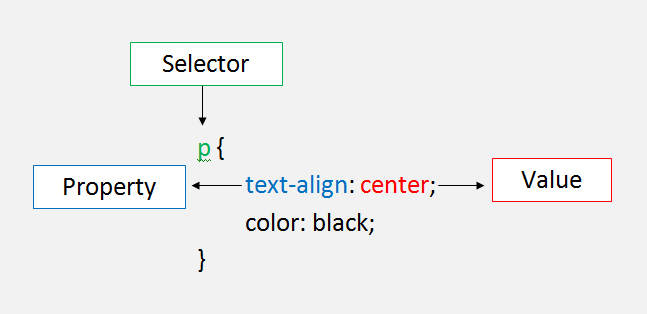

# Pengenalan CSS

## 1. Penjelasan CSS

Jikalau di minggu kemarin kita belajar struktur penulisan html, menampilkan atribut html, belajar menggunakan atribut-atribut di html, maka kali ini kita akan belajar bahasa baru yaitu CSS apa itu ?

 > CSS adalah singkatan dari Cascading StyleSheet yang merupakan bahasa `style sheet` yang tujuan utama nya adalah untuk membantu kita mengatur keindahan atau style di aplikasi web yang akan kita tulis bersama dengan HTML. Apabila HTML hanya bisa menentukan struktur tampilannya, maka CSS dapat menentukan bagaimana gaya dari tampilan tersebut.

Untuk apa kita belajar CSS ? 
 Alasan yang paling mendasar adalah karena css memang sangat dibutuhkan dalam mendesign aplikasi web ,karena denga css kita dapat membuat : 

>    1. Halaman landing page yang menarik
>   2. Template atau tema blog
 >   3. Mengubah PSD (Desain web) menjadi HTML
 >   4. dan sebagainya. 


  *1 file CSS dapat digunakan untuk banyak halaman HTML atau 1 Halaman HTML dapat terlihat berbeda jika menggunakan file CSS berbeda pula.*

## 2. Cara Penulisan ( Refactor css )

Cara penulisan strukture CSS biasanya terlihat seperti ini

```css
selector { property: value; }
```

**Selector** merupakan suatu cara dimana kita ingin mengelompokan kode-kode didalam CSS dan juga merupakan aturan yang digunakan untuk memisahkan kode-kode dengan target berbeda. Selector digunakan untuk memanipulasi tag HTML yang ingin diberikan style. Misalnya tag h1, p, a, dan tag lainnya.

### Ada beberapa cara untuk menggunakan selector

yang pertama kita bisa menggunakan `#` atau sinonim dari `id`

1. Seleksi elemen berdasarkan id

```css
#nama-id {
  property: value;
}
```

2. Seleksi elemen berdasarkan class

```css
.nama-class {
  property: value;
}
```

3. Seleksi semua elemen

```css
* {
  property: value;
}
```
4. Seleksi elemen yang berada didalam elemen lain

```css
div p {
  property: value;
}
```
5. Seleksi link yang sedang di hover

```css
a:hover {
  property: value;
}
```


**Property** merupakan suatu jenis style CSS yang berfungsi memberikan style pada selector yang telah ditentukan. Property pada CSS sangat banyak sekali. Misalnya property yang biasa kita temukan adalah background-color, color, font-family, font-size, margin, padding dan masih banyak lagi dan semua itu dapat dipakai untuk selector apapun cara penulisannya `nama properti` diikuti dengan tanda titik dua (colon) (`:`) diikuti dengan nilai atau value yang ditutup dengan titik koma (`;`)

Properti umum yang bisa digunakan :

- `color`
- `font`
- `background`
- `border`
- `width dan height`
- `margin dan padding`
- `display`


**Value** merupakan nilai dari property dimana value telah ditentukan pasangannya dengan property yang ada. Dan tidak bisa sembarangan dalam meberikan value pada setiap property. Misalnya property color tidak bisa diisikan dengan value bold.

CSS telah menentukan rumus baku dimana cara penulisan selector, property dan value .




Ok kita implementasi kan definisi diatas
jadi saya ingin menampilkan tulisan header dengan warna tulisan nya berwarna merah

yang pertama saya akan buat file html dengan nama *index.html*

```html
<html> 
  <head>
  <title>Embed css</title>
    <style>
      selector { property: value; }
    </style>
  </head>
  <body>
    <h1>Ini adalah header dengan style bold</h1> 
  </body>
</html>
```
ganti selector di style menjadi 

```css
<style>
      h1 { color: red; 
           font-weight : bold;      
      }
</style>
```

maksudnya adalah `h1` adalah sebagai **selector** nya ,`color` sebagai **property** dan `red` sebagai **value** nya begitu pula di style berikutnya.

## 3. Memasukkan CSS untuk HTML

Ada 3 cara untuk menuliskan css untuk html kita 
yang pertama adalah 

1. **inline css** : nulis langsung di tag yang mau di styling, cepet, tapi struktur html jadi kotor dan susah dibaca.

contohnya : 
```html
<html> 
  <head>
    <title>Inline css</title>
  </head>
  <body>
    <h1 style="color:blue;text-align:center;">This is a heading</h1>
    <p style="color:red;">This is a paragraph.</p>
  </body>
</html>
```

Yang kedua 

2. **pake tag style** : struktur html dan styling sudah mulai dipisah, sehingga bisa baca struktur html dengan lebih enak. tapi kalau stylingnya banyak, baris file htmlnya jadi banyak.

Contohnya : 
```html
<html> 
  <head>
  <title>Tag css</title>
    <style>
      h1 {
        color : blue;
        text-align : center;
      }
      p {
        color : red;
      }
    </style>
  </head>
</html>
```

Dan yang terakhir 

3. **eksternal css** : Memasukkan file css eksternal ke dalam html maksudnya adalah file html di pisah dengan file css , lalu kita hubungkan dengan cara seperti dibawah ini ,di bawah ini saya hubungkan html saya dengan `mystyles.css`

Contohnya :
```html
<html>
  <head>
    <title>Eksternal css</title>
    <link href="mystyles.css" rel="stylesheet" />
  </head>
</html>
```


## 4. Komentar

Menambahkan Komentar pada CSS

```css
/* Komentar masro  */
selector {
  property: value;
}
```
