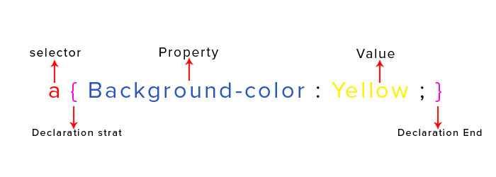

# Pengenalan CSS

## 1. Penjelasan CSS

 CSS adalah singkatan dari Cascading StyleSheet yang merupakan bahasa `style sheet` yang tujuan utama nya adalah untuk membantu mengatur keindahan di aplikasi web yang ditulis dengan HTML. Apabila HTML hanya bisa menentukan struktur tampilannya, maka CSS dapat menentukan bagaimana gaya dari tampilan tersebut.

 
 > 1 CSS dapat digunakan untuk banyak halaman HTML atau 1 Halaman HTML dapat terlihat berbeda jika menggunakan CSS berbeda pula.

## 2. Cara Penulisan ( Anatomi css )

Cara penulisan strukture CSS biasanya terlihat seperti ini

```css
selector { property: value; }
```

contoh implementasi nya seperti ini 


<!-- 


```css
h1 { color: red; }
``` -->

## 3. Memasukkan CSS untuk HTML

Ada 3 metode untuk menyertakan CSS agar dapat mengubah layout HTML.

### 3.1. Embed HTML

Menulis css ke dalam head html menggunakan tag `style`

```html
<html> 
  <head>
  <title>Embed css</title>
    <style>
      selector { property: value; }
    </style>
  </head>
</html>
```

### 3.2. Eksternal CSS

Memasukkan file css eksternal ke dalam html maksudnya adalah file html di pisah dengan file css , lalu kita hubungkan dengan cara seperti dibawah ini ,di bawah ini saya hubungkan html saya dengan `mystyles.css`

```html
<html>
  <head>
    <title>Eksternal css</title>
    <link href="mystyles.css" rel="stylesheet" />
  </head>
</html>
```

### 3.3. Inline CSS

Menulis css langsung ke tag tertentu pada html di bawah ini saya mencontohkan menggunakan `h1` dan menambahkan css di dalamnya seperti `color` dan `text-align` .

```html
<html> 
  <head>
    <title>Inline css</title>
  </head>
  <body>
    <h1 style="color:blue;text-align:center;">This is a heading</h1>
    <p style="color:red;">This is a paragraph.</p>
  </body>
</html>
```

## 4. Selector

Selector merupakan suatu cara dimana kita ingin mengelompokan kode-kode didalam CSS dan juga merupakan aturan yang digunakan untuk memisahkan kode-kode dengan target berbeda. Selector digunakan untuk memanipulasi tag HTML yang ingin diberikan style. Misalnya tag h1, p, a, dan tag lainnya.

Bentuk umum selector seperti berikut:

```css
selector {
  property: value;
  property: value;
}
```

Ada beberapa cara untuk menyeleksi elemen dengan selector 

### 4.1. Seleksi elemen berdasarkan id

```css
#nama-id {
  property: value;
}
```

### 4.2. Seleksi elemen berdasarkan class

```css
.nama-class {
  property: value;
}
```

### 4.3. Seleksi semua elemen

```css
* {
  property: value;
}
```

### 4.4. Seleksi elemen yang berada didalam elemen lain

```css
div p {
  property: value;
}
```

### 4.5. Seleksi link yang sedang di hover

```css
a:hover {
  property: value;
}
```

## 5. Property

Property merupakan suatu jenis style CSS yang berfungsi memberikan style pada selector yang telah ditentukan. Property pada CSS sangat banyak sekali. Misalnya property yang biasa kita temukan adalah background-color, color, font-family, font-size, margin, padding dan masih banyak lagi dan semua itu dapat dipakai untuk selector apapun cara penulisannya `nama properti` diikuti dengan tanda titik dua (colon) (`:`) diikuti dengan nilai atau value yang ditutup dengan titik koma (`;`)

Properti umum yang bisa digunakan :

- `color`
- `font`
- `background`
- `border`
- `width dan height`
- `margin dan padding`
- `display`

## 6. Value

Value merupakan nilai dari property dimana value telah ditentukan pasangannya dengan property yang ada. Dan tidak bisa sembarangan dalam meberikan value pada setiap property. Misalnya property color tidak bisa diisikan dengan value bold.

CSS telah menentukan rumus baku dimana cara penulisan selector, property dan value .


## 7. Komentar

Menambahkan Komentar pada CSS

```css
/* Komentar masro  */
selector {
  property: value;
}
```
