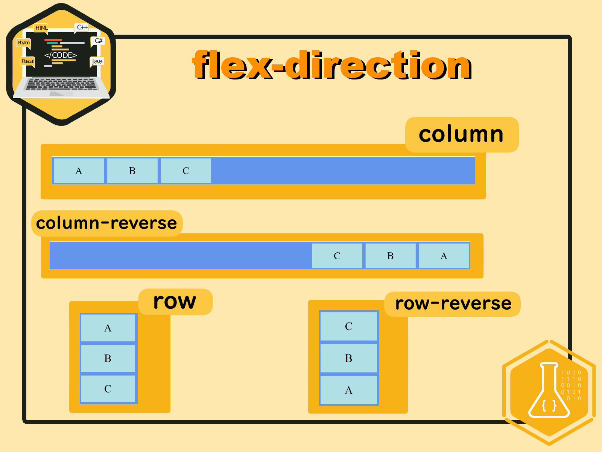
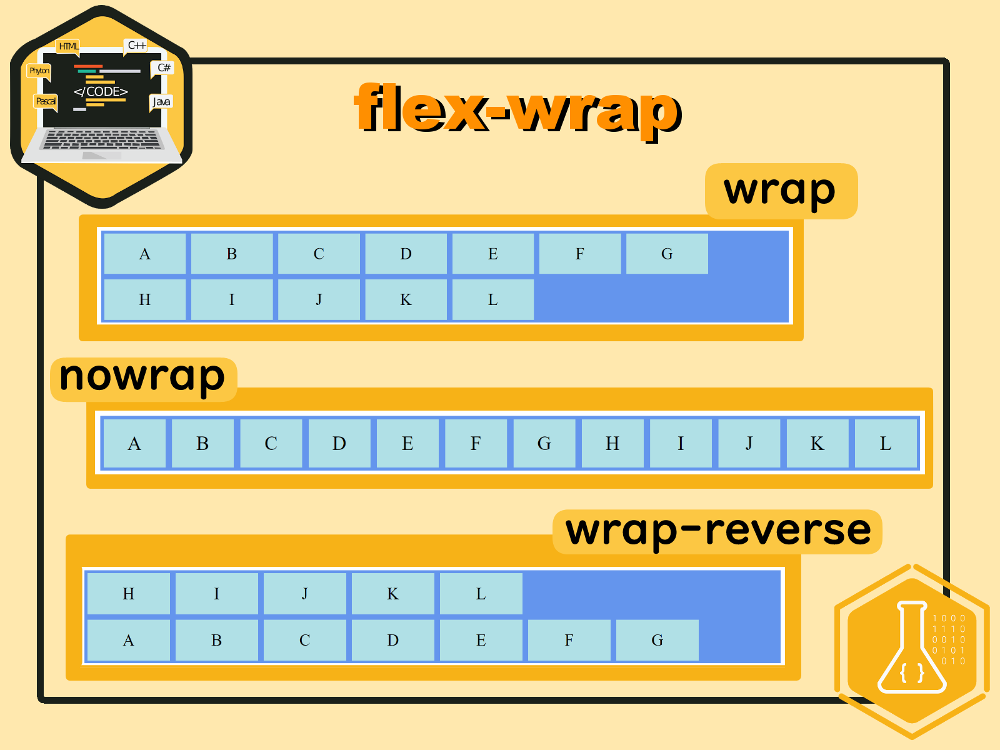
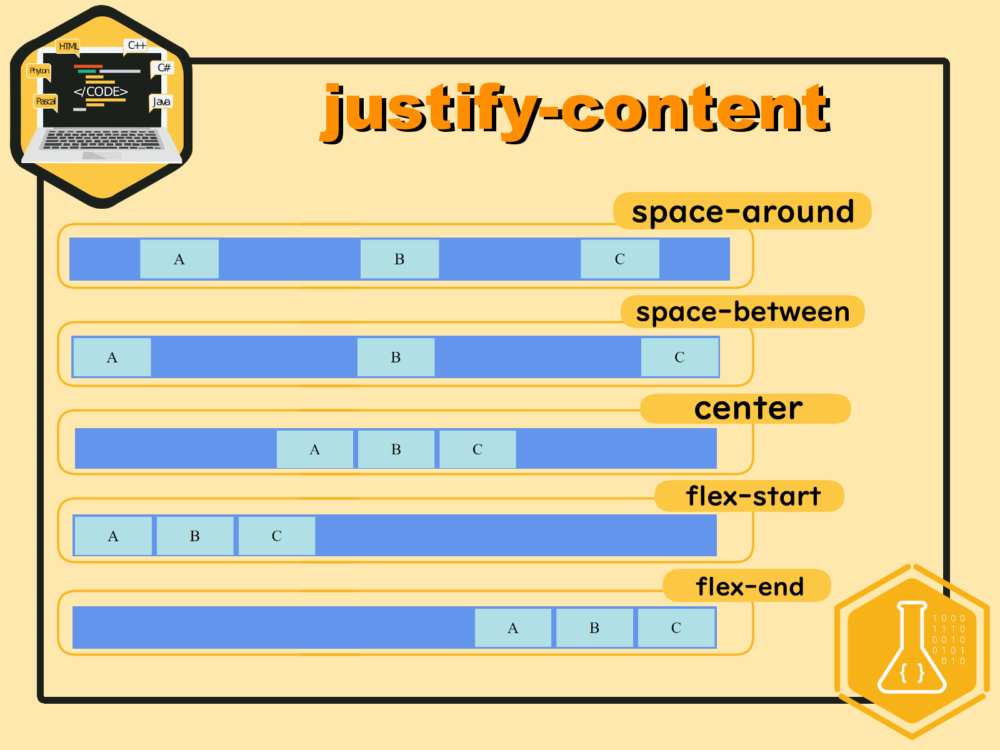
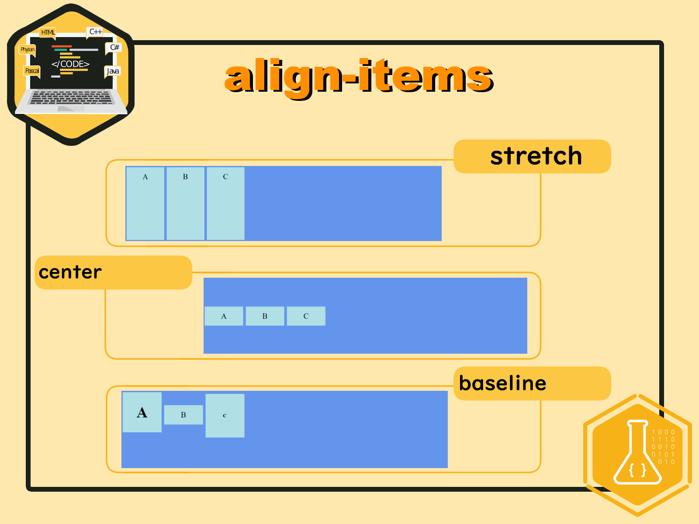
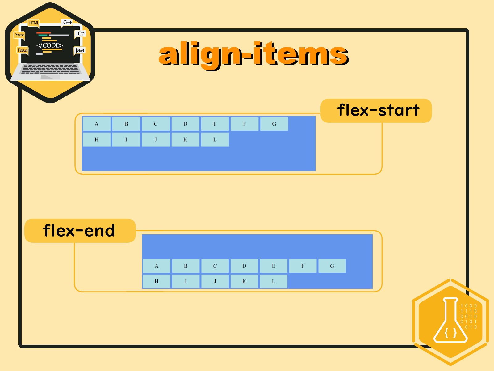
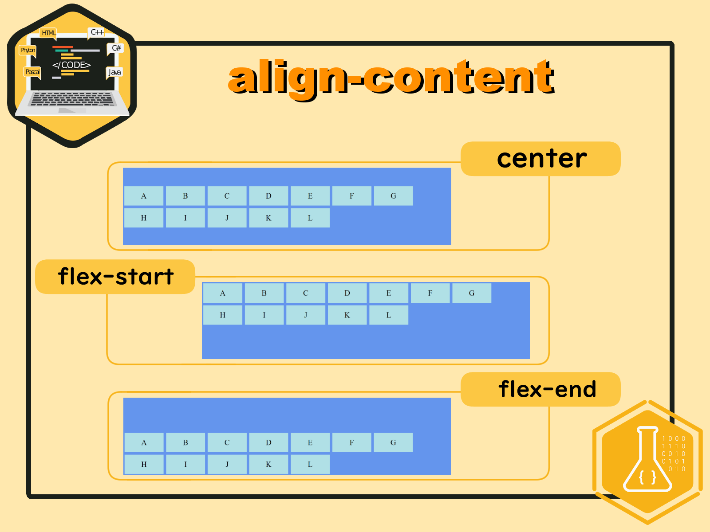
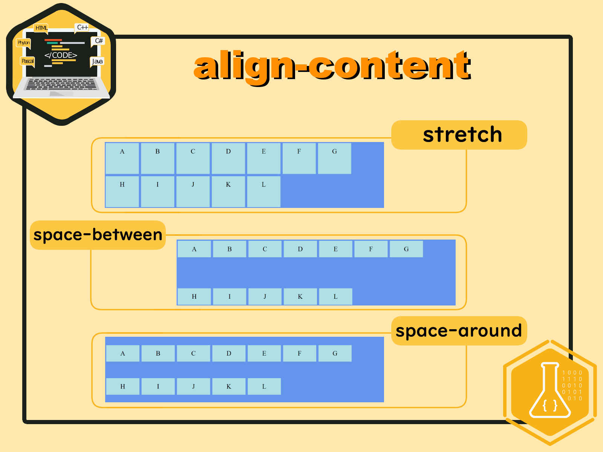

# Responsive Design

## 1. Permasalahan 

Sebelumnya pada materi `layouting`, kita telah mempelajari bagaimana cara membuat layout web dengan menggunakan display property `inline-block`. Namun kemarin hanya dengan dua kolom saja, lalu bagaimana jika kita ingin membuat layout web dengan banyak kolom? Bukankah akan sangat rumit untuk mengkalkulasikan pembagian presentasenya?

## 2. Penjelasan Flexbox

Untuk layouting website seperti yang kita tanyakan tadi, kita perlu mengetahui `flexbox` sebagai solusinya. `Flexbox` terdapat dalam property `display` yang telah kita pelajari kemarin, di antaranya yaitu `block`, `inline`, `inline-block`, dan `flexbox`. Kali ini kita akan mempelajari `flexbox` yang akan disematkan pada `container` untuk membuat layout web yang responsif.

## 3. Jenis - Jenis Flexbox untuk Container

### 3.1. flex-direction

`flex-direction` berguna untuk mengurutkan apakah `container` yang ada akan berjajar secara horizontal atau vertikal. 

Untuk lebih jelasnya, mari kita lihat penerapan `flex-direction`. Kita akan menggunakan file html berikut.

```html
<!-- index.html -->
<html>
<head>
<link rel="stylesheet" href="flex.css">
</head>
<body>
<div class="flex-container">
  <div>A</div>
  <div>B</div>
  <div>C</div>  
</div>
</body>
</html>
``` 

Lalu untuk cssnya akan kita sesuaikan pada property `flex-direction`  dengan pilihan value `column`, `row`, `column-reverse`, dan `row-reverse`.

```css
/* index.css */
.flex-container {
  display: flex;
  flex-direction: column;
  background-color: cornflowerblue;
}

.flex-container > div {
  background-color: powderblue;
  width: 150px;
  margin: 5px;
  text-align: center;
  line-height: 75px;
  font-size: 30px;
}
```

Hasilnya akan tampak seperti ini pada setiap valuenya.



### 3.2. flex-wrap

`flex-wrap`, sesuai dengan namanya, berguna untuk membungkus container. Seperti apa maksud dari membungkus itu? Untuk mengetahuinya, mari kita coba terlebih dahulu. Kita akan menggunakan tambahan container pada file HTML agar bisa terlihat bagaimana `flex-wrap` bekerja. 

```html
<!-- index.html -->
<html>
<head>
<link rel="stylesheet" href="flex.css">
</head>
<body>
<div class="flex-container">
  <div>A</div>
  <div>B</div>
  <div>C</div>  
  <div>D</div>
  <div>E</div>
  <div>F</div>  
  <div>G</div>
  <div>H</div>
  <div>I</div>  
  <div>J</div>
  <div>K</div>
  <div>L</div>  
</div>
</body>
</html>
``` 
Pada file CSS kita hanya perlu mengganti menjadi `flex-wrap` dengan pilihan value `wrap`, `nowrap`, dan `wrap-reverse`.

```css
/* index.css */
.flex-container {
  display: flex;
  flex-wrap: wrap;
  background-color: cornflowerblue;
}

.flex-container > div {
  background-color: powderblue;
  width: 150px;
  margin: 5px;
  text-align: center;
  line-height: 75px;
  font-size: 30px;
}
```

Tampilannya akan menjadi seperti ini pada setiap valuenya. 



Jika hanya dilihat sekilas, mungkin tidak ada bedanya dengan `flex-direction`. Untuk mengetahui perbedaannya, cobalah untuk mengubah ukuran windowsnya dengan memperbesar atau memperkecil.

### 3.3. justify-content

`justify-content` berguna untuk meluruskan container secara horizontal. Untuk value dari property ini sendiri ada 5, yaitu `space-around`, `space-between`, `center`, `flex-start`, dan `flex-end`.

Kita akan menggunakan file HTML seperti di property `flex-direction` dan mengganti property sebelumnya menjadi `justify-content` pada file CSS.

```html
<!-- index.html -->
<html>
<head>
<link rel="stylesheet" href="flex.css">
</head>
<body>
<div class="flex-container">
  <div>A</div>
  <div>B</div>
  <div>C</div>
</div>
</body>
</html>
``` 

```css
/* index.css */
.flex-container {
  display: flex;
  justify-content: center;
  background-color: cornflowerblue;
}

.flex-container > div {
  background-color: powderblue;
  width: 150px;
  margin: 5px;
  text-align: center;
  line-height: 75px;
  font-size: 30px;
}
```

Hasilnya akan menjadi seperti ini untuk setiap valuenya



### 3.4. align-items

Jika `justify-content` menluruskan secara horizontal, `align-items` memiliki kegunaan untuk menyusun posisi vertikal. Kita akan menggunakan file HTML dengan 12 container seperti pada property `flex-wrap`. 

```html
<!-- index.html -->
<html>
<head>
<link rel="stylesheet" href="flex.css">
</head>
<body>
<div class="flex-container">
  <div>A</div>
  <div>B</div>
  <div>C</div>  
  <div>D</div>
  <div>E</div>
  <div>F</div>  
  <div>G</div>
  <div>H</div>
  <div>I</div>  
  <div>J</div>
  <div>K</div>
  <div>L</div>  
</div>
</body>
</html>
``` 

Lalu untuk file CSS, kita akan menambahkan property `height` untuk panjang area yang menjadi pembatas posisi container, lalu mengganti property sebelumnya menjadi `align-item` dengan value `stretch`, `center`, `baseline`, `flex-start`, and `flex-end`.

```css
/* index.css */
.flex-container {
  display: flex;
  height: 300px;
  align-items: stretch;
  background-color: cornflowerblue;
}

.flex-container > div {
  background-color: powderblue;
  width: 150px;
  margin: 5px;
  text-align: center;
  line-height: 75px;
  font-size: 30px;
}
```

*Khusus untuk value `baseline`, kita akan menggunakan file HTML seperti ini agar bisa melihat perbedaannya*
```html
<!-- index.html -->
<html>
<head>
<link rel="stylesheet" href="flex.css">
</head>
<body>
<div class="flex-container">
  <div><h1>A</h1></div>
  <div>B</div>
  <div><h6>C</h6></div>  
</div>
</body>
</html>
```

Hasilnya akan menjadi seperti ini untuk setiap valuenya.




*Untuk value `baseline`, bisa dilihat huruf A, B, dan C lurus segaris* 

### 3.5. align-content

`align-content` merupakan property yang disebut memodifikasi property `flex-wrap` dengan memberi letak vertikal pada property tersebut. Property ini memiliki 6 value yaitu `center`, `flex-start`, `flex-end`, `stretch`, `space-between`, dan `space-around`. 

Untuk file HTML kita akan menggunakan file sebelumnya.

```html
<!-- index.html -->
<html>
<head>
<link rel="stylesheet" href="flex.css">
</head>
<body>
<div class="flex-container">
  <div>A</div>
  <div>B</div>
  <div>C</div>  
  <div>D</div>
  <div>E</div>
  <div>F</div>  
  <div>G</div>
  <div>H</div>
  <div>I</div>  
  <div>J</div>
  <div>K</div>
  <div>L</div>  
</div>
</body>
</html>
``` 

Lalu untuk file CSS, kita hanya perlu mengganti property sebelumnya menjadi `align-content` dengan value yang telah disebutkan di atas.

```css
/* index.css */
.flex-container {
  display: flex;
  height: 300px;
  flex-wrap: wrap;
  align-content: flex-start;
  background-color: cornflowerblue;
}

.flex-container > div {
  background-color: powderblue;
  width: 150px;
  margin: 5px;
  text-align: center;
  line-height: 75px;
  font-size: 30px;
}
```

Hasilnya akan menjadi seperti ini untuk tiap valuenya.





