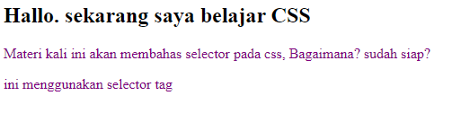
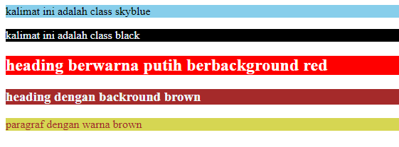

# Selector

## 1. Permasalahan
Sebelumnya kita sudah bisa memberikan styling pada sebuah element HTML menggunakan CSS, misalnya membuat semua tag h1 menjadi warna hijau. Tampilan semua tag h1 akan berwarna hijau, bagaimana jika kita ingin membuat beberapa h1 menjadi warna lain atau menerapkan styling lain?

## 2. Penjelasan Materi Sebagai Solusi
Selector digunakan pada CSS untuk mengenali sebuah elemen HTML. Selector juga dapat diterapkan untuk melakukan styling pada elemen tertentu saja.

## 3. Penjelasan Detail Materi
### 3.1 Jenis Selector pada CSS
#### 3.1.1 Selector Tag
Selector Tag disebut juga Type Selector. Selector ini menggunakan nama elemen atau tag HTML sebagai target untuk penerapan styling.
Pada Syntax dibawah ini terdapat 2 tag, yaitu `<h2>` dan `<p>`. tag `<p>` akan dikenai styling dengan perubahan warna font, akan tetapi selector ini akan merubah semua tag `<p>` sehingga tidak tepat untuk dijadikan sebagai solusi untuk permasalahan diatas.

```html
    <h2>Hallo. sekarang saya belajar CSS</h2>
    <p>Materi kali ini akan membahas selector pada css,
        Bagaimana? sudah siap?
    </p>
    <p>ini menggunakan selector tag</p>
```
```css
  p {
        color: purple;
    }
```


#### 3.1.2 Selector Class
Selector class menetapkan target elemen berdasarkan atribut class yang diterapkan pada elemennya. untuk penulisan selector class diawali dengan tanda titik(.) kemudian dilanjutkan dengan nama `class`-nya.

Selector ini dapat diterapkan pada banyak elemen dengan tipe elemen yang berbeda dan juga dapat dispesifikan lagi dengan penambahan nilai `class` ataupun elemen yang diikuti dengan nama `class`.
Selector jenis ini cocok jika diterapkan untuk menjadi solusi dari permasalahan diatas karena dapat hanya memberikan styling kepada 1 elemen dengan class yang berbeda dan tidak mempengaruhi elemen lain yang serupa tapi berbeda class.

```html
    <p class="skyblue">kalimat ini adalah class skyblue</p>
    <p class="black">kalimat ini adalah class black</p>

    <!-- elemen yang diberi nilai class >1 -->
    <h2 class="white red"> heading berwarna putih berbackground red</h2>

    <!-- nama class sama di elemen berbeda -->
    <h3 class="brown"> heading dengan backround brown</h3>
    <p class="brown"> paragraf dengan warna brown</p>
```

```css
.skyblue{
    background-color: skyblue;
}
.black{
    color: aliceblue;
    background-color: black;
}
/* class yang memiliki nilai >1 dituliskan terpisah */
.white{
    color: white;
}
.red{
    background-color: red;
}
/* nama class sama di elemen berbeda */
h3.brown{
    color: aliceblue;
    background-color: brown;
}
p.brown{
    color: brown;
    background-color: rgb(214, 214, 82);
}
```

#### 3.1.3 Selector ID
Selector ID menetapkan target elemen berdasarkan atribut `ID` yang diterapkan pada elemennya. untuk penulisan selector ID diawali dengan tanda <em>hash</em>(#)  kemudian dilanjutkan dengan nama `ID`-nya.

Selector Id tidak seperti Selector class yang dapat diterapkan pada banyak elemen dengan tipe elemen yang berbeda-beda, Selector Id harus unik dan hanya dapat digunakan pada satu elemen saja.

```html
    <div id="spesial">
        <p>didalam sebuah div dengan id spesial</p>
    </div>
     <!-- contoh penerapan yang salah untuk penggunaan id -->
    <div id="spesial"> 
        <p>didalam sebuah div dengan id biasa</p>
    </div>
```
```css
   #spesial{
            color: red; 
        }
```

#### 3.1.4 Selector Atribut
Selector atribut menetapkan target elemen berdasarkan atribut. selector ini hampir sama dengan selector tag atau type selector.

```html
<input type='text' placeholder="pencarian" />
```
```css
input[type=text]{
    background: none ;
    padding: 10px;
    border: 1px solid;
}
```

#### 3.1.5 Selector Universal
Selector universal menetapkan target pada semua elemen. penulisan untuk selector ini menggunakan (*)

```css
*{
    font-family: Arial, Helvetica, sans-serif;
}
```

## 4. Contoh Kasus

pada studi kasus ini, kita akan membuat halaman website yang menerapkan styling yang berbeda pada elemen-elemen sejenis berdasarkan classnya

### 4.1 Membuat file HTML
pada file HTML ini, isi dari website dikelompokkan berdasarkan elemen yang diberi `class`. Jangan lupa menuliskan link untuk menghubungkan dengan file CSS-nya

```html
<html>

<head>
    <title>Selector css</title>
    <link rel="stylesheet" href="belajar.css" />
</head>

<body>
    <p class="skyblue">kalimat ini adalah class skyblue</p>
    <p class="black">kalimat ini adalah class black</p>
    <h2 class="white red"> heading berwarna putih berbackground red</h2>
    <h3 class="brown"> heading dengan backround brown</h3>
    <p class="brown"> paragraf dengan warna brown</p>

</html>
```

### 4.2 Membuat file CSS
file CSS yang telah dihubungkan dengan link HTML digunakan sebagai styling website. 

```css
.skyblue{
    background-color: skyblue;
}
.black{
    color: aliceblue;
    background-color: black;
}
.white{
    color: white;
}
.red{
    background-color: red;
}
h3.brown{
    color: aliceblue;
    background-color: brown;
}
p.brown{
    color: brown;
    background-color: rgb(214, 214, 82);
}
```

## 4.3 Hasil Akhir



## 5. Referensi

**petani kode** - https://www.petanikode.com/css-selektor/

**w3school** - https://www.w3schools.com/cssref/css_selectors.asp


