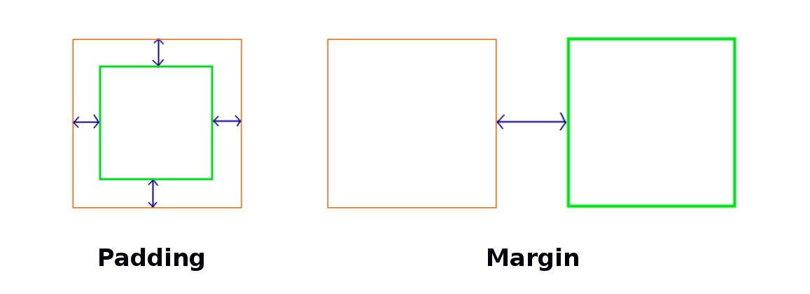

# Spacing

Space atau ruang kosong sangat penting dalam mendesain sebuah website, karena memberikan kenyamanan kepada user. Dengan CSS kita dapat memberikan space terhadap suatu elemen HTML, terdapat dua jenis space dalam CSS, yaitu `padding` dan `margin`



## 1. Padding

Padding merupakan space yang berada di dalam konten suatu elemen, untuk menentukan padding kita dapat menggunakan css seperti berikut

```css
div {
  padding-top: 50px;
  padding-bottom: 50px;
  padding-right: 30px;
  padding-left: 30px;
}
```

## 2. Margin

Margin merupakan space yang berada di luar elemen, untuk menentukan margin kita dapat menggunakan css seperti berikut

```css
div {
  margin-top: 100px;
  margin-bottom: 100px;
  margin-right: 80px;
  margin-left: 80px;
}
```

## 3. Box Sizing

Ada satu lagi property yang sering digunakan untuk mengatur space pada CSS, yaitu `box-sizing`. Property ini digunakan untuk memasukkan `border`, `padding` dan `margin` untuk keseluruhan total tinggi dan lebar suatu elemen

```css
/* div selalu berukuran 300 x 100 walaupun ada tambahan border, padding, dan margin */
div {
  width: 300px;
  height: 100px;
  margin: 100px;
  padding: 100px;
  border: 1px solid blue;
  box-sizing: border-box;
}
```
