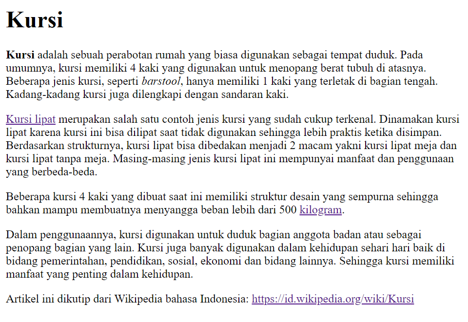
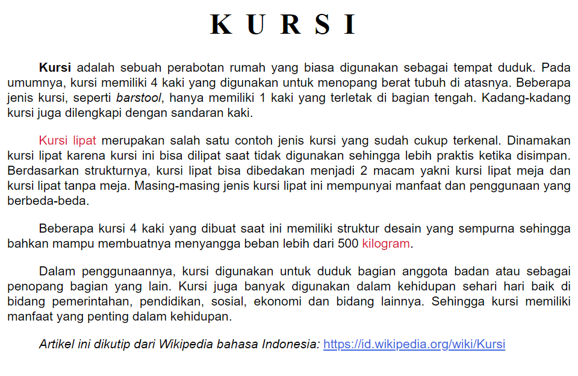

# Text Formatting Menggunakan CSS

## 1. Permasalahan

Dalam HTML, kita dapat menerapkan text formatting dasar seperti menebalkan, memiringkan, menggarisbawahi, atau mencoret text. Namun, bagaimana jika kita ingin melakukan text formatting yang lebih mendalam, seperti mengubah warna teks, mengatur jenis font dalam teks, mengatur perataan teks, dan lain-lain? Kita harus menggunakan CSS untuk mengaturnya.

## 2. Text Formatting pada CSS

Dengan menggunakan CSS, kita dapat menerapkan text formatting dengan pilihan sintaks yang lebih beragam daripada hanya menggunakan HTML. Menerapkan text formatting pada CSS dapat membuat tampilan teks di dalam website menjadi terlihat lebih unik dan menarik.

## 3. Properti Text Formatting pada CSS

Properti yang digunakan untuk melakukan text formatting umumnya terbagi dalam dua kategori, yaitu:

- **Font styling**: untuk mengatur tampilan tiap katakter pada teks.
- **Text styling**: untuk mengatur tata letak, posisi, dan tampilan visual teks.

### 3.1 Font Styling

#### 3.1.1. Font Family

Properti `font-family` digunakan untuk menentukan standar font yang digunakan dalam teks. Properti `font-family` dapat berisi beberapa nilai (dikenal sebagai font stack), sehingga jika browser pengguna tidak mendukung font utama yang digunakan, sistem dapat menggunakan font pengganti yang didukung oleh browser pengguna.

```css
p {
  font-family: Arial, Helvetica, sans-serif;
}
```

#### 3.1.2. Font Size

Kita dapat menggunakan properti `font-size` untuk menentukan ukuran teks. Font standar yang digunakan dalam browser umumnya berukuran `16px`.

```css
p {
  font-size: 14px;
}
```

#### 3.1.3. Font Weight

Properti `font-weight` digunakan untuk mengatur ketebalan teks. Properti ini dapat diisi dengan nilai deskripsi seperti `normal`, `bold`, `lighter`, dan lain-lain, serta dapat diisi dengan angka, yaitu nilai dengan rentang antara `100` (paling tipis) hingga `900` (paling tebal). Nilai font `normal` adalah `400` dan nilai font `bold` adalah `700`.

```css
p {
  font-weight: lighter;
}

h1 {
  font-weight: 900;
}
```

#### 3.1.4. Font Style

Kita dapat menggunakan properti `font-style` untuk mengatur kemiringan teks. Properti ini mempunyai beberapa nilai, yaitu `normal` untuk teks normal, serta `italic` dan `oblique` untuk teks miring.

```css
a {
  font-style: italic;
}
```

### 3.2 Text Styling

#### 3.2.1. Text Color

Kita dapat menggunakan properti `color` untuk menentukan warna teks. Properti color dapat berisi nilai deskripsi, seperti `red`, `blue`, `yellow`, `purple`, dan lain-lain, atau dapat pula berisi color-hex, seperti `#FF0000` untuk warna merah, `#000000` untuk warna hitam, dan sebagainya.

```css
p {
  color: blue;
}

h1 {
  color: #ff0000;
}
```

#### 3.2.2. Text Alignment

Kita dapat menggunakan properti `text-align` untuk menentukan perataan teks. Nilai `text-align` pada CSS mirip dengan nilai text alignment pada Microsoft Word, yaitu `left`, `center`, `right`, dan `justify`.

```css
p {
  text-align: left;
}

h1 {
  text-align: center;
}

h2 {
  text-align: right;
}

h3 {
  text-align: justify;
}
```

#### 3.2.3. Text Indentation

Kita dapat menggunakan properti `text-indent` untuk menambahkan indentasi pada teks. Text indentation umumnya digunakan pada awal paragraf. Nilai `text-indent` dapat berupa nilai positif (indentasi ke dalam) dan nilai negatif (indentasi ke luar).

```css
p {
  text-indent: 50px;
}
```

#### 3.2.4. Text Transformation

Kita dapat menggunakan properti `text-transform` untuk menentukan formasi teks. Properti ini dapat memudahkan kita untuk mengubah huruf besar-kecil pada teks tanpa harus mengubah teksnya satu per satu di HTML.

```css
h1 {
  text-transform: uppercase;
}

h2 {
  text-transform: lowercase;
}

h3 {
  text-transform: capitalize;
}
```

#### 3.2.5. Text Decoration

Kita dapat menggunakan properti `text-decoration` untuk mendekorasi teks, yang umumnya digunakan untuk memodifikasi garis bawah yang terdapat pada link. Namun, kita juga dapat menggunakan properti `text-decoration` untuk mendekorasi teks lainnya.

```css
a {
  text-decoration: none;
}

h1 {
  text-decoration: overline;
}

h2 {
  text-decoration: line-through;
}

h3 {
  text-decoration: underline;
}
```

#### 3.2.6. Line Height

Properti `line-height` digunakan untuk mengatur jarak antar baris. Fungsi ini mirip dengan line spacing yang terdapat di Microsoft Word.

```css
p {
  line-height: 18px;
}
```

#### 3.2.7. Letter Spacing dan Word Spacing

Kita dapat menggunakan properti `letter-spacing` untuk mengatur jarak antar huruf. Properti `letter-spacing` umumnya diterapkan pada teks yang menggunakan huruf kapital agar lebih mudah dibaca oleh pengguna.

Properti `word-spacing` mirip dengan `letter-spacing`, namun properti `word-spacing` digunakan untuk mengatur jarak antar kata dalam teks.

```css
h1 {
  letter-spacing: 18px;
}

h2 {
  word-spacing: 5px;
}
```

## 4. Contoh Kasus

Di sini kita akan membuat halaman website yang berisi sebuah artikel dan menerapkan text formatting CSS di dalamnya.

### 4.1. Membuat File `index.html`

Pertama-tama, buatlah file `index.html` dan isi file html tersebut dengan kode di bawah ini.

```html
<!-- index.html -->
<html>
  <head>
    <body>
      <link rel="stylesheet" href="style.css" />
      <h1>Kursi</h1>
      <p>
        <b>Kursi</b> adalah sebuah perabotan rumah yang biasa digunakan sebagai
        tempat duduk. Pada umumnya, kursi memiliki 4 kaki yang digunakan untuk
        menopang berat tubuh di atasnya. Beberapa jenis kursi, seperti
        <i>barstool</i>, hanya memiliki 1 kaki yang terletak di bagian tengah.
        Kadang-kadang kursi juga dilengkapi dengan sandaran kaki.
      </p>
      <p>
        <a href="https://id.wikipedia.org/wiki/Kursi_lipat">Kursi lipat</a>
        merupakan salah satu contoh jenis kursi yang sudah cukup terkenal.
        Dinamakan kursi lipat karena kursi ini bisa dilipat saat tidak digunakan
        sehingga lebih praktis ketika disimpan. Berdasarkan strukturnya, kursi
        lipat bisa dibedakan menjadi 2 macam yakni kursi lipat meja dan kursi
        lipat tanpa meja. Masing-masing jenis kursi lipat ini mempunyai manfaat
        dan penggunaan yang berbeda-beda.
      </p>
      <p>
        Beberapa kursi 4 kaki yang dibuat saat ini memiliki struktur desain yang
        sempurna sehingga bahkan mampu membuatnya menyangga beban lebih dari 500
        <a href="https://id.wikipedia.org/wiki/Kilogram">kilogram</a>.
      </p>
      <p>
        Dalam penggunaannya, kursi digunakan untuk duduk bagian anggota badan
        atau sebagai penopang bagian yang lain. Kursi juga banyak digunakan
        dalam kehidupan sehari hari baik di bidang pemerintahan, pendidikan,
        sosial, ekonomi dan bidang lainnya. Sehingga kursi memiliki manfaat yang
        penting dalam kehidupan.
      </p>
      <p class="references">
        Artikel ini dikutip dari Wikipedia bahasa Indonesia:
        <a class="references" href="https://id.wikipedia.org/wiki/Kursi"
          >https://id.wikipedia.org/wiki/Kursi</a
        >
      </p>
    </body>
  </head>
</html>
```

Dalam file `index.html` ini terdapat class `references` untuk mengedit format paragraf referensi yang berada di akhir artikel.

Berikut tampilan file `index.html` setelah dibuka dengan browser.



### 4.2. Mengedit Format Judul

Pertama-tama, buatlah file `style.css` yang nantinya akan digunakan untuk menerapkan text formatting pada `index.html`. Gunakan selector `h1` untuk mengubah format judul di dalam CSS.

Lalu, terapkan kode di bawah ini untuk mengubah format judul artikel.

```css
h1 {
  font-family: 'Times New Roman', Times, serif; /* mengatur jenis font yang dipakai */
  font-weight: 900; /* mengatur ketebalan font */
  text-align: center; /* mengatur perataan teks judul */
  text-transform: uppercase; /* mengatur formasi teks judul */
  letter-spacing: 15px; /* mengatur jarak antar huruf */
}
```

### 4.3. Mengedit Format Paragraf

Setelah mengubah format judul, selanjutnya kita akan mengubah format paragraf dengan menggunakan selector `p`.

Terapkan kode di bawah ini untuk mengubah format teks paragraf.

```css
p {
  font-family: Arial, Helvetica, sans-serif; /* mengatur jenis font yang dipakai */
  font-size: 14px; /* mengatur ukuran font */
  text-align: justify; /* mengatur perataan teks paragraf */
  text-indent: 35px; /* mengatur indentasi pada paragraf */
  line-height: 17px; /* mengatur ketinggian antar baris pada paragraf*/
}
```

### 4.4. Mengubah Format Link pada Artikel

Selanjutnya kita akan mengubah format link di dalam artikel agar tampilan artikel menjadi lebih menarik serta mudah dibaca oleh pengunjung.

Terapkan kode di bawah ini untuk mengubah format link pada artikel.

```css
a {
  color: #db1d3d;
  text-decoration: none;
}
```

### 4.5. Mengubah Format Teks Referensi pada Akhir Paragraf

Karena referensi tidak termasuk ke dalam paragraf di dalam artikel, kita harus membuat tampilan paragraf referensi tampak berbeda dengan paragraf artikel. Hal ini bertujuan agar pengunjung dapat membedakan paragraf berisi artikel dengan paragraf khusus referensi. Gunakan selector `element.references` untuk mengubah format teks yang ada pada suatu element yang memiliki class `references`.

Terapkan kode di bawah ini untuk mengubah format paragraf referensi.

```css
p.references {
  font-style: oblique;
}

a.references {
  color: royalblue;
  text-decoration: underline;
  font-style: normal;
}
```

### 4.6. Tampilan Halaman Website Setelah Menerapkan Text Formatting CSS

Berikut tampilan akhir halaman website yang kita buat sebelumnya setelah menerapkan seluruh text formatting pada CSS.


