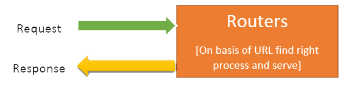

# Routing pada Express JS



## 1. Penjelasan Routing

Dalam dunia pengembangan web, routing merupakan pemetaan URL - URL yang dapat diakses oleh client menggunakan method tertentu seperti `GET`, `POST`, `PUT`, `DELETE`

## 2. Melakukan Routing

Berikut merupakan standar routing untuk melakukan CRUD pada website

| Verb   | URI              | Action  | Description                        |
| ------ | ---------------- | ------- | ---------------------------------- |
| GET    | /biodata         | index   | Menampilkan semua biodata          |
| GET    | /biodata/id      | show    | Menampilkan biodata berdasarkan ID |
| GET    | /biodata/create  | create  | Menampilkan form tambah biodata    |
| POST   | /biodata         | store   | Menambahkan biodata                |
| GET    | /biodata/id/edit | edit    | Menampilkan form ubah biodata      |
| PUT    | /biodata/id      | update  | Mengubah biodata berdasarkan ID    |
| DELETE | /biodata/id      | destroy | Menghapus biodata berdasarkan ID   |

Berikut contoh penerapan menggunakan express

```Javascript
// index.js

const express = require("express")
const app = express()

// Menampilkan semua biodata
app.get('/biodata', function (req, res) {
  
})

// Menampilkan biodata berdasarkan ID
app.get('/biodata/:id', function (req, res) {
  	
})

// Menampilkan form tambah biodata
app.get('/biodata/create', function (req, res) {
  	
})

// Menambah biodata
app.post('/biodata', function (req, res) {
  
})

// Menampilkan form ubah biodata berdasarkan ID
app.get('/biodata/:id/edit', function (req, res) {
  
})

// Mengubah biodata berdasarkan ID
app.put('/biodata/:id', function (req, res) {

})

// Menghapus biodata berdasarkan ID
app.delete('/biodata/:id', function (req, res) {

})

app.listen(3000, function () {})
```

## 3. Memisahkan Routing ke File Lain

Selama ini kita selalu meletakkan routing pada satu file saja, yaitu pada `index.js` hal ini tidak baik karena semakin fitur dari aplikasi bertambah maka `index.js` akan semakin penuh dengan baris kode, berikut langkah - langkah untuk memisahkan routing ke file lain

### 3.1. Membuat File Untuk Routing

Karena kita akan membuat routing untuk biodata, maka disini kita akan membuat sebuah file bernama `biodataRouter.js` yang hanya berisi routing dari biodata

```javascript
// biodataRouter.js

const express = require("express")
const router = express.Router()

// Menampilkan semua biodata
router.get('/biodata', function (req, res) {
  	
})

// Menampilkan biodata berdasarkan ID
router.get('/biodata/:id', function (req, res) {
  	
})

// Menampilkan form tambah biodata
router.get('/biodata/create', function (req, res) {
  	
})

// Menambah biodata
router.post('/biodata', function (req, res) {
  
})

// Menampilkan form ubah biodata berdasarkan ID
router.get('/biodata/:id/edit', function (req, res) {
  
})

// Mengubah biodata berdasarkan ID
router.put('/biodata/:id', function (req, res) {

})

// Menghapus biodata berdasarkan ID
router.delete('/biodata/:id', function (req, res) {

})

module.exports = router
```

### 3.2. Menerapkan File Routing ke index.js

Setelah kita memisah routing ke file lain, maka kita perlu mengimport dan menggunakan routing tersebut ke `index.js` menggunakan `app.use`

```javascript
// index.js

const express = require("express")
const app = express()
const biodataRouter = require("./biodataRouter")

app.use(biodataRouter)
app.listen(3000, function() {})
```

## 4. Contoh Penerapan

Berikut contoh penerapan routing dengan membuat aplikasi CRUD dengan express dan mysql

https://github.com/wrideveloper/express-mysql-crud
