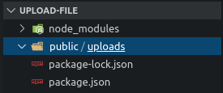
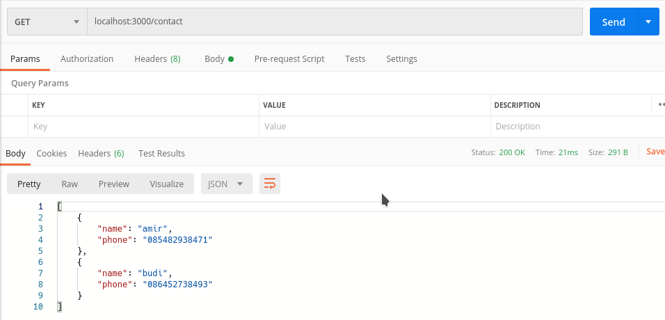
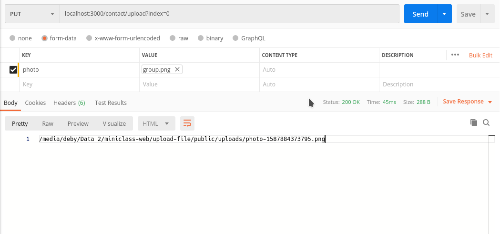
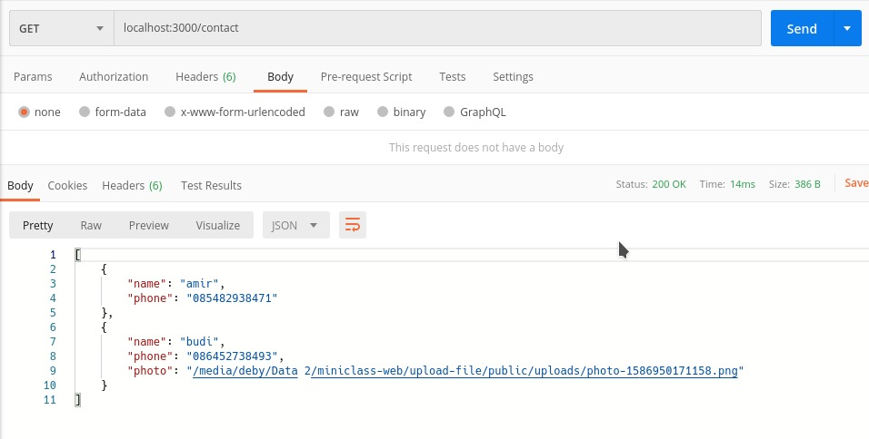

# Mengunggah File Menggunakan Express JS

## 1. Permasalahan

Selain menerima data dari body menggunakan format `url encoded` dan `json`, sebuah web server juga dapat menerima `file` dari client. Misalnya apabila kita akan membuat sebuah web yang memiliki fitur upload seperti upload foto profile atau file pdf.

## 2. Solusi

Untuk mengirim sebuah file, client harus mengirimkan data melalui body dengan format `form data`. Kemudian server dapat memparsingnya menggunakan middleware `multer`. Node JS sendiri tidak dapat menghandle multipart request. Sehingga membutuhkan Multer. `Multer` adalah middleware node.js untuk menangani `form data`, yang biasanya digunakan untuk mengunggah file.

## 3. Cara Parsing Form Data Menggunakan Middleware Multer

### 3.1 Pertama, Install `Multer` terlebih dahulu

```bash
$ npm i multer --save
```

### 3.2 Membuat folder untuk menyimpan file

Selanjutnya untuk menerapkan multer pada express adalah dengan membuat folder untuk menyimpan file yang akan diunggah, misalnya folder `upload`

### 3.3 Mendefinisikan Dependency `multer` dan `path`

Sebelum menggunakan `multer`, kita perlu mendefinisikan dependency multer terlebih dahulu :

```javascript
const multer = require("multer");
```

`Multer` memiliki fitur untuk menghasilkan jalur tujuan dan nama file secara dinamis, yaitu `path`.  
Jadi, kita harus melewati fungsi yang akan melakukan generate path dan mengembalikannya melalui callback (cb).  
Sehingga kita membutuhkan dependency untuk `path` sebelum kita dapat menggunakannya :

```javascript
// dependency multer
const multer = require("multer");
// dependency path
const path = require("path");
```

### 3.4 Membuat Configurasi Storage Multer

`diskStorage` engine memungkinkan kita untuk menyimpan file kedalam disk. Disini kita akan menyimpan file pada directory upload seperti yang telah kita buat pada langkah 3.1 sebelumnya.

```javascript
// membuat konfigurasi diskStorage multer
const diskStorage = multer.diskStorage({ });
```

### 3.5 Mengkonfigurasi Destination Storage Multer

`destination` merupakan Folder tempat file tersebut disimpan. Agar folder yang telah kita sediakan dapat selalu digunakan setiap kali kita melakukan upload file, kita gunakan `path.join` pada callback (cb) dari `destination`. Karena jika tanpa path.join, maka ketika kita memperbaruhi server (reload), akan ada folder baru dengan nama yang sama. Jadi sebaiknya kita gunakan `path.join`.

```javascript
const diskStorage = multer.diskStorage({
  // konfigurasi folder penyimpanan file
  destination: function (req, file, cb) {
    cb(null, path.join(__dirname, "/uploads"));
  }
});
```

### 3.6 Mengkonfigurasi Filename Storage Multer

`filename` merupakan Nama file yang akan disimpan di dalam `destination`. Gunakan `path.extname` untuk melakukan generate nama file yang unik dan dinamis.

```javascript
const diskStorage = multer.diskStorage({
  destination: function (req, file, cb) {
    cb(null, path.join(__dirname, "/uploads"));
  },
  // konfigurasi penamaan file yang unik
  filename: function (req, file, cb) {
    cb(
      null,
      file.fieldname + "-" + Date.now() + path.extname(file.originalname)
    );
  },
});
```

### 3.7 Menerapkan Middleware Multer

Langkah selanjutnya, kita harus menentukan rute mana yang akan digunakan untuk mengupload file. Caranya adalah menerapkan middleware `multer({ storage: diskStorage }).single("photo")`

```javascript
// menerapkan middleware multer hanya pada rute berikut
app.put(
  "/contact/upload",
  multer({ storage: diskStorage }).single("photo"),
  (req, res) => {
    const file = req.file.path;
    if (!file) {
      res.status(400).send({
        status: false,
        data: "No File is selected.",
      });
    }
    res.send(file);
  }
);
```

## 4. Contoh Kasus

Disini kita akan melanjutkan contoh kasus yang sudah kita buat pada materi sebelumnya. Kita akan menambahkan fitur untuk mengupload photo pada data contact yang sudah dibuat.

Berikut langkah - langkah untuk melakukannya :
aaaaa
### 4.1 Install `multer`

```bash
$ npm i multer --save
```

### 4.2 Konfigurasi Folder Penyimpanan

Buatlah folder `public` yang didalamnya terdapat folder `upload` untuk menyimpan file yang akan di upload. Sehingga struktur foldernya seperti dibawah ini :



### 4.3 Buatlah file `server.js`, kemudian edit.

Pertama, definisikan dependency yang akan kita gunakan :

```javascript
// definisikan dependency yang dibutuhkan
const express = require("express");
const app = express();
// dependency multer
const multer = require("multer");
//untuk menambahkan path
const path = require("path");
```

### 4.4 Mengatur lokasi penyimpanan file.

Lokasi penyimpanan yaitu pada folder `public/uploads`.

```javascript
// menentukan lokasi pengunggahan
const diskStorage = multer.diskStorage({
  // konfigurasi folder penyimpanan file
  destination: function (req, file, cb) {
    cb(null, path.join(__dirname, "public/uploads"));
  },
  // konfigurasi penamaan file yang unik
  filename: function (req, file, cb) {
    cb(
      null,
      file.fieldname + "-" + Date.now() + path.extname(file.originalname)
    );
  },
});
```

### 4.5 Konfigurasi Middleware Multer

Selanjutnya buat `middleware` untuk penerapan `multer` pada data array contact :

```javascript
// menerapkan middleware multer hanya pada rute berikut
app.put(
  "/contact/upload",
  multer({ storage: diskStorage }).single("photo"),
  (req, res) => {
    const file = req.file.path;
    console.log(file);
    if (!file) {
      res.status(400).send({
        status: false,
        data: "No File is selected.",
      });
    }
    // menyimpan lokasi upload data contacts pada index yang diinginkan
    contacts[req.query.index].photo = req.file.path;
    res.send(file);
  }
);
```

### Source Code Lengkap server.js :

```javascript
// definisikan dependency yang dibutuhkan
const express = require("express");
const app = express();
const multer = require("multer");
//untuk menambahkan path
const path = require("path");

// menentukan lokasi pengunggahan
const diskStorage = multer.diskStorage({
  destination: function (req, file, cb) {
    cb(null, path.join(__dirname, "public/uploads"));
  },
  filename: function (req, file, cb) {
    cb(
      null,
      file.fieldname + "-" + Date.now() + path.extname(file.originalname)
    );
  },
});

const contacts = [
  {
    name: "amir",
    phone: "085482938471",
  },
  {
    name: "budi",
    phone: "086452738493",
  },
];

function validateIndex(req, res, next) {
  if (
    req.query.index !== undefined &&
    contacts[req.query.index] === undefined
  ) {
    res.send({ success: false });
  } else {
    next();
  }
}

app.use(validateIndex);
app.use(express.json());

app.get("/contact", function (req, res) {
  res.send(contacts);
});

app.post("/contact", function (req, res) {
  contacts.push({ name: req.body.name, phone: req.body.phone });
  res.send({ success: true });
});

app.put("/contact", function (req, res) {
  contacts[req.query.index] = { name: req.body.name, phone: req.body.phone };
  res.send({ success: true });
});

app.delete("/contact", function (req, res) {
  contacts.splice(req.query.index, 1);
  res.send({ success: true });
});

// menerapkan middleware multer hanya pada rute berikut
app.put(
  "/contact/upload",
  multer({ storage: diskStorage }).single("photo"),
  (req, res) => {
    const file = req.file.path;
    console.log(file);
    if (!file) {
      res.status(400).send({
        status: false,
        data: "No File is selected.",
      });
    }
    // menyimpan lokasi upload data contacts pada index yang diinginkan
    contacts[req.query.index].photo = req.file.path;
    res.send(file);
  }
);

app.listen(3000, function () {
  console.log("server running");
});
```

### 4.6 Jalankan file server.js

```
$ nodemon server.js
```

### 4.7 Mengecek di POSTMAN

Buka app postman untuk mengecek data array (gunakan method `GET`):



### 4.8 Mengupload file photo

Masuk ke rute : `localhost:3000/contact/upload` dengan method `PUT`.  
Isikan index array dengan menggunakan req.query. Yaitu menambahkan `?index=0` setelah rute. Nilai `0` disesuaikan dengan index array yang akan kita tambahkan file photo.  
Penulisan rutenya menjadi seperti berikut ini :  
`localhost:3000/contact/upload?index=0`

Kemudian pilih tab `Body` lalu klik `form-data` pada postman dan isikan `KEY` dengan nama field `photo` seperti dibawah ini :

  
note: pastikan ubah tipe field photo menjadi `file`. Karena akan digunakan untuk mengupload file.

### 4.9 Mengecek file photo

Jika output telah menampilkan lokasi file seperti pada gambar di langkah sebelumnya, maka file photo telah berhasil di upload.

Cek kembali menggunakan method `GET` pada route `localhost:3000/contact`



## Selesai. Yeayyy :grin:
