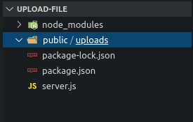
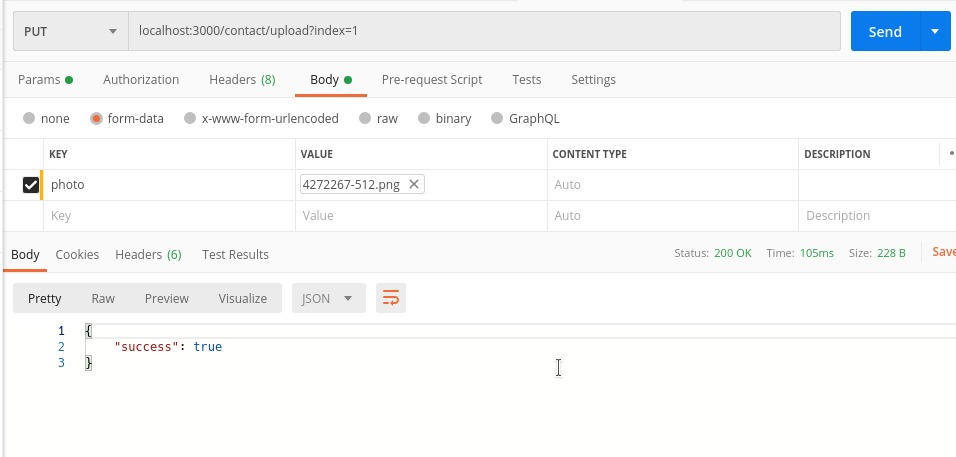

# Mengunggah File Menggunakan Express JS

## 1. Permasalahan

Selain menerima data dari body menggunakan format `url encoded` dan `json`, sebuah web server juga dapat menerima file dari client. Misalnya apabila kita akan membuat sebuah web yang memiliki fitur upload seperti upload foto profile.

## 2. Solusi

Untuk mengirim sebuah file, client harus mengirimkan data melalui body dengan format `form data`. Kemudian server dapat memparsingnya menggunakan middleware `multer`. Node JS sendiri tidak dapat menghandle multipart request. Sehingga membutuhkan Multer.  
 `Multer` adalah middleware node.js untuk menangani multipart / form-data, yang biasanya digunakan untuk mengunggah file.

## 3. Cara Parsing Form Data Menggunakan Middleware Multer

### 3.1 Membuat folder untuk menyimpan file
Langkah pertama untuk menerapkan multer pada express adalah dengan membuat folder untuk menyimpan file yang akan diunggah, misalnya folder `upload`

3.2 Buat variable untuk menyimpan nama file yang akan di upload.

```javascript
let filename;
```

3.3 Aturlah lokasi penyimpanan file :  
 note : ubah kalimat dalam tanda `<>` sesuai dengan lokasi folder kalian.  
 Nama file diambil dari nama field pada form kalian kemudian tanggal dan diakhiri dengan format photo yang di upload.

```javascript
const storage = multer.diskStorage({
  destination: function (req, file, cb) {
    cb(null, path.join(__dirname, "<lokasi folder untuk menyimpan file>"));
  },
  filename: function (req, file, cb) {
    cb(
      null,
      (fileName =
        file.fieldname + "-" + Date.now() + path.extname(file.originalname))
    );
  },
});
let upload = multer({ storage });
```

3.4 Buatlah rute untuk upload file (boleh POST/PUT) :  
 note : ubah kalimat dalam tanda `<>` sesuai dengan nama field input file pada form kalian.

```javascript
app.put(
  "/contact/upload",
  upload.single("<nama input file pada form data>"),
  (req, res, next) => {
    const file = req.file.path;
    console.log(file);
    if (!file) {
      res.status(400).send({
        status: false,
        data: "No File is selected.",
      });
    }
    next();
    //sesuaikan baris kode dibawah ini dengan data kalian
    // ini adalah contoh menyimpan lokasi upload data contacts pada index yang diinginkan (karena data contact berbentuk array)
    contacts[req.query.index].photo = req.file.path;
    res.send({ success: true });
  }
);
```

## 4. Contoh Kasus

source code akhir contoh kasus :

### Langkah - langkah :

4.1 Buatlah folder dengan nama upload-file, lalu masuk ke dalam folder tersebut, dan ketikkan npm init untuk membuat file `package.json` yang akan mengatur semua dependency project kita.

```bash
$ mkdir upload-file
$ cd upload-file
$ npm init
```

4.2 Install `express` dan `multer`

```bash
$ npm i express multer --save
```

4.3 Buatlah folder `public` yang didalamnya terdapat folder `upload` untuk menyimpan file yang akan di upload. Sehingga struktur foldernya seperti dibawah ini :


4.4 Buatlah file `server.js` yang letak penyimpanan nya sejajar dengan package.json. Seperti contoh di bawah ini :  


4.5 Selanjutnya kita akan mengedit file `server.js`.  
Pertama, definisikan dependency yang akan kita gunakan :

```javascript
// definisikan dependency yang dibutuhkan
const express = require("express");
const app = express();
const multer = require("multer");
//untuk menambahkan path
const path = require("path");
```

4.6 Buat variable `filename` untuk menyimpan nama file yang akan di upload.

```javascript
// variabel untuk menyimpan nama file ketika akan di upload
let fileName;
```

4.7 Mengatur lokasi penyimpanan file. Yaitu pada folder `public/uploads`.  
Nama file diambil dari nama field input file pada form kemudian tanggal dan diakhiri dengan format photo yang di upload.

```javascript
// menentukan lokasi pengunggahan
const storage = multer.diskStorage({
  destination: function (req, file, cb) {
    cb(null, path.join(__dirname, "public/uploads"));
  },
  filename: function (req, file, cb) {
    cb(
      null,
      (fileName =
        file.fieldname + "-" + Date.now() + path.extname(file.originalname))
    );
  },
});
let upload = multer({ storage });
```

4.8 Lalu buatlah data array contact (seperti materi sebelumnya).

```javascript
const contacts = [
  {
    name: "amir",
    phone: "085482938471",
  },
  {
    name: "budi",
    phone: "086452738493",
  },
];
```

4.9 Buatlah fungsi untuk mengecek validasi index (seperti materi sebelumnya).

```javascript
function validateIndex(req, res, next) {
  if (
    req.query.index !== undefined &&
    contacts[req.query.index] === undefined
  ) {
    res.send({ success: false });
  } else {
    next();
  }
}
```

4.10 Buatlah `middleware` seperti pada materi sebelumnya :

```javascript
app.use(validateIndex);
app.use(express.json());

app.get("/contact", function (req, res) {
  res.send(contacts);
});

app.post("/contact", function (req, res) {
  contacts.push({ name: req.body.name, phone: req.body.phone });
  res.send({ success: true });
});

app.put("/contact", function (req, res) {
  contacts[req.query.index] = { name: req.body.name, phone: req.body.phone };
  res.send({ success: true });
});

app.delete("/contact", function (req, res) {
  contacts.splice(req.query.index, 1);
  res.send({ success: true });
});
```

4.11 Selanjutnya buat `middleware` untuk penerapan `multer` pada data array :

```javascript
// menerapkan middleware multer hanya pada rute berikut
app.put("/contact/upload", upload.single("photo"), (req, res, next) => {
  const file = req.file.path;
  console.log(file);
  if (!file) {
    res.status(400).send({
      status: false,
      data: "No File is selected.",
    });
  }
  next();
  // menyimpan lokasi upload data contacts pada index yang diinginkan
  contacts[req.query.index].photo = req.file.path;
  res.send({ success: true });
});
```

4.12 Sertakan baris kode program untuk mengatur port yang akan digunakan untuk menjalankan server.

```javascript
app.listen(3000, function () {
  console.log("server running");
});
```

## Source Code Lengkap server.js :

```javascript
// definisikan dependency yang dibutuhkan
const express = require("express");
const app = express();
const multer = require("multer");
//untuk menambahkan path
const path = require("path");

//menyimpan nama file ketika akan di upload
let fileName;

// menentukan lokasi pengunggahan
const storage = multer.diskStorage({
  destination: function (req, file, cb) {
    cb(null, path.join(__dirname, "public/uploads"));
  },
  filename: function (req, file, cb) {
    cb(
      null,
      (fileName =
        file.fieldname + "-" + Date.now() + path.extname(file.originalname))
    );
  },
});
let upload = multer({ storage });

const contacts = [
  {
    name: "amir",
    phone: "085482938471",
  },
  {
    name: "budi",
    phone: "086452738493",
  },
];

function validateIndex(req, res, next) {
  if (
    req.query.index !== undefined &&
    contacts[req.query.index] === undefined
  ) {
    res.send({ success: false });
  } else {
    next();
  }
}

app.use(validateIndex);
app.use(express.json());

app.get("/contact", function (req, res) {
  res.send(contacts);
});

app.post("/contact", function (req, res) {
  contacts.push({ name: req.body.name, phone: req.body.phone });
  res.send({ success: true });
});

app.put("/contact", function (req, res) {
  contacts[req.query.index] = { name: req.body.name, phone: req.body.phone };
  res.send({ success: true });
});

app.delete("/contact", function (req, res) {
  contacts.splice(req.query.index, 1);
  res.send({ success: true });
});

// menerapkan middleware multer hanya pada rute berikut
app.put("/contact/upload", upload.single("photo"), (req, res, next) => {
  const file = req.file.path;
  console.log(file);
  if (!file) {
    res.status(400).send({
      status: false,
      data: "No File is selected.",
    });
  }
  next();
  // menyimpan lokasi upload data contacts pada index yang diinginkan
  contacts[req.query.index].photo = req.file.path;
  res.send({ success: true });
});

app.listen(3000, function () {
  console.log("server running");
});
```

4.13 Jalankan file server.js

```
$ nodemon server.js
```

4.14 Buka app postman untuk mengecek data array (gunakan method `GET`):


4.15 Masuk ke rute : `localhost:3000/contact/upload` dengan method `PUT`.  
Isikan index array dengan menggunakan req.query. Yaitu menambahkan `?index=1` setelah rute. Nilai 1 disesuaikan dengan index array yang akan kita tambahkan file photo.  
Pilih tab `Body` lalu klik `form-data` pada postman dan isikan seperti dibawah ini :

  
note: pastikan ubah tipe field photo menjadi `file`. Karena akan digunakan untuk mengupload file.

4.16 Jika output telah `"success": true` seperti pada gambar di langkah sebelumnya, maka file photo telah berhasil di upload.  
Cek kembali menggunakan method `GET` pada route `localhost:3000/contact`


## Selesai. Yeayyy
