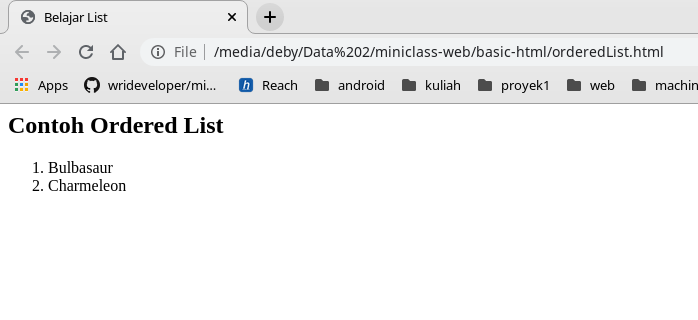
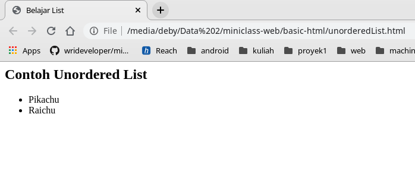
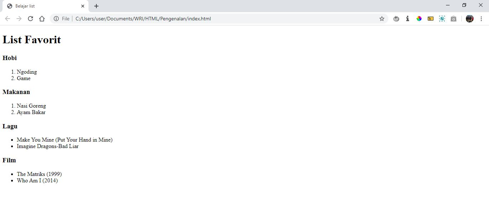

# List

## 1. Permasalahan

Pada pembuatan website, biasanya kita butuh menampilkan data dalam bentuk list untuk mempermudah pembacaan. Misalnya pada website media sosial, kita dapat menampilkan daftar user yang sedang online menggunakan list. Pada HTML, kita bisa saja membuat list menggunakan `<p>` seperti berikut :

```html
<p>1. item</p>
<p>2. item</p>
<p>3. item</p>
<p>4. item</p>
<p>5. item</p>
<p>6. item</p>
<p>7. item</p>
<p>8. item</p>
```

Namun, apabila ada item baru yang dimasukkan, maka kita harus merubah semua nomor item secara manual seperti berikut

```html
<p>1. item</p>
<p>2. item</p>
<!-- ada item baru yang dimasukkan disini, sehingga dia menjadi nomor urut 3 -->
<p>3. item yang baru masuk</p>
<!-- nomor item dibawahnya harus diubah manual supaya penomorannya urut lagi -->
<p>3. item</p>  <!-- ini harusnya nomor 4 -->
<p>4. item</p>  <!-- ini harusnya nomor 5 -->
<p>5. item</p> <!-- ini harusnya nomor 6 -->
<p>6. item</p> <!-- ini harusnya nomor 7 -->
<p>7. item</p> <!-- ini harusnya nomor 8 -->
<p>8. item</p> <!-- ini harusnya nomor 9 -->
```

Hal tersebut bisa menjadi masalah besar apabila kita harus membuat list yang memiliki banyak sekali item, karena membutuhkan waktu yang lama untuk merubah nomor item secara satu per satu

## 2. Solusi

Oleh karena itu dengan adanya permasalahan di atas, kita bisa menggunakan kombinasi dari tag `<ol/>` dan `<li>` untuk membuat list yang dapat memberikan penomoran item secara otomatis

## 3. Penjelasan List HTML
  
List digunakan untuk menampilkan kumpulkan text dalam bentuk daftar, ada dua jenis list, yaitu berurutan (ordered list), dan tidak berurutan (unordered list). 

### 3.1 Ordered List 
      
Ordered list merupakan list yang berurutan, sehingga setiap itemnya akan diberi nomor urut secara otomatis. Maka dari itu, kita tidak perlu lagi mengubah nomor item secara satu per satu apabila ada item baru yang dimasukkan. Untuk membuat ordered list kita dapat menggunakan tag `ol`, contohnya seperti berikut :
  
 ```html
<ol>
  <li>Bulbasaur</li>
  <li>Charmeleon</li>
</ol>
```

disana juga terdapat tag `li` yang digunakan untuk membuat list item, sehingga untuk setiap item pada list tersebut perlu kita bungkus dengan tag `li`.

Contoh tampilan Ordered List :




### 3.2 Unordered List

Unordered list merupakan list yang tidak berurutan, sehingga setiap item pada list tersebut tidak diberikan nomor urut, untuk membuat unordered list kita dapat menggunakan tag `ul`, contohnya seperti berikut :

```html
<ul>
  <li>Pikachu</li>
  <li>Raichu</li>
</ul>
```

Disana juga terdapat tag `li` yang digunakan untuk membuat list item, sehingga untuk setiap item pada list tersebut perlu kita bungkus dengan tag `li`.

Contoh tampilan Unordered List :  


## 4. Contoh Kasus

Dari materi di atas sudah dijelaskan ringkasan mengenai list, untuk lebih memahami lagi, mari kita mencoba untuk membuat website sederhana untuk menampilkan list menu favorit.


### 4.1. Membuat File HTML Baru

Pertama, kita buat file html baru bernama `index.html`. Kemudian isilah dengan struktur dasar HTML seperti berikut

```html
<!-- index.html -->
<html>
<head>
	<title>Belajar list</title>
</head>
<body>
	<h1>List Favorit</h1>
</body>
</html>
```

### 4.2. Menambahkan Ordered List

Selanjutnya, kita akan menambahkan dua ordered list untuk menampilkan daftar hobi dan makanan favorit menggunakan tag `<ol>`

 ```html
<!-- index.html -->
<html>
<head>
	<title>Belajar list</title>
</head>
<body>
	<h1>List Favorit</h1>

	<h3>Hobi</h3>
	<ol>
		<li>Ngoding</li>
		<li>Game</li>
	</ol>
	
	<h3>Makanan</h3>
	<ol>
		<li>Nasi Goreng</li>
		<li>Ayam Bakar</li>
	</ol>
</body>
</html>
```

### 4.3. Menambahkan Unordered List

Kemudian, kita akan menambahkan unordered list untuk menampilkan daftar lagu dan film favorit menggunakan tag `<ul>`


 ```html
<!-- index.html -->
<html>
<head>
	<title>Belajar list</title>
</head>
<body>
	<h1>List Favorit</h1>
	<h3>Hobi</h3>
	<ol>
		<li>Ngoding</li>
		<li>Game</li>
	</ol>
	<h3>Makanan</h3>
	<ol>
		<li>Nasi Goreng</li>
		<li>Ayam Bakar</li>
	</ol>
	<h3>Lagu</h3>
	<ul>
		<li>Make You Mine (Put Your Hand in Mine)</li>
		<li>Imagine Dragons-Bad Liar</li>
	</ul>
	<h3>Film</h3>
	<ul>
		<li>The Matriks (1999)</li>
		<li>Who Am I (2014)</li>
	</ul>
</body>
</html>
```

### 4.4. Hasil Akhir

Setelah melakukan perubahan diatas, simpanlah dan buka file `index.html` pada browser, sehingga tampilannya akan menjadi seperti berikut




