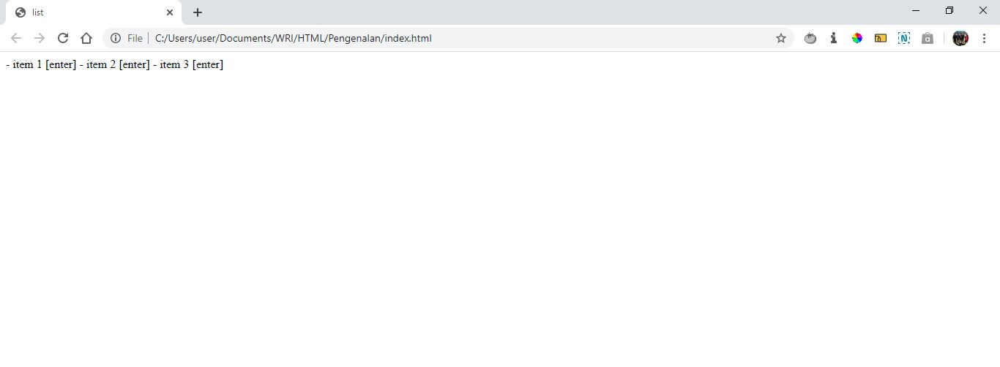

# List

## 1. Permasalahan

  Pada pembuatan website, biasanya kita butuh menampilkan data dalam bentuk list untuk mempermudah pembacaan. Namun, pada HTML kita tidak bisa langsung membuat list menggunakan text. contohnya seperti berikut:

  ```html
- item 1 [enter]
- item 2 [enter]
- item 3 [enter]    
  ```

  kode di atas jika di tampilkan di web browser maka hasilnya akan seperti berikut:

  


## 2. Solusi

  Oleh karena itu dengan adanya permasalahan di atas maka kita bisa menggunakan kombinasi dari tag ```<ol/> dan <ul/>```.

## 3. Detail Materi
  
  List digunakan untuk menampilkan kumpulkan text dalam bentuk daftar (list), ada dua jenis list, yaitu berurutan (ordered list), dan tidak berurutan (unordered list). 

  ### 3.1 Ordered List 
      
 Ordered list merupakan list yang berurutan, sehingga setiap itemnya akan diberi nomor urut, untuk membuat ordered list kita dapat menggunakan tag `ol`, contohnya seperti berikut :
  
 ```html
<ol>
  <li>Bulbasaur</li>
  <li>Charmeleon</li>
</ol>
```

disana juga terdapat tag `li` yang digunakan untuk membuat list item, sehingga untuk setiap item pada list tersebut perlu kita bungkus dengan tag `li`.

Contoh tampilan Ordered List :


  ### 3.2 Unordered List

  Unordered list merupakan list yang tidak berurutan, sehingga setiap item pada list tersebut tidak diberikan nomor urut, untuk membuat unordered list kita dapat menggunakan tag `ul`, contohnya seperti berikut :

```html
<ul>
  <li>Pikachu</li>
  <li>Raichu</li>
</ul>
```

Disana juga terdapat tag `li` yang digunakan untuk membuat list item, sehingga untuk setiap item pada list tersebut perlu kita bungkus dengan tag `li`.


Contoh tampilan Unordered List :  


## 4. Praktek!

Dari materi di atas sudah dijelaskan ringkasan mengenai list, untuk lebih memahami lagi, Ikuti intruksi dibawah ini:

1. Buatlah Website sederhana untuk menampilkan menu Favorit Anda.

2. List yang perlu ditampilkan adalah hobi, makanan, lagu, dan film. 

3. Untuk list hobi dan makanan berikan tag ``<ol/>``

4. Untuk list lagu dan film berikan tag ``<ul>``

  Contoh tampilan hasil kasus diatas sebagai berikut: 


  


