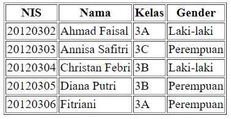

# Table

## 1. Permasalahan

Pada pembuatan website, biasanya kita butuh menampilkan data yang memiliki banyak property, misalnya data siswa memiliki property NIS, nama, kelas, dan gender. Data ini akan tidak cocok apabila ditampilkan menggunakan list. Cara yang lebih cocok untuk menampilkan data ini adalah dengan menggunakan tabel. Sehingga masing - masing property akan ditampilkan pada masing - masing kolom pada tabel tersebut.

## 2. Cara Membuat Table Pada HTML

Dalam table terdapat baris dan kolom untuk memudahkan penyajian data. Untuk membuat table pada HTML, kita dapat menggunakan kombinasi tag `table` dengan `tr`, `th`, dan `td`.

### 2.1. Tag `<table>`

Langkah pertama untuk membuat tabel pada HTML adalah dengan menuliskan tag `<table>`. Tag ini digunakan untuk membuat tabel baru. Kita juga bisa memberikan border pada table tersebut dengan menuliskan lebar border pada attribute `border`

```html
<table border="1px"></table>
```

### 2.2. Tag `<tr>`

Sebelum membuat table header atau table data, kita perlu membuat baris baru terlebih dahulu. Untuk membuat baris baru, kita bisa menuliskan tag `<tr>` di dalam tag `<table>` seperti berikut.

```html
<table border="1px">
  <tr></tr>
</table>
```

### 2.3. Tag `<th>`

Tag `<th>` digunakan untuk membuat table header atau kolom header. Biasanya tag ini digunakan untuk mendeskripsikan data - data apa saja yang akan disajikan pada tabel yang akan dibuat. Untuk membuat table header baru, masukkan tag `<th>` ke dalam tag `<tr>` yang sudah dibuat

```html
<table border="1px">
  <tr>
    <th>kolom 1</th>
    <th>kolom 2</th>
    <th>kolom 3</th>
  </tr>
</table>
```

### 2.4. Tag `<td>`

Tag `<td>` digunakan untuk membuat table data, atau bisa dibilang data yang akan disajikan pada table tersebut. Untuk membuat table data baru, masukkan tag `<td>` ke dalam tag `<tr>` baru.

```html
<table border="1px">
  <tr>
    <th>kolom 1</th>
    <th>kolom 2</th>
    <th>kolom 3</th>
  </tr>
  <tr>
    <td>data baris 1 kolom 1</td>
    <td>data baris 1 kolom 2</td>
    <td>data baris 1 kolom 3</td>
  </tr>
  <tr>
    <td>data baris 2 kolom 1</td>
    <td>data baris 2 kolom 2</td>
    <td>data baris 2 kolom 3</td>
  </tr>
</table>
```

## 3. Contoh penggunaan table dalam sebuah kasus

Dalam sebuah halaman sekolah, ingin menampilkan data-data seluruh siswanya seperti NIS, Nama, Kelas, dan Gender. Contoh table seperti berikut :



### 3.1 Buat file html

Buat file baru menggunakan text editor dengan nama file `index.html`

### 3.2 Buat tag table

Tulislah dalam html dengan tag `<table>` lalu tutup dengan `</table>`

```html
<html>
  <head>
    <title>Membuat tabel</title>
  </head>
  <body>
    <table></table>
  </body>
</html>
```

### 3.3 Membuat table header

Selanjutnya, tambahkan table header untuk memberikan deskripsi tentang data apa yang akan ditampilkan. Disini kita bisa membuat baris baru menggunakan `<tr>`, kemudian di dalam baris tersebut bisa kita tambahkan tag `<th>` untuk membuat beberapa table header sesuai kebutuhan.

```html
<html>
  <head>
    <title>Membuat tabel</title>
  </head>
  <body>
    <table>
      <tr>
        <th>NIS</th>
        <th>Nama</th>
        <th>Kelas</th>
        <th>Gender</th>
      </tr>
    </table>
  </body>
</html>
```

### 3.4 Membuat table data

Table data digunakan untuk menampilkan data-data yang ingin disajikan. Sebelum membuat table data jangan lupa untuk membuat baris baru menggunakan tag `<tr>` terlebih dahulu. Untuk membuat table data tulislah tag `<td>` lalu tutup dengan `</td>`

```html
<html>
  <head>
    <title>Membuat tabel</title>
  </head>
  <body>
    <table>
      <tr>
        <th>NIS</th>
        <th>Nama</th>
        <th>Kelas</th>
        <th>Gender</th>
      </tr>
      <tr>
        <td>20120302</td>
        <td>Ahmad Faisal</td>
        <td>3A</td>
        <td>Laki-laki</td>
      </tr>
    </table>
  </body>
</html>
```

### 3.5 Tambahan

Agar table mudah dilihat, kita bisa memberikan table border. Untuk memberikan table border, kita perlu menambahkan attribute `border` dalam tag `<table>`.

```html
<table border="1px"></table>
```

## Contoh penulisan keseluruhan

```html
<html>
  <head>
    <title>Membuat tabel</title>
  </head>
  <body>
    <table border="1px">
      <tr>
        <th>NIS</th>
        <th>Nama</th>
        <th>Kelas</th>
        <th>Gender</th>
      </tr>
      <tr>
        <td>20120302</td>
        <td>Ahmad Faisal</td>
        <td>3A</td>
        <td>Laki-laki</td>
      </tr>
      <tr>
        <td>20120303</td>
        <td>Annisa Safitri</td>
        <td>3C</td>
        <td>Perempuan</td>
      </tr>
      <tr>
        <td>20120304</td>
        <td>Christan Febri</td>
        <td>3B</td>
        <td>Laki-laki</td>
      </tr>
      <tr>
        <td>20120305</td>
        <td>Diana Putri</td>
        <td>3B</td>
        <td>Perempuan</td>
      </tr>
      <tr>
        <td>20120306</td>
        <td>Fitriani</td>
        <td>3A</td>
        <td>Perempuan</td>
      </tr>
    </table>
  </body>
</html>
```
