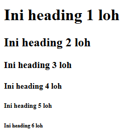
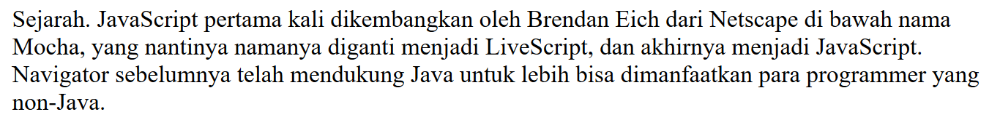

# Text Formatting

Dengan menggunakan HTML, kita bisa malakukan formatting terhadap text, seperti menebalkan, memiringkan, mencoret, atau menggaris bawahi suatu text

## 1. Heading

Heading digunakan untuk menuliskan judul, terdapat enam jenis heading, diurutkan tergantung dari pentingnya dan ukurannya, menggunakan angka seperti `h1`, `h2`, `h3`, `h4`, `h5`, dan `h6`.
Semakin kecil angka yang ada pada tag `h`, maka Heading akan semakin besar

```
<h1>Ini heading 1 loh</h1>
<h2>Ini heading 2 loh</h2>
<h3>Ini heading 3 loh</h3>
<h4>Ini heading 4 loh</h4>
<h5>Ini heading 5 loh</h5>
<h6>Ini heading 6 loh</h6>
```

Output :


## 2. Paragraph

Paragraph digunakan untuk mengelompokkan kumpulan text kedalam satu paragraph, untuk membuat paragraph pada HTML, kita bisa membungkus kumpulan text menggunakan tag `p`.

```html
<p>
  Sejarah. JavaScript pertama kali dikembangkan oleh Brendan Eich dari Netscape
  di bawah nama Mocha, yang nantinya namanya diganti menjadi LiveScript, dan
  akhirnya menjadi JavaScript. Navigator sebelumnya telah mendukung Java untuk
  lebih bisa dimanfaatkan para programmer yang non-Java.
</p>
```

Output :


## 3. Styling Text

Styling umum yang dapat digunakan antara lain bold `b`, italic `i`, underline `u`, dan strike-through `s`.

```html
<b>menebalkan text</b>

<i>memiringkan text</i>

<u>menggaris bawahi text</u>

<s>mencoret text</s>
```

Output :

