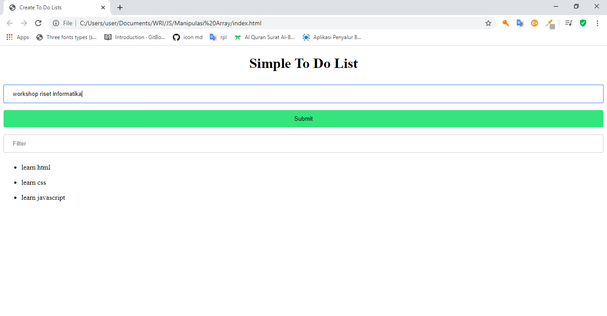

# Array

## 1. Permasalahan


Terkadang, untuk membuat suatu fitur pada web, kita butuh menyimpan list of data (atau kumpulan data), di dalam sebuah variable. Namun variable hanya bisa menyimpan satu data saja, bukan kumpulan data. Oleh karena itu ketika kita ingin mengumpulkan data, kita bisa menggunakan Array.

## 2. Penjelasan Array

Array merupakan variabel spesial yang dapat menyimpan banyak nilai sekaligus, bayangkan array adalah sebuah loker, loker dapat menyimpan banyak barang karena memiliki banyak pintu, masing - masing pintu memiliki nomor agar kita tidak bingung dimana kita menyimpan barang kita sebelumnya.

Sama seperti loker, array juga memiliki banyak index (pintu) dimana masing - masing index memiliki nomor index (nomor pintu), ketika ingin mengambil data dari sebuah array kita harus tau di index keberapa kita menyimpan data tersebut

## 3. Cara Membuat dan Mengakses Array

Sama seperti pada bahasa pemrograman yang lain penulisan array selalu di awali dengan simbol `[]`, begitupula dengan javascript kita bisa menuliskan javascript dengan menuliskan simbol ini. Untuk mengakses array pada javascript kita dapat memanggil nama variabel kemudian di ikuti dengan indexnya. Lebih jelasnya bisa memperhatikan program di bawah ini!.

```javascript
// cara membuat array
var kumpulan_buah = ['mangga', 'jeruk', 'apel', 'pisang']

// cara memanggil nilai dari array
console.log(kumpulan_buah[0]) // mangga
console.log(kumpulan_buah[1]) // jeruk

// cara mengubah nilai dari array
kumpulan_buah[0] = 'salak'

console.log(kumpulan_buah[0]) // salak
```

## 4. Manipulasi Array

Ada banyak sekali cara untuk memanipulasi array, di bawah ini adalah beberapa method yang sering digunakan dalam memanipulasi array:

- `array.filter()` : memfilter element array berdasarkan kondisi tertentu

- `array.push()` : memasukkan data baru ke array

- `array.map()` : mengubah struktur element array

- `array.forEach()` : melakukan looping untuk setiap element array

- `array.reduce()` : menggabungkan element array menjadi satu

- `array.find()` : menemukan item tertentu pada suatu array

- `array.indexOf()` : mendapatkan index dari item yang diinginkan

- `array.includes()` : memeriksa apakah suatu array berisi element tertentu (true or false)

untuk lebih mendalami lagi bisa [klik di sini](https://www.w3schools.com/jsref/jsref_obj_array.asp)

## 5. Studi Kasus

Dari materi di atas sudah dijelaskan ringkasan mengenai array, untuk lebih memahami lagi, mari kita mencoba untuk membuat website sederhana. Website ini nantinya akan dapat menampilkan list todo menggunakan tag `<ul />`, kemudian kita buat form untuk menambahkan data todolist(Menggunakan array.push), serta form filter yang di gunakan untuk menfilter data yang ingin di cari (Menggunakan array.filter).

### 5.1 Membuat File HTML Baru

Pertama, kita buat file html baru bernama `index.html`. Kemudian isilah dengan struktur HTML seperti berikut

```html
<html>
  <head>
    <title>
      Simple To Do Lists
    </title>
    <link rel="stylesheet" href="styles.css" />
  </head>
  <body>
    <div>
      <h1>Simple To Do List</h1>
      <input type="text" placeholder="Input" id="input_data" /><br />
      <button type="submit" id="input_submit">
        Submit
      </button>
      <input type="text" placeholder="Filter" id="input_search" />
    </div>
    <div id="content"></div>
    <script src="script.js"></script>
  </body>
</html>
```

### 5.2 Membuat File CSS Baru

Setelah file HTML sudah dibuat, kita bisa menambahkan file css agar tampilan yang dibuat nanti bisa lebih menarik.

```css
#input_data,
#input_search {
  width: 100%;
  padding: 12px 20px;
  margin: 8px 0;
  display: inline-block;
  border: 1px solid #ccc;
  border-radius: 4px;
  box-sizing: border-box;
}

#input_submit {
  width: 100%;
  background-color: rgb(52, 228, 125);
  color: #000;
  padding: 12px 20px;
  margin: 8px 0;
  border: none;
  border-radius: 4px;
  cursor: pointer;
}

h1 {
  text-align: center;
}
```

### 5.3 Membuat File Javascript Baru

Langkah ketiga kita manipulasi array sesuai dengan soal di atas.

```javascript
var data = []

var content = document.getElementById('content')
var input_data = document.getElementById('input_data')
var input_submit = document.getElementById('input_submit')
var input_search = document.getElementById('input_search')
input_submit.onclick = addData
input_search.onchange = renderData

function addData() {
  data.push(input_data.value)
  renderData()
  input_data.value = ''
}

function renderData() {
  content.innerHTML = ''
  var filterData = data.filter((item) => item.includes(input_search.value))
  for (var i = 0; i < filterData.length; i++) {
    console.log(filterData)
    content.innerHTML += `
        <ul data_item>
        <li class="item">${filterData[i]}</li>
        </ul>
      `
  }
}
```

### 5.4 Hasil Akhir

Setelah melakukan perubahan di atas, simpanlah dan buka file index.html pada browser, sehingga tampilannya akan menjadi seperti berikut

1. Menambahkan Data Baru

   

2. Filter Data

   
