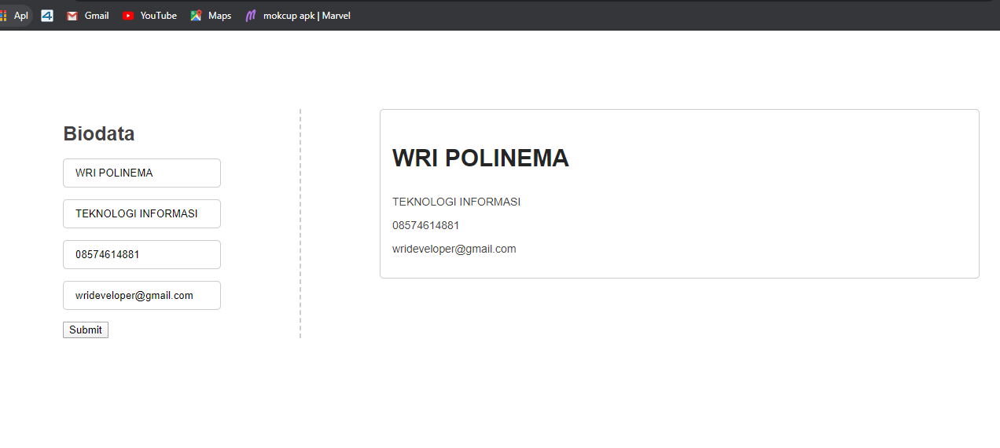

# Event Pada Javascript


## 1. Permasalahan
Saat membuat fitur web,terkadang kita membutuhkan perintah sebagai respon sistem terhadap kegiatan yang dilakukan oleh user pada web. Contohnya menampilkan pesan (alert) setelah user mengisi sebuah form, merubah warna button setelah di klik, dll.

## 2. Penjelasan Event

Event merupakan suatu respon dari web atau sistem terhadap kegiatan yang dilakukan oleh user dimana kegiatan tersebut akan memicu jalannya script javascript yang terhubung dengan file HTML dari web tersebut. 

Normalnya, event dikombinasikan dengan fungsi dimana fungsi tidak akan dieksekusi sebelum event terjadi

## 3. Penjelasan Detail Materi
Contoh-contoh event umum pada javascript, misalnya : 

1. **onclick**    : Event ketika user melakukan klik pada button 
2. **onkeypress** : Event ketika user menekan keyboard
3. **onchange**   : Event ketika nilai dari input form berubah 
4. **onload**     : Event ketika suatu elemen selesai dimuat
5. **onkeydown**  : Event ketika tombol keyboard ditekan atau dalam posisi down
6. **onkeyup**    : Event ketika tombol keyboard selesai ditekan atau dalam posisi up
7. **onsubmit**   : Event ketika suatu form akan mengirimkan data inputan 
8. **onblur**     : Event ketika kursor user terletak diluar kolom text 
9. **onfocus**    : Event ketika kursor user terletak pada kolom text. Contoh penggunaan  **onblur** dan **onfocus** pada form inputan data

contoh lain dari event javascript dapat dilihat pada referensi
## 4. Event Handler

### 4.1. Penjelasan Event Handler

Komputer akan mendengarkan kegiatan apa yang dilakukan oleh user dan menjalankan suatu fungsi saat event terjadi menggunakan Event Handler. Event Handler ditandai dengan keyword `on<event>` contohnya onsubmit, onclick, dsb.

### 4.2. Cara Membuat Event Handler

Ada tiga cara umum yang dapat kita gunakan untuk membuat event handler pada javascript

#### 4.2.1 Menggunakan Inline Event Handler

Inline Event Handler diterapkan didalam file HTML dengan menambahkan attribute pada suatu element

```html
<!-- index.html -->
<html>
  <head>
    <title>Belajar Event</title>
  </head>
  <body>

    <!-- tambahkan attribute onclick untuk menulis event handler -->
    <button onclick="console.log('event click terjadi')">Tekan saya</button>
  </body>
</html>
```
Aktivitas onclick pada syntax diatas dapat dilihat pada console yang dapat dibuka dengan mengklik kanan mouse, lalu pilih inspeksi.
Angka yang terdapat pada console bertanda merah tersebut akan bertambah setiap tombol di klik


```
note:
kelemahan menggunakan cara ini adalah akan mencampur-adukkan file HTML dan Javasript
```
#### 4.2.2 Menggunakan DOM Event Handler

Kita juga dapat menuliskan event handler pada file javascript  

```javascript
// index.js

// ambil element yang akan ditambahkan event handler
var button = document.getElementById("id")

// masukkan event handler pada onclick
button.onclick = function() {
  console.log('event click terjadi')
}
```


## 5. Event Object

Dalam Event, Event handler sebagai button yang dikenai aksi oleh user sedangkan Event object sebagai parameter pertama dari event handler yang berisi informasi terkait event yang sedang terjadi

```javascript
// index.js

var button = document.getElementById("id-button")
button.onclick = function(event) {
  // menampilkan button mouse mana yang diklik (kanan atau kiri)
  console.log(event.button)
}

var input = document.getElementById("id-input")
input.onchange = function(event) {
  // menampilkan value dari input setelah valuenya berubah
  console.log(event.target.value)
}
```

## 6. Studi Kasus Form Biodata
Pada studi kasus ini, kita akan membuat form biodata yang dapat ditambahkan datanya dan menampilkan alert yang berisi "hallo (nama yang diinputkan)". Setelah alert muncul, data yang diinputkan akan ditampilkan. Berikut contohnya





### 6.1 Membuat file `event.html` 
```html
<html>

<head>
    <title> Form app</title>
    <!-- link menuju file css -->
    <link rel="stylesheet" href="event.css" />
</head>

<body>
    <div class="app">
        <div class="form">
            <h1 class="form__title">Biodata</h1>
            <input class="form__input" type="text" placeholder="Nama" id="input_nama" />
            <input class="form__input" type="text" placeholder="Jurusan" id="input_jurusan" />
            <input class="form__input" type="text" placeholder="Phone" id="input_phone" />
            <input class="form__input" type="text" placeholder="Email" id="input_email" />
            <button class="form__button" type="submit" id="id_button">Submit</button>
        </div>
        <div class="biodata" id="biodata">

        </div>
    </div>

    <!-- link menuju file javascipt -->
    <script src="event.js"></script>
</body>

</html>
```

Pada div dengan class `app`, berisi 2 div dengan class `form` dan `biodata`. class `form` berisi kolom yang dapat disi dengan data dan button submit untuk menampilkan data. sedangkan class `biodata` berfungsi untuk menampilkan data yang telah diinputkan. Jangan lupa mencantumkan link yang menghubungkan file html dengan file css dan file javascript

### 6.2 Membuat File `event.css` untuk styling website
#### 6.2.1 Styling untuk form inputan

```css
* {
    box-sizing: border-box;
  }
  
  body {
    margin: 0;
    font-family: Arial, Helvetica, sans-serif;
  }
  
  .app {
    display: flex;
    justify-content: space-around;
    margin: 100px;
  }
  
  .form {
    border-right: dashed 2px #ccc;
    padding-right: 100px;
    margin-right: 100px;
  }
  
  .form__title {
    font-size: 25px;
    color: #424242;
  }
  
  .form__input {
    display: block;
    padding: 10px 15px;
    margin-bottom: 15px;
    border: solid 1px #ccc;
    border-radius: 5px;
    outline: none;
  }
  
  .form__submit {
    padding: 10px 20px;
    border: none;
    border-radius: 5px;
    background-color: #2d89d9;
    color: white;
    font-weight: bold;
  }
  ```
  #### 6.2.2 Styling untuk tampilan biodata yang telah diinputkan
  ```css
  .biodata {
    flex: 1;
  }
  
  .biodata__item {
    border: solid 1px #ccc;
    border-radius: 5px;
    margin-bottom: 15px;
    padding: 15px;
  }
  
  .biodata__nama {
    
    color: #252525;
    font-weight: bold;
    font-size: 30px;
  }
  .biodata__jurusan {
    color: #424242;
    font-size: 14px;
  }
  .biodata__phone {
    color: #424242;
    font-size: 14px;
  }

  .biodata__email {
    color: #424242;
    font-size: 14px;
  }
  ```

### 6.3 Membuat file `event.js`
#### 6.3.1 Deklarasi variabel
```javascript
// array untuk menampung data inputan
var data = []
// mengambil elemen berupa Id
var biodata = document.getElementById('biodata')
var input_nama = document.getElementById('input_nama')
var input_jurusan = document.getElementById('input_jurusan')
var input_phone = document.getElementById('input_phone')
var input_email = document.getElementById('input_email')
var id_button = document.getElementById('id_button')
```
Deklarasikan variabel yang digunakan untuk mengambil elemen yang ada pada file html dengan selection `getElementById`.

#### 6.3.2 Fungsi pada saat mengeklik button submit
```javascript
id_button.onclick = function () {
    var nama = input_nama.value
    alert('Hallo ' + nama)
    addBio()
}
```
Buatlah fungsi yang akan dijalankan saat button di klik. Fungsi ini menampilkan alert yang berisi "hallo (nama yang diinput)" dan bertugas untuk memanggil fungsi selanjutnya, yaitu `addBio()`

#### 6.3.3 Fungsi untuk menampilkan data
```javascript
function addBio() {
    var nama = input_nama.value
    var jurusan = input_jurusan.value
    var phone = input_phone.value
    var email = input_email.value

    data.push({
        nama: nama, jurusan: jurusan, phone: phone,
        email: email
    })
    renderBio()
}
```
Fungsi ini berfungsi untuk menampilkan data dan memanggil fungsi selanjutnya, yaitu `renderBio()`

### 6.3.4 Fungsi `renderBio()`
```javascript
function renderBio() {
    biodata.innerHTML = ''
    for (var i = 0; i < data.length; i++) {
        biodata.innerHTML += `
        <div class="biodata__item">
            <p class= "biodata__nama">${data[i].nama}</p>
            <p class= "biodata__jurusan">${data[i].jurusan}</p>
            <p class= "biodata__phone">${data[i].phone}</p>
            <p class= "biodata__email">${data[i].email}</p>
        </div>
        `
    }
}

renderBio()
```
Fungsi ini berfungsi untuk melooping data ke dalam Array yang telah di deklarasikan sebelumnya

## 7. Referensi

- **w3school** - https://www.w3schools.com/js/js_events.asp
- **flaviocopes** - https://flaviocopes.com/javascript-events/