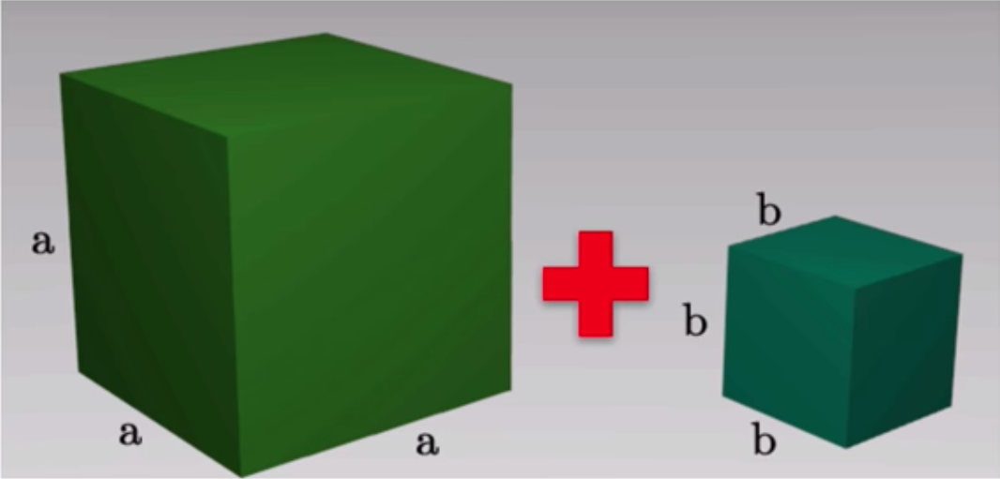

# Fungsi

## 1. Permasalahan

saya memiliki 2 buah kubus ,kubus a dan kubus b ,kita akan membuat program untuk menghitung jumlah volume dari tiap-tiap kubus ,hal yang perlu diketahui adalah :



1. sisi dari tiap-tiap kubus (a/b)
2. lalu hitung volume kubus a dan kubus b
3. lalu kita jumlahkan hasilnya dengan rumus (volumeA + volumeB).
4. lalu kita lapor/return kan hasil dari penjumlahan nya.


## 2. Cara Menghitung volume(review materi)
  Pertama-tama kita buat file baru ``index.js`` 

  ```html
      <!DOCTYPE html>
      <html lang="en">
      <head>
        <meta charset = "UTF-8">
        <title>Function</title>
      </head>
      <body>
        <script src="script.js"></script>
      </body>
      </html>

  ```
      
  Langkah kedua kita akan buat ``script.js``

 ```javascript
  var a = 8;
  var b = 3;
  var volumeA;
  var volumeB;
  var total;
  volumeA = a * a * a;
  volumeB = b * b * b;

  total = volumeA + volumeB;

```

2 file diatas adalah cara menjumlah kan volume balok secara manual ,masalah nya akan sangat ribet sekali jika banyak balok yang akan dihitung volume nya pasti akan sangat banyak kode yang berulang ,solusi nya adalah kita membuat suatu fungsi dimana fungsi ini akan menghitung otamatis dengan hanya beberapa baris kode yang nilai inputannya bisa kita ubah dengan mudah. 

### 2.1 Struktur Fungsi
```javascript

function hitungJumlahVolumeDuaKubus(a,b){
var volumeA;
var volumeB;
var total;

volumeA = a * a * a;
volumeB = b * b * b;

return total = volumeA + volumeB;
}

```

**function** = keyword pada javascript.  
**HitungVolume** = nama fungsinya.  
**()** = Parameter/argument(tempat inputan).  
**a dan b** = adalah bahan-bahan inputan atau nilai yang akan di proses oleh fungsi.  
**{}** = pembatas dari fungsi tersebut.  
**var** = adalah cara javascript membuat variable.  
**return** = keyword yang bisa mengembalikan nilai/hasil laporan dari sebuah proses.

*cara baca nya adalah javascript tolong buatkan saya sebuah fungsi yang bernama **hitungJumlahVolumeDuaKubus** dengan bahan inputan **a dan b** dimana perhitungan nya adalah menghitung sebuah volume dari beberapa kubus dengan rumus (sisi X sisi X sisi) lalu jika sudah **tambahkan nilai yang ada pada volume-volume tersebut lalu simpan pada variable total dan laporkan hasilnya nya .***


### 2.2 Penerapan fungsi

dari file diatas ``index.html`` dan ``script.js``
maka kita perlu merubah code di script.js
seperti berikut :
```javascript
// script.js

function jumlahVolumeDuaKubus(a,b) {
  var volumeA;
  var volumeB;
  var total;

  volumeA = a * a * a;
  volumeB = b * b * b;

  total = volumeA + volumeB;
  return total;
  
}

console.log(jumlahVolumeDuaKubus(8,6));


```

lalu setelah kita selesai merubah code nya kita panggil fungsi nya dengan cara *namaFungsi()* yang dituliskan di ``script.js`` ,dikode diatas saya menggunakan console.log 

kita juga dapat merubah bahan-bahan inputan nilai yang ada di parameter sesuai keinginan

```javascript
// script.js

function jumlahVolumeDuaKubus(a,b) {
  var volumeA;
  var volumeB;
  var total;

  volumeA = a * a * a;
  volumeB = b * b * b;

  total = volumeA + volumeB;
  return total;
  
}

console.log(jumlahVolumeDuaKubus(8,6));
console.log(jumlahVolumeDuaKubus(9,3));
console.log(jumlahVolumeDuaKubus(5,10));

```

### 2.3 Fungsi tidak mengembalikan nilai tanpa return
Berikut contoh pembuatan fungsi sederhana bernama hitungLuasPersegiPanjang. Setelah fungsi tersebut dibuat, maka bisa dijalankan berkali - kali
```javascript
// index.js

// membuat fungsi untuk menghitung luas persegi panjang
function hitungLuasPersegiPanjang() {
  var panjang = 5
  var lebar = 6
  var luas = panjang * lebar
  console.log(luas)
}

// menjalankan fungsi
hitungLuasPersegiPanjang() // output : 30

```

jika diawal kita menggunakan return atau mengisi nilai pada parameter maka di fungsi sederhana diatas ini kita langsung mendeklarasikan nilai pada variable nya ,sengaja saya menjelaskan bab ini terakhir hanya sebagai pelengkap saja karena yang common atau sering dipakai adalah function yang berparameter.

file javascript bisa di cek di [sini](implementation/fungsi)
