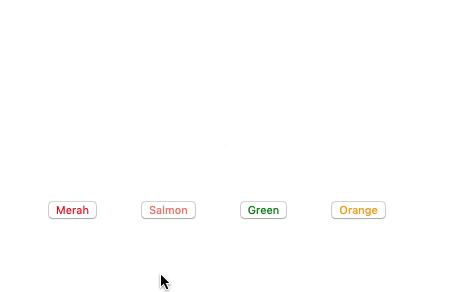

# Fungsi

## 1. Permasalahan

Terkadang, saat kita membuat fitur program, kita memiliki beberapa perintah yang sama, yang selalu kita tulis berulang - ulang, sehingga baris kode yang kita miliki menjadi banyak sehingga kode yang kita buat tidak cukup efektif.

Lalu bagaimana cara agar kita membuat program kita lebih efektif, tidak menulis perintah yang sama secara berulang - ulang ?

## 2. Penjelasan Fungsi

Fungsi merupakan kumpulan perintah yang digabung menjadi satu dan bisa dipanggil secara bersamaan. Apabila ada perintah - perintah yang sama, bisa kita masukkan ke dalam fungsi, sehingga kita tidak perlu menuliskan perintah yang sama tersebut berulang kali

### 2.1. Cara Membuat Fungsi

Untuk membuat sebuah fungsi, kita dapat menggunakan kata kunci `function` dengan diikuti nama fungsinya. Berikut contoh pembuatan fungsi untuk menghitung luas persegi panjang.

```javascript
// membuat fungsi untuk menghitung luas persegi panjang
function hitungLuasPersegiPanjang() {
  var panjang = 5
  var lebar = 6
  var luas = panjang * lebar
  console.log(luas)
}

// menjalankan fungsi
hitungLuasPersegiPanjang() // output : 30

// fungsi bisa dijalankan lagi
hitungLuasPersegiPanjang() // output : 30
```

Apabila kita menjalankan fungsi `hitungLuasPersegiPanjang` diatas, maka pada console browser akan muncul output `30` dari hasil perhitungan luas persegi panjang. Apabila kita ingin menghitung luas persegi panjang lagi, kita tinggal memanggil fungsi `hitungLuasPersegiPanjang` tersebut sekali lagi, jadi tidak perlu menuliskan script hitung luas persegi berkali - kali

### 2.2 Jenis - Jenis Fungsi

1. Menggunakan cara biasa;
2. Menggunakan parameter
3. Menggunakan return

#### 2.2.1. Membuat Fungsi dengan Cara Biasa

Berikut cara membuat fungsi yang paling sederhana yang sudah dicontohkan pada penjelasan diatas.

```javascript
function hitungLuasPersegiPanjang() {
  var panjang = 5
  var lebar = 6
  var luas = panjang * lebar
  console.log(luas)
}
```

### 2.2.2. Membuat Fungsi yang menggunakan parameter

Pada contoh fungsi sebelumnya, kita bisa menghitung luas persegi panjang secara berulang kali, namun `panjang` dan `lebar` dari persegi panjang yang dihitung selalu sama. Agar kita dapat mengubah nilai dari `panjang` dan `lebar` pada fungsi `hitungLuasPersegiPanjang`, maka kita dapat menggunakan parameter. Kemudian, kita dapat memasukkan `panjang` dan `lebar` dari persegi panjang setiap kali kita memanggil fungsi `hitungLuasPersegiPanjang`

```javascript
// membuat fungsi dengan parameter panjang dan lebar
function hitungLuasPersegiPanjang(panjang, lebar) {
  var luas = panjang * lebar
  console.log(luas)
}

// menjalankan fungsi dengan memasukkan nilai parameter
hitungLuasPersegiPanjang(5, 6) // output : 30
hitungLuasPersegiPanjang(2, 4) // output : 8
hitungLuasPersegiPanjang(3, 5) // output : 15
```

### 2.2.3. Membuat Fungsi yang mengembalikan nilai

Agar nilai dari perhitungan luas persegi panjang dapat diolah kembali, kita dapat mengembalikan nilai dari fungsi `hitungLuasPersegiPanjang` menggunakan perintah `return`

```javascript
// index.js

// membuat fungsi yang mengembalikan nilai dari luas
function hitungLuasPersegiPanjang(panjang, lebar) {
  var luas = panjang * lebar
  return luas
}

var hasil = hitungLuasPersegiPanjang(5, 6) + 20
console.log(hasil) // output : 50
```

## 3.Contoh kasus

Cobalah temen-temen buat file html yang didalamnya terdapat 1 kotak beserta beberapa button yang apabila button tersebut di klik akan merubah warna dari kubus tersebut.

Disini kita akan membuat penerapan fungsi yang sudah kita pelajari sebelumnya di dalam html

### 3.1.Membuat file index

Pertama-tama, buatlah file `index.html` dan isi file html tersebut dengan kode di bawah ini.

```html
<!-- index html -->

<!DOCTYPE html>
<html lang="en">
  <head>
    <meta charset="UTF-8" />
    <title>Function</title>
    <link rel="stylesheet" href="style.css" />
    <!-- menghubungkan ke file style.css -->
  </head>
  <body>
    <div id="kotak"></div>
    <button class="merah" onclick="berubah('red')">Merah</button>
    <button class="salmon" onclick="berubah('salmon')">Salmon</button>
    <button class="hijau" onclick="berubah('greenyellow')">Green</button>
    <button class="orange" onclick="berubah('orange')">Orange</button>
  </body>
  <script src="script.js"></script>
  <!-- menghubungkan dengan file script.js -->
</html>
```

### 3.2.Membuat file style.css

Buatlah file `style.css` yang nantinya akan digunakan untuk menerapkan text formatting pada index.html. Kemudian, terapkan kode di bawah ini untuk mengubah style pada div yang memiliki id `kotak`. ubah juga style button nya.

```css
/* style.css */

#kotak {
  width: 100px;
  height: 100px;
  position: relative;
  background: transparent;
  margin: 50px 50px 50px 150px;
}

button {
  margin-left: 40px;
  transition-duration: 0.4s;
}

.merah {
  color: red;
}
.salmon {
  color: salmon;
}
.hijau {
  color: green;
}
.orange {
  color: orange;
}
```

### 3.3.Membuat file javascript

Buatlah file `script.js` yang nantinya akan digunakan untuk menerapkan fungsi yang akan mengubah warna dari setiap kotak ketika button di klik.

```javascript
// script.js

function berubah(warna) {
  document.getElementById('kotak').style.background = warna
}
```

hingga hasilnya seperti berikut :

