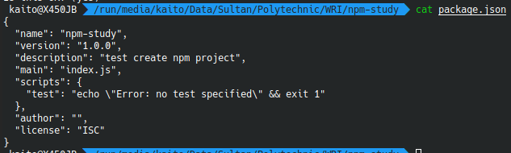

# Node Package Manager


## 1. Permasalahan

Untuk membuat web server menggunakan node.js, terkadang kita membutuhkan library atau package tambahan. Salah satu package yang sudah tersedia saat pertama kali menginstall node.js adalah package `http`. Pada saat pertama kali install node.js kita tidak mendapatkan semua package tambahan tersebut. Hal ini bertujuan agar:

* Ukuran file penginstalan node.js tidak besar
* Jika semua package tambahan yang ada telah terinstall pada saat kita menginstall node.js pertama kali maka akan menjadi tidak efisien, karena package yang tidak kita butuhkan akan ikut terpasang.

Untuk memudahkan dalam penginstalan package tambahan didalam node.js, hadirlah npm (Node Package Manager) sebagai solusi.

## 2. Penjelasan Node Package Manager

Node Package Manager (NPM) merupakan salah satu package manager yang digunakan untuk menginstall package di node.js, npm ini telah disertakan pada node.js, yang berarti pada saat kita menginstall node.js untuk pertama kali kita juga telah menginstall npm.

Untuk mengecek apakah dikomputer telah terinstall npm cukup ketikkan perintah

```bash
npm -v
```

## 3. Menginstall Package Menggunakan Node Package Manager

### 3.1. Inisiasi Project Node

Sebelum melakukan instalasi package, kita harus membuat project node terlebih dahulu, buatlah sebuah folder kosong kemudian jalankan perintah berikut

```bash
npm init
```

Kemudian ikuti petunjuk yang ada, seperti isikan nama package, versi, deskripsi, dll atau jika ingin secara default cukup tekan `enter`.

Setelah menjalankan perintah diatas, maka akan muncul file baru bernama `package.json` yang berisi informasi dari project yang dibuat



Gambar diatas adalah contoh isi file `package.json`

### 3.2. Menginstall Package

Gunakan perintah berikut untuk menginstall package node.js pada project yang sudah dibuat sebelumnya

```bash
npm install <package-name>

# contoh
npm install hello-world-node-package
```

Setelah melakukan penginstalan package, maka akan muncul folder baru bernama `node_modules` yang berisi script dari package yang diinstall. Daftar seluruh package dapat kita install menggunakan npm dapat ditemukan pada [https://www.npmjs.com/](https://www.npmjs.com/)

## 3.3. Menggunakan Package

Setelah package terinstall, maka package tersebut dapat digunakan pada project

```javascript
// index.js

// import package
const hello = require('hello-world-node-package')

// menggunakan package
hello.helloWorld() // output : Hello World!
hello.doSomethingAwesome() // output : Doing something awesome...
hello.doSomethingElse() // output : Now something else...
```

### 3.4. Uninstall Package

Gunakan perintah berikut untuk menguninstall package node.js pada project yang sudah dibuat sebelumnya

```bash
# uninstall local package
npm uninstall <package-name>

# contoh
npm uninstall hello-world-node-package
```

## 4. Referensi

**website resmi npm -** [https://www.npmjs.com/](https://www.npmjs.com/)

**dokumentasi npm -** [https://docs.npmjs.com/getting-started/what-is-npm](https://docs.npmjs.com/getting-started/what-is-npm)
