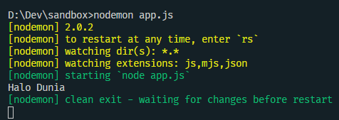
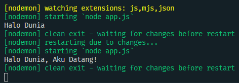
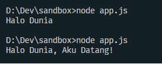

# Nodemon?


## 1. Permasalahan

Pernah gak sih kalian merasa sudah ubah file Javascript kalian tapi output dari program kalian masih seperti yang lama? Ya! barangkali kita semua lupa untuk merestart server yang kita buat. Maka dari itu hadirlah Nodemon ini untuk membantu kita yang sering lupa ini untuk merestart file kita secara otomatis saat kita menyimpan file kita.

## 2. Penjelasan

Nodemon adalah sebuah package yang membantu kita merestart aplikasi kita setiap ada perubahan pada file di project kita.

## 3. Install Nodemon

Pertama, pastikan project sudah terinisiasi dengan npm, jika belum maka lakukan inisiasi dahulu dengan

```
npm init
```

Lalu install nodemon pada direktori node kita

```
npm install nodemon -g
```

dengan `-g` berarti kita menginstall library secara global, sehingga package nodemon langsung terinstall pada sistem komputer.

## 4. Pengaplikasian

Untuk percobaan, kita buat satu file Javascript baru dengan nama app.js

```javascript
//app.js
console.log("Halo Dunia");
```

Untuk menjalankan aplikasi kita dengan Nodemon, cukup ketikkan

```
nodemon namafile.js
```



Saat ada perubahan pada file maka Nodemon langsung merestart aplikasi



## 5. Perbandingan

Coba kita bandingkan dengan tanpa menggunakan Nodemon, setelah menyimpan perubahan kita perlu mematikan aplikasi dan memulainya lagi secara manual.


