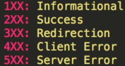

# HTTP Status Code

**HTTP status code** menunjukkan apakah HTTP Request telah berhasil diselesaikan. 

**HTTP status Code** memiliki beberapa kategori diantaranya :

1. **Informational** ( 100 - 199 )
2. **Successful Responses** (200 - 299 )
3. **Redirection Messages atau something moved** (300 - 399)
4. **Client Error Responses** (400 - 499)
5. **Server Error Responses** (500 - 599).

## 