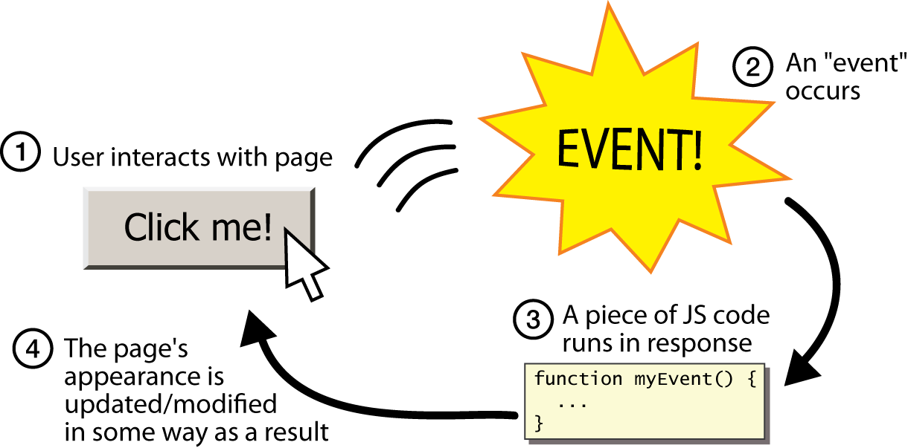

# Event Pada Javascript

Javascript bisa dijalankan atau dieksekusi ketika **sebuah event terjadi**, contoh dari event dalam HTML msisalnya : 

- ketika user mengklik pada suatu elemen html misalnya button (**onclick**)
- ketika halaman web selesai dimuat secara keseluruhan (**onload**)
- ketika mouse melakukan hover pada suatu elemen html (**onmouseover**)
- ketika nilai dari input form berubah (**onchange**)
- dan masih banyak lagi

**Referensi untuk belajar event pada javascript** :

- **w3school** - [https://www.w3schools.com/js/js_events.asp](https://www.w3schools.com/js/js_events.asp)

**Catatan :** untuk menghandle event pada javascript bisa menggunakan html event seperti `onchange`, `onsubmit`, `onclick` dll atau menggunakan method javascript `addEventListener()`