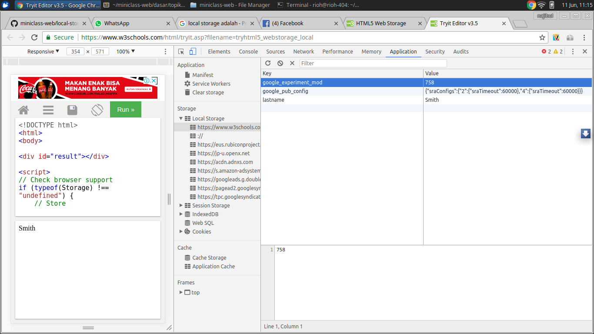

# Local Storage

HTML5 Web Storage adalah web penyimpanan lokal, artinya dengan HTML5 Web Storage kita dapat menyimpan data secara lokal dalam browser pengguna. Kamu bisa bayangkan hal ini mirip dengan Cookie. Kelebihan dari web storage adalah lebih aman dan lebih cepat. Data tidak disertakan setiap permintaan server, tetapi digunakan hanya ketika meminta. Hal ini juga memungkinkan untuk menyimpan sejumlah besar data, tanpa mempengaruhi kinerja situs web. Data disimpan dalam pasangan kunci atau nilai, dan halaman web hanya dapat mengakses data yang tersimpan dengan sendirinya.

## Ada dua objek baru untuk menyimpan data pada klien:

- **LocalStorage** - Menyimpan data tanpa tanggal kedaluwarsa.

- **SessionStorage** - Menyimpan data untuk satu sesi.

### Berikut ini contoh tempat dimana local storage di simpan

Jika kita penasaran dimana local storage di simpan, kita tidak usah bingung kita inspect element lalu pilih aplication, disana sudah ada sebuah menu local storage. Ini contohnya:

**Berikut beberapa tutorial tentang manipulasi Local Storage yang dapat dipelajari :**

[https://www.w3schools.com/html/html5_webstorage.asp](https://www.w3schools.com/html/html5_webstorage.asp)