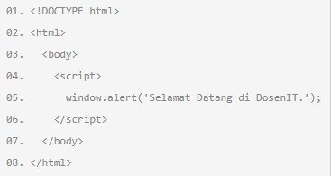
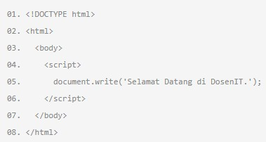
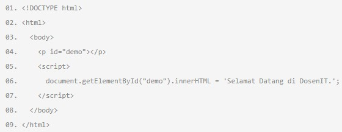
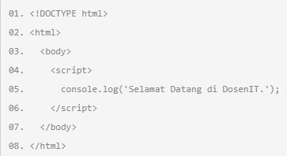
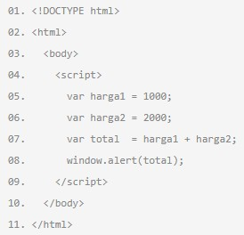
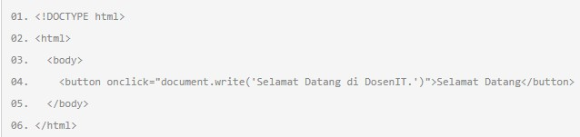
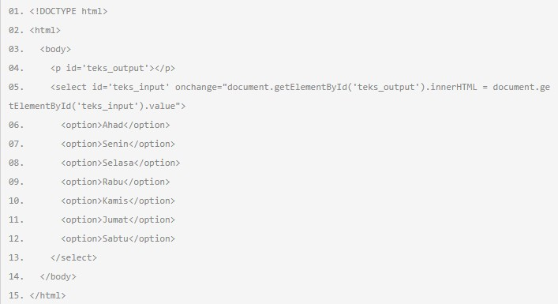

# Pengenalan Syntax Javascript

**Javascript** (JS) merupakan bahasa pemrograman yang biasa digunakan bersama dengan HTML dan CSS untuk menambahkan fitur interaktif pada website. 

Berikut terdapat beberapa contoh syntax dasar Javascript :

1. Menampilkan data pada dialog box menggunakan fungsi `windows.alert()`

   

   

2. Menampilkan data pada halaman web menggunakan fungsi `document.write()`

   

1. Menampilkan data pada element menggunakan fungsi `innerHTML`

   

   

2. Menampilkan data pada console menggunakan `console.log()`

   

   

3. Mendeklarasikan variable dalam javascript menggunakan `var`

   

   

4. Menggunakan event `onClick`

   

   

5. Menggunakan event `onChange`

   

