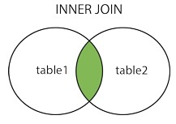
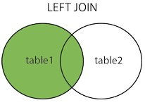
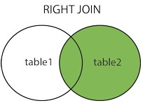

#Relasi Antar Table

Relasi antar table dalam database lebih dikenal dengan istilah **JOIN**.

Berikut beberapa jenis join yang ada pada relasi antar table :

1. **(INNER) JOIN**

   **INNER JOIN** mengembalikan record yang  memiliki kesamaan data antara kedua table.

   

   Untuk referensinya dapat dilihat pada link berikut :

   https://www.w3schools.com/sql/sql_join_inner.asp

   

2. **LEFT (OUTER) JOIN**

   **LEFT JOIN** mengembalikan semua record dari left table, dan mengembalikan record yang memiliki kesamaan (irisan) dengan right table.

   

   Untuk referensinya dapat dilihat pada link berikut :

   https://www.w3schools.com/sql/sql_join_left.asp 

   

3. **RIGHT (OUTER) JOIN**

   **RIGHT JOIN** mengembalikan semua record dari right table, dan mengembalikan record yang memiliki kesamaan (irisan) dengan left table.

   

   Untuk referensinya dapat dilihat pada link berikut :

   https://www.w3schools.com/sql/sql_join_right.asp

   

4. **FULL (OUTER) JOIN**

   **FULL JOIN** mengembalikan semua record pada kedua table, sekaligus record yang memiliki kesamaan diantara kedua table.

   

   Untuk referensinya dapat dilihat pada link berikut :

   https://www.w3schools.com/sql/sql_join_full.asp

