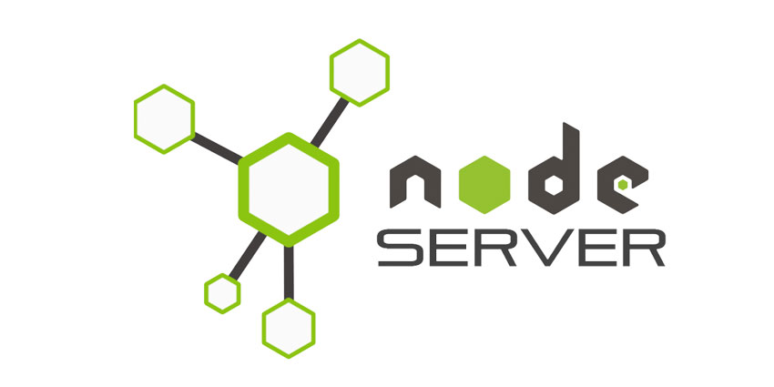

#  Membuat Web Server Dengan Node JS

Dengan teknologi node js kita bisa membuat server dengan hanya menggunakan javascript (good bye PHP :smirk:), sekarang kita akan belajar bagaimana cara membuat web server dengan menggunakan Node JS

## Membuat Web Server

Untuk membuat sebuah web server kita perlu meload module node js yang bernama `http`, module ini sudah disediakan ketika kita pertama kali menginstall node js, jadi kita tidak perlu menginstall module `http` ini menggunakan npm. setelah kita meload module http maka kita dapat membuat server dengan menggunakan method `createServer()`

## Penjelasan Module

**module** merupakan kumpulan dari library dan tool yang akan mempermudah kita dalam melakukan pembuatan proyek javascript, kita dapat menggunakan **npm** untuk menginstall module - module yang akan kita gunakan, ada juga module yang sudah disediakan oleh nodejs secara default, module ini disebut **built in module**, contoh built in module nodejs yaitu module `http` yang berguna untuk membuat web server, untuk meload suatu module kita menggunakan kata kunci `require()`

## Tutorial Membuat Web Server

Untuk mempelajari cara membuat web server dengan node js, silahkan kunjungi halaman berikut : [https://www.w3schools.com/nodejs/nodejs_http.asp](https://www.w3schools.com/nodejs/nodejs_http.asp)