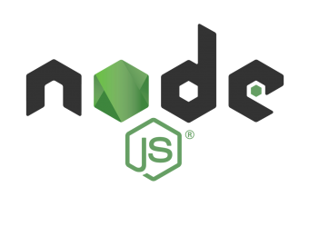

# Pengenalan Node JS dan NPM

Sebelum memulai pembuatan web dinamis mari kita berkenalan dulu dengan Node JS dan NPM

## 1. Node JS

**Node JS** merupakan runtime environment javascript yang dibangun menggunakan javascript engine milik chrome bernama **V8**.

**Runtime environment** merupakan tempat dimana suatu aplikasi dapat berjalan, misalnya aplikasi java akan berjalan pada JVM (Java Virtual Machine), sedangkan aplikasi javascript berjalan pada node js, karena node js inilah javascript jaman now dapat berjalan di server, mobile (dengan react native), IOT, robotik, desktop, dan masih banyak lagi.

**website resmi nodejs** - [https://nodejs.org](https://nodejs.org)

**dokumentasi nodejs** - [https://nodejs.org/en/docs/](https://nodejs.org/en/docs/)

## 2. NPM (Node Package Manager)

**NPM** merupakan salah satu package manager yang digunakan untuk menginstall framework atau library node js. Kalau PHP menggunakan composer maka node js menggunakan NPM

**website resmi npm -** [https://www.npmjs.com/](https://www.npmjs.com/)

**dokumentasi npm -** [https://docs.npmjs.com/getting-started/what-is-npm](https://docs.npmjs.com/getting-started/what-is-npm)

