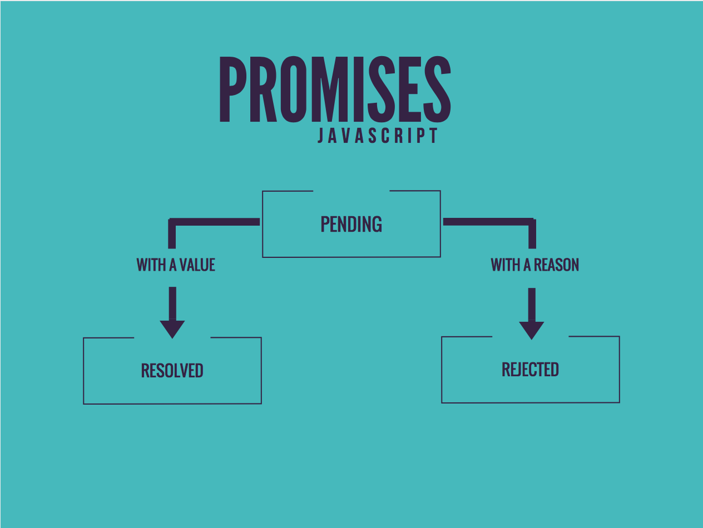

# Synchronous vs Asynchronous

Disini kita akan membahas tentang alur eksekusi program, yaitu synchronous dan asynchronous, hal ini penting untuk dipahami karena banyak bahasa pemrograman yang menggunakan konsep synchronous, sedangkan node js sendiri lebih banyak menerapkan konsep asynchronous.

## Synchronous

Merupakan alur eksekusi program yang dilakukan secara **seri** atau **berurutan**, sehingga suatu statement / request akan menunggu hingga response nya terjawab dahulu, baru kemudian request lain boleh dieksekusi.

Hal tersebut akan menjadi **permasalahan** apabila ada sebuah request yang membutuhkan waktu eksekusi yang cukup lama, misalnya meload sejuta data di database, hal ini akan **membloking** request lain karena harus menunggu request sebelumnya selesai.

## Asynchronous

Merupakan alur eksekusi program yang dilakukan secara **pararel**, artinya suatu statement / request tidak perlu menunggu request sebelumnya agar dapat dieksekusi, sehingga dalam satu waktu akan ada banyak request yang dapat dilakukan **secara bersamaan**. Hal ini akan mempercepat eksekusi suatu program.

## Handling Asynchronous dengan Javascript
Ada beberapa metode untuk melakukan handling async pada javascript, yaitu :

### 1. Callback
Callback merupakan sebuah **fungsi yang akan dijalankan tepat setelah suatu fungsi selesai dijalankan.** Callback merupakan cara paling sederhana untuk menghandle proses asynchronous, tetapi terkadang penggunaan callback yang berlebihan akan membuat code tidak rapi dan susah dibaca dan mengakibatkan _callback hell_

### 2. Promise

Promise merupakan suatu **objek yang berisi status dari proses asynchronous.** Status yang dimaksud adalah `pending` yaitu masih sedang diproses, `fulfilled` apabila proses async berhasil diselesaikan dan menghasilkan value, dan `rejected` apabila proses async gagal dilakukan beserta alasan mengapa gagal dilakukan.

### 3. Async Await
Merupakan cara baru untuk menghandle proses asynchornous, dengan async await kita dapat **menulis kode async serasa menulis kode sync**, sehingga membuat kita mudah membaca koding yang kita tulis
