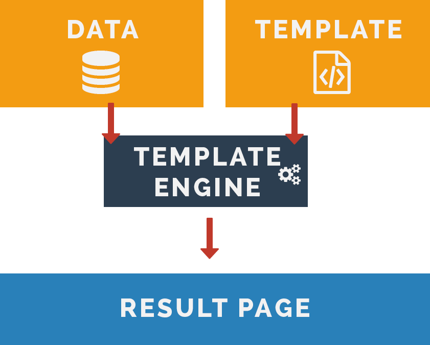

# Template Engine

Apakah kalian merasa terganggu melihat file html kalian yang berantakan atau terlalu panjang ? padahal hanya untuk menampilkan halaman sederhana, kalau iya disini kita akan mempelajari yang namanya template engine.

## Penjelasan Template Engine

**Template Engine** merupakan sebuah tool yang dapat memudahkan kita menulis sebuah tampilan web menjadi lebih sederhana, karena dengan template engine kita dapat menyingkat penulisan syntax html yang banyak menjadi lebih sedikit.

## Beberapa Contoh Template Engine

Berikut contoh - contoh template engine yang dapat digunakan dengan express js :

### 1. Pug

**Dokumentasi**

 [https://pugjs.org/api/getting-started.html](https://pugjs.org/api/getting-started.html)

**Tutorial**

- [https://www.youtube.com/watch?v=cddghkeGAdU](https://www.youtube.com/watch?v=cddghkeGAdU)
- [https://gist.github.com/joepie91/c0069ab0e0da40cc7b54b8c2203befe1](https://gist.github.com/joepie91/c0069ab0e0da40cc7b54b8c2203befe1)

### 2. EJS

**Dokumentasi**

 [http://ejs.co/#docs](http://ejs.co/#docs)

**Tutorial**

- [https://scotch.io/tutorials/use-ejs-to-template-your-node-application](https://scotch.io/tutorials/use-ejs-to-template-your-node-application)
- [https://www.youtube.com/watch?v=EYKjBJDPvEU](https://www.youtube.com/watch?v=EYKjBJDPvEU)

