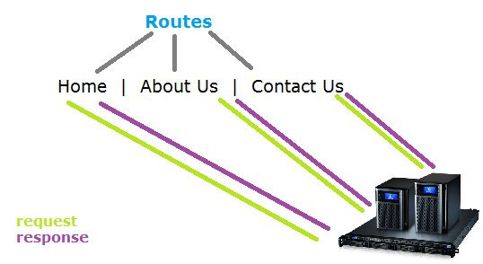

# Advance Routing pada Express JS



Setelah mempelajari tentang dasar-dasar routing pada express js, selanjutnya akan dibahas mengenai advance routing. Apa sebenarnya advance routing dan bagaimana penggunaanya? Berikut penjelasannya.

## Penjelasan Advance Routing
Advance routing adalah suatu teknik routing untuk mengatur rute berdasarkan fitur-fitur aplikasi. 

**Mengapa** perlu menggunakan teknik advance routing? 

Ketika aplikasi yang dibuat sudah dalam skala besar dan kompleks, perlu dibuat struktur aplikasi yang bagus untuk memudahkan dalam pengembangan aplikasi tersebut. Advance routing ini memilah-milah setiap rute berdasarkan fiturnya, sehingga semua rute tidak dijadikan dalam satu file. Bayangkan saja jika semua rute dituliskan pada satu file saja, pasti akan membingungkan dalam hal pengembangan aplikasi bahkan mungkin aplikasi tidak berjalan dengan efisien. Oleh karena itu, penting untuk menggunakan teknik advance routing ini.

## Cara Mengimplementasikan Advance Routing

1. Buat file untuk mengatur semua rute, misalnya app.js

    ```
    var index = require('routes/index');  
    var profile = require('routes/profile');  
    var search = require('routes/search');  
    
    app.use('/', index);  
    app.use('/profile', profile);  
    app.use('/search', search);
    ```

    Kode program terlihat lebih bersih karena rute disimpan dalam file yang berbeda. Variabel profile menyimpan rute-rute profil, dimana rute tersebut disimpan di file profile dalam folder routes. Begitu juga dengan rute pada fitur search.

    Advance routing ini menggunakan middleware untuk bisa mengakses rute-rute yang dibuat, ditunjukkan dengan adanya ``app.use()``. 

2. Buat folder routes, lalu buat file dengan nama profile (nama folder & file terserah, sesuai pada app.js)

    ```
    var express = require('express');  
    var router = express.Router();  
    
    router.get('/', function(req, res) { 
        ... 
    });  
    
    module.exports = router; //export the router
    ```

    Kode program di atas menunjukkan pembuatan router pada express, kemudian mengatur URL untuk setiap rute yang dibutuhkan. Rute yang sudah dibuat perlu di export agar bisa digunakan di app.js

**Untuk memahami lebih lanjut tentang advance routing silahkan lihat tutorial berikut**

- Express Routing - Advanced Techniques: [http://jilles.me/express-routing-advanced-techniques/](http://jilles.me/express-routing-advanced-techniques/)
- ExpressJS Advance Routing - Part 1: [https://www.youtube.com/watch?v=26wm0IQsDCs&index=23&list=PLYxzS__5yYQmHbpKMARP04F344zYRX91I](https://www.youtube.com/watch?v=26wm0IQsDCs&index=23&list=PLYxzS__5yYQmHbpKMARP04F344zYRX91I)
- ExpressJS Advance Routing - Part 2: [https://www.youtube.com/watch?v=a8uH3_Ykpp4&list=PLYxzS__5yYQmHbpKMARP04F344zYRX91I&index=24](https://www.youtube.com/watch?v=a8uH3_Ykpp4&list=PLYxzS__5yYQmHbpKMARP04F344zYRX91I&index=24)