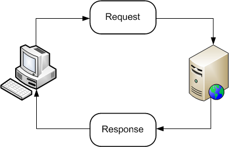

# Request dan Response

## Request

**Request** adalah operasi yang dilakukan dimana klien mengirimkan suatu permintaan yang nantinya akan ditanggapi oleh server.

Banyak method dari request, diantaranya adalah :

- `req.params()` : mengembalikan nilai parameter saat ini
- `req.accepts()` : memeriksa apakah jenis konten dapat diterima atau tidak
- dan lain-lain ...

## Response

**Response** adalah suatu operasi yang dilakukan oleh server untuk menampilkan/memberikan hasil dari proses request yang dilakukan oleh klien.

Method dari response, diantaranya adalah :
- `res.end()` : untuk mengakhiri response
- `res.json()` : mengirimkan response berupa json
- dan lain-lain ...

### Link Terkait

Untuk lebih mengetahui request dan response serta method-method yang dapat digunakan, kunjungi link dibawah ini :

**Link** -> https://expressjs.com/en/api.html
