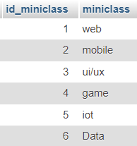
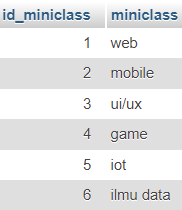

# DML

## 1. Permasalahan

Pada sebuah website, biasanya terdapat fitur untuk melakukan operasi CRUD (Create, Read, Update, dan Delete) seperti fitur edit biodata, hapus biodata, dsb. Dalam database kita dapat menggunakan operasi DML untuk mengatasi permasalahan tersebut.

## 2. Penjalasan DML

DML(Data Manipulation Language) adalah perintah SQL untuk melakukan manipulasi data dalam tabel. Manipulasi yang dimaksud disini adalah menambah data, mengupdate data, dan menghapus data.

- INSERT 

    Insert adalah sebuah operasi yang ada pada SQL untuk menambahkan baris baru pada sebuah tabel. 

    Klausa pembentuk :
    - INSERT = Keyword untuk melakukan operasi menambahkan baris baru
    - INTO = Merujuk pada nama tabel yang dioperasikan
    - VALUES = Nilai kolom yang ingin dimasukkan

    Format penulisan :
    ```sql
    # Tidak menyebutkan nama kolom secara spesifik (semua kolom)
    INSERT INTO [nama_tabel] 
    VALUES (value_kolom1, value_kolom2, ...)

    # Menyebutkan nama kolom secara spesifik
    INSERT INTO [nama_tabel] (nama_kolom1, nama_kolom2, ...) 
    VALUES (value_kolom1, value_kolom2, ...) 

    # Memasukkan banyak baris sekaligus
    INSERT INTO [nama_tabel] (nama_kolom1, nama_kolom2, ...) 
    VALUES ((value1_kolom1, value1_kolom2, ...),(value2_kolom1, value2_kolom2, ...))
    ```

- UPDATE

    Update adalah sebuah operasi yang ada pada SQL untuk mengubah nilai suatu baris pada sebuah tabel.

    Klausa pembentuk :
    - UPDATE = Keyword untuk melakukan operasi mengubah nilai suatu data
    - SET = Merujuk nama kolom yang ingin diubah
    - WHERE [Opsional] = Memfilter row/baris yang akan dioperasikan dengan kondisi tertentu

    Format penulisan :
    ```sql
    # Mengubah semua baris
    UPDATE [nama_tabel] SET [nama_kolom1] = [nilai1], [nama_kolom2] = [nilai2], ...

    # Mengubah baris tertentu
    UPDATE [nama_tabel] SET [nama_kolom1] = [nilai1], [nama_kolom2] = [nilai2], ... 
    WHERE [kondisi] 
    ```

- DELETE

    Delete adalah sebuah operasi yang ada pada SQL untuk menghapus suatu baris dari sebuah tabel.

    Klausa pembentuk :
    - DELETE = Keyword untuk melakukan operasi penghapusan baris dari sebuah tabel
    - FROM = Merujuk pada nama tabel yang dioperasikan
    - WHERE [Opsional] = Memfilter row/baris yang akan dioperasikan dengan kondisi tertentu

    Format penulisan :

    ```sql
    # Menghapus semua baris
    DELETE FROM [nama_tabel] 

    # Menghapus baris tertentu
    DELETE FROM [nama_tabel] 
    WHERE [kondisi]
    ```

## 3. Contoh Kasus
Terdapat dua table yang bernama anggota dan miniclass pada database wri. Kedua table tersebut saling berelasi, yaitu sebagai berikut


Dari kedua table tersebut, kolom miniclass yang ada pada table anggota merupakan sebuah foreign key dari primary ket id_miniclass yang ada pada table miniclass. 

- Isi dari table miniclass

    

- Isi dari table anggota

    

### 3.1 INSERT

Data Awal


```sql
# INSERT
INSERT INTO miniclass(miniclass)
VALUES (
    "Data"
)
# Query di atas adalah untuk memasukkan data baru ke kolom miniclass pada table miniclass
```

Hasil Query Setelah Dilakukan SELECT



### 3.2 UPDATE

```sql
# Mengubah baris tertentu
UPDATE miniclass 
SET miniclass = 'ilmu data'
WHERE miniclass = 'Data'
```

Hasil Query Setelah Dilakukan SELECT



### 3.3 DELETE

```sql
# Menghapus record dengan id_miniclass adalah 6
DELETE 
FROM miniclass
WHERE id_miniclass = 6
```

HASIL QUERY SETELAH DILAKUKAN SELECT

