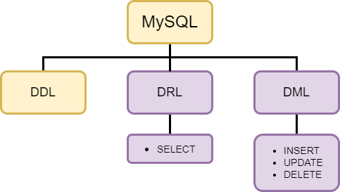
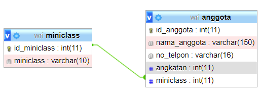
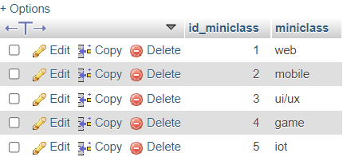
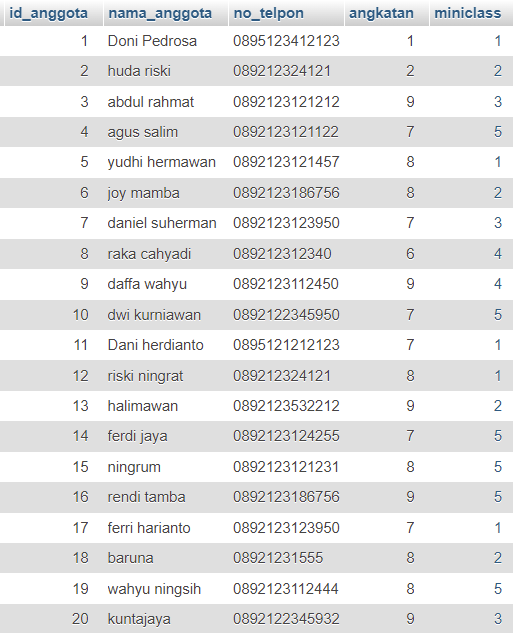
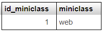
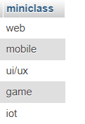
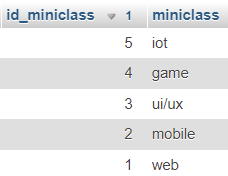
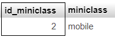

# DRL

## 1. Permasalahan

Pada sebuah website, biasanya terdapat fitur untuk melakukan operasi CRUD (Create, Read, Update, dan Delete) seperti fitur menampilkan biodata, pencarian, dsb. Dalam database kita dapat menggunakan operasi DRL untuk mengatasi permasalahan tersebut.

## 2. Penjalasan DRL

DRL(Data Retrieval Language) adalah perintah SQL untuk mengambil data dari tabel database. DRL terdiri dari beberapa klausa yang dapat dikembangkan lagi, antara lain:
- SELECT : Keyword untuk melakukan operasi DRL.
- FROM : Merujuk nama sebuah tabel yang akan dioperasikan. 
- WHERE : Memfilter row/baris yang akan dioperasikan dengan kondisi tertentu.
- ORDER BY : Mengurutkan record secara ASCENDING / DESCENDING.
- AS : Memberikan nama alias sementara untuk tabel atau kolom.

```sql
# Mengambil semua kolom dan semua baris
SELECT * FROM [nama_tabel] 

# Mengambil semua kolom pada baris tertentu
SELECT * FROM [nama_tabel] WHERE [kondisi]

# Mengambil kolom tertentu
SELECT [nama_kolom1, nama_kolom2, ...] FROM [nama_tabel] 

# Penggunaan ORDER BY
SELECT [nama_kolom1, nama_kolom2, ...] FROM [nama_tabel]
ORDER BY nama_kolom_filter ASC|DESC

# Penggunaan AS
SELECT [nama_kolom1 AS alias1, nama_kolom2 AS alias2, ...] FROM [nama_tabel] AS alias_tabel
```

## 3. Contoh Kasus
Terdapat dua table yang bernama anggota dan miniclass pada database wri. Kedua table tersebut saling berelasi, yaitu sebagai berikut



Dari kedua table tersebut, kolom miniclass yang ada pada table anggota merupakan sebuah foreign key dari primary ket id_miniclass yang ada pada table miniclass. 

- Isi dari table miniclass

    

- Isi dari table anggota

    

### 3.1 PENGGUNAAN DRL
- Mengambil record semua kolom dari tabel miniclass
    ```sql
    SELECT * FROM miniclass 
    ```

    HASIL QUERY:

    

- Mengambil semua kolom pada baris dengan id_miniclass adalah 1
    ```sql
    SELECT * FROM miniclass 
    WHERE id_miniclass = 1
    ```

    HASIL QUERY

    

- Mengambil kolom miniclass pada table miniclass
    ```sql
    SELECT miniclass 
    FROM miniclass
    ```

    HASIL QUERY

    

- Mengurutkan berdasarkan indeks paling besar (DESC)
    ```sql
    SELECT *
    FROM miniclass 
    ORDER BY miniclass.id_miniclass DESC
    ```

    HASIL QUERY

    

- Penggunaan AS
    ```sql
    SELECT *
    FROM miniclass AS m
    WHERE m.id_miniclass = 2
    ```

    HASIL QUERY

    