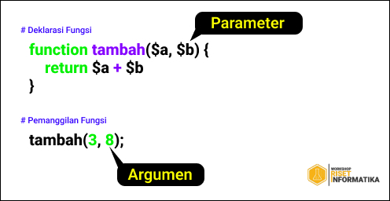

# Function PHP
## Permasalahan
Dalam merancang kode program, kadang kita sering membuat kode yang melakukan tugas yang sama secara berulang-ulang, seperti membaca tabel dari database, menampilkan penjumlahan, dan lain-lain. Tugas yang sama ini akan lebih efektif jika dipisahkan dari program utama, dan dirancang menjadi sebuah 'Function'.

## Penjelasan Function
`Fungsi` atau `Function` dalam bahasa pemograman adalah kode program yang dirancang untuk menyelesaikan sebuah tugas tertentu, dan merupakan bagian dari program utama. Kita dapat membuat fungsi sendiri, atau menggunakan fungsi yang dibuat oleh programmer lain.

### Fungsi Bawaan
Dalam bahasa pemograman PHP terdapat banyak fungsi bawaan dari PHP itu sendiri, berikut beberapa fungsi bawaan dari php dan kegunaannya.
- `isset()` digunakan untuk mengecek apakah suatu variabel sudah ada dan tidak bernilai NULL
- `empty()` digunakan untuk mengecek apakah suatu variabel bernilai kosong atau tidak
- `unset()` digunakan untuk menghilangkan variabel yang telah dibuat sebelumnya
- `ucwords()` digunakan untuk mengubah huruf pertama setiap kata menjadi kapital
- `strtoupper()` digunakan untuk mengubah suatu string menjadi kapital
- `strtolower()` kebalikan fungsi `strtoupper()`
- `sqrt()` digunakan untuk mencari akar pangkat dua dari integer
- `print_r()` digunakan untuk mencetak output ke browser dengan format yang lebih mudah dibaca
- `var_dump()` digunakan untuk mencetak informasi suaty variabel
- `echo` digunakan untuk mencetak variabel (sering digunakan) contoh penggunaan:
```php
<?php
  // deklarasi variabel string
  $var = 'ayang';

  // penggunaan echo
  echo 'udah bisa makan soalnya uda diingetin ' . $var;

  // outputnya :
  // udah bisa makan soalnya uda diingetin ayang

  // titik digunakan untuk menggabung string.


```

selain itu echo juga dapat mengembalikan elemen html, contohnya :

```php
<?php

  echo "<b> Mas Fauzan lagi coding sendirian </b>";
  // outputnya akan menampilkan tulisan diatas dengan penulisan tebal atau bold

```

dalam praktenya, fungsi echo sering digunakan dan penulisannya yang cukup merepotkan kalau banyak,  maka terdapat penulisan ringkas : 

```php
<?php

  // deklarasi variabel
  $nama = 'Nauvan';
  ?>

  <p> Kemarin aku bertemu dengan Mas <?php echo $nama ?> di Isekai </p> 
  // output : Kemarin aku bertemu dengan Mas Nauvan di Isekai

  // penulisan diatas bisa dipersingkat menjadi

  <p> Kemarin aku bertemu dengan Mas <?= $nama ?> di Isekai </p>


```


</br>

### Fungsi Bukan Bawaan
Selain fungsi bawaan dari PHP kita juga dapat membuat fungsi kita sendiri. adapun cara pendeklarasian fungsi dalam bahasa pemograman PHP 

```php

<?php
  // Pendeklarasian fungsi
  function namaFungsi(){
    // kode program fungsi
  }
  
```

Fungsi sendiri secara umum bisa dibedakan menjadi 4 jenis fungsi, yakni `Fungsi tanpa parameter`, `berparameter`, `mengembalikan nilai`, dan `fungsi rekursif`.

**1. Fungsi Tanpa Parameter** </br>
contoh pendeklarasian dan pemanggilan fungsi tanpa parameter :

```php
<?php
  
  // Pendeklarasian Fungsi
  function alamat() {
    echo 'Jl. Soekarno Hatta No. 9 Malang' . "</br>";
    echo 'Kota Malang - Provinsi Jawa Timur - Indonesia' . "</br>";
    echo 'Telp. (0341) 404424-404425' . "</br>";
  }
  
  // Pemanggilan Fungsi
  alamat();
  
  // Menghasilkan Output :
    // Jl. Soekarno Hatta No. 9 Malang
    // Kota Malang - Provinsi Jawa Timur - Indonesia
    // Telp. (0341) 404424-404425
  
  // dapat dipanggil lagi untuk menampilkan output yang sama
  alamat();
  
```
</br>

**2. Fungsi Berparameter** </br>
contoh pendeklarasian dan pemanggilan fungsi Berparameter :

```php
<?php
  
  // Pendeklarasian Fungsi
  function hasilKali($a, $b) {
    echo 'Hasil Kali nya menghasilkan angka ' . ($a * $b);
  }
  
  // Pemanggilan Fungsi
  hasilKali(3,8);
  
  // Menghasilkan Output :
    // Hasil Kali nya menghasilkan angka 24
  
  // dapat dipanggil lagi untuk diisi argumen yang berbeda
  hasilKali(2,10);
  
  // Menghasilkan Output :
    // Hasil Kali nya menghasilkan angka 20
  
```
</br>

contoh lain :

```php
<?php
  
  // Pendeklarasian Fungsi
  function tujuanSurat($jabatan, $ket, $nama) {
    echo 'Kpd. ' . $jabatan . '</br>';
    echo $ket . '. ' . $nama . '</br>';
    echo 'Ditempat. </br>';
  }
  
  // Pemanggilan Fungsi
  tujuanSurat("Lurah Sukorame", "Bpk", "Akhmadeta");
  
  // Menghasilkan Output :
    // Kpd. Lurah Sukorame
    // Bpk. Akhmadeta
    // Ditempat.
  
  // dapat dipanggil lagi untuk diisi argumen yang berbeda
  
  $a = "Kepala SDN 1 Konoha";
  $b = "Ibu";
  $c = "Rindu";
  
  tujuanSurat($a, $b, $c);
  
  // Menghasilkan Output :
    // Kpd. Kepala SDN 1 Konoha
    // Ibu. Rindu
    // Ditempat.
  
```

Adapun perbedaan Argumen dan Parameter dalam fungsi PHP adalah sebagai berikut, </br>


**3. Fungsi Mengembalikan Nilai** </br>
merupakan fungsi yang ditandai dengan sintaks `return` di dalam fungsinya. Contoh fungsi mengembalikan return :

```php
<?php
  // membuat fungsi
  function kelilingSegiTiga($sisi_a, $sisi_b, $sisi_c) {
    $keliling = $sisi_a + $sisi_b + $sisi_c;
    return $keliling;
  }
  
  // penerapan fungsi
  echo "Keliling Segitiga dengan panjang sisi 3, 4, dan 6 adalah " . kelilingSegiTiga(3, 4, 6);
  
  // outputnya :
    // keliling Segitiga dengan panjang sisi 3, 4, dan 6 adalah 13
  
```
</br>

**4. Fungsi Rekursif** </br>
fungsi rekursif singkatnya ialah memanggil fungsi A di dalam fungsi A, atau fungsi yang memanggil dirinya sendiri. contoh dari fungsi rekursif adalah sebagai berikut :

```php
<?php

  // deklarasi fungsi
  function faktorial($number) {
    if ($number < 2) {
      return 1;
    } else {
      // bagian rekursif
      return ($number * faktorial($number-1));
    }
  } 
  
  // pemanggilan fungsi
  echo "faktorial dari 8 ialah " . faktorial(8);
  
```

</br>


## Contoh Pemanggilan Fungsi PHP
Sebagai latihan dan prakter dalam menggunakan fungsi,  Berikut adalah format dasar pemanggilan, dan pengembalian nilai fungsi:
```php
  $varibel_hasil_fungsi = nama_fungsi(argumen1, argumen2, argumen3)
```
Penjelasan :
- `$varibel_hasil_fungsi` adalah variabel yang akan menampung hasil pemrosesan fungsi. Tergantung fungsinya, hasil dari sebuah fungsi bisa berupa angka, string, array, bahkan objek.
- `nama_fungsi` adalah nama dari fungsi yang akan dipanggil
- `argumen1`, `argumen2` adalah nilai inputan fungsi. Banyaknya argumen yang dibutuhkan, tergantung kepada fungsi tersebut. Jika sebuah fungsi membutuhkan argumen 2 buah angka, maka kita harus menginputnya sesuai dengan aturan tersebut, atau jika tidak, PHP akan mengeluarkan error.

Sebagai contoh, PHP menyediakan fungsi akar kuadrat, yakni sqrt(), berikut adalah cara penggunaannya:
```php
  <?php
    $akar_kuadrat = sqrt(49);
    echo "Akar kuadrat dari 49 adalah $akar_kuadrat";
    // Akar kuadrat dari 49 adalah 7
  ?>
```
Dalam contoh diatas, fungsi `sqrt()` akan menghitung akar kuadrat dari nilai argumen yang diinput. Saya menambahkan argumen 49 sebagai inputan.

Nilai hasil dari fungsi `sqrt(49)`, selanjutnya di tampung dalam variabel `$akan_kuadrat`, yang kemudian ditampilkan ke dalam web browser.

Selain ditampung di dalam variabel, kita bisa menampilkan hasil fungsi langsung ke web browser, seperti contoh berikut:
```php
  <?php
    echo "12 pangkat 2 adalah: ".pow(12,2);
    // 12 pangkat 2 adalah: 144
  ?>
```
Fungsi `pow()` adalah fungsi pemangkatan matematika bawaan PHP. Fungsi ini membutuhkan 2 argumen, argumen pertama adalah nilai awal yang ingin dihitung, dan argumen kedua adalah nilai pangkat. `Pow(12,2)` sama dengan 12 kuadrat.

Perlu juga diperhatikan adalah tipe parameter yang dibutuhkan oleh sebuah fungsi. Seperti 2 contoh kita diatas, fungsi `sqrt()` dan `pow()` adalah fungsi matematika. Kedua fungsi ini hanya bisa memproses parameter dengan tipe angka (interger dan float). Jika anda memasukkan parameter jenis string, maka PHP akan mengeluarkan error.