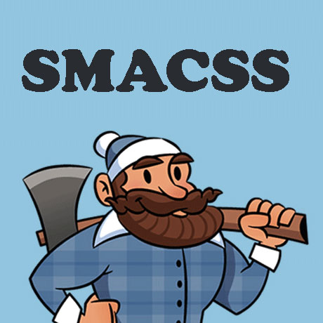

# Pengenalan Metodologi CSS

## Apa itu metodologi ?

**Metodologi** adalah ilmu atau sistem tentang mempelajari sebuah metode.

## Apa itu metodologi CSS ?

**Metodologi CSS**  adalah metode atau tata cara penulisan dalam menulis CSS yang dirancang untuk mengoptimalkan kode CSS agar lebih **efisien** dan **terstruktur** 

Terdapat beberapa contoh **Metodologi CSS**, diantarannya : 

### 1. OOCSS (Object Oriented CSS)

**OOCSS** adalah sebuah metode yang dikembangkan untuk mencakup identifikasi objek CSS, pemisahan struktur dan gaya pada sebuah tampilan. Pada OOCSS perlu adannya sebuah pemisahan antara struktur dan latar belakang yang berfungsi untuk membedakan antara keduannya. 

 **Keungulan**  
 
 * Style/tampilan pada kode yang dapat digunakan kembali dan lokasi kode terlihat lebih fleksibel

 **Pengembang OOCSS -** [https://github.com/stubbornella](https://github.com/stubbornella)

 **Official Website -** [http://oocss.org/](http://oocss.org/)

 **Dasar OOCSS -** [https://toddmotto.com/getting-started-with-object-orientated-css-oocss-creating-a-button-kit/](https://toddmotto.com/getting-started-with-object-orientated-css-oocss-creating-a-button-kit/)

### 2. BEM (Block, Element, Modifier)
Berbeda dengan OOCSS, **BEM** (Block, Element, Modifier) adalah salah satu teknik metode penamaan class CSS pada sebuah sintaks HTML.
 

**Komponen pada BEM**
* **Block**    : Adalah sebuah abstraksi dari sebuah elemen, biasannya berupa `form` yang terdiri dari beberapa elemen seperti `input`, `button` dll 
* **Element**  : Adalah komponen yang membentuk sebuah Block **contoh** : `input`, `button`, `textarea`
* **Modifier** : Adalah sebuah komponen yang berdiri sendiri dan tanpa bergantung pada koponen lain.

 **Keunggulan** 

 * Mudah untuk menggunakan nama Class dalam CSS.
 * Dengan melihat nama dari Class kita dapat menjelaskan apa yang dilakukan oleh komponen tersebut.

 **Official Website -** 
 - [https://en.bem.info/](https://en.bem.info/)

**Referensi BEM CSS**

 - [Mengenal BEM pada CSS](https://mazipanneh.com/blog/2017/04/mengenal-bem-css/)

 - [CSS Architecture BEM by Sitepoint](https://www.sitepoint.com/css-architecture-block-element-modifier-bem/)

- [BEM by CSStricks](https://css-tricks.com/bem-101/)

 **Youtube** 
 - [https://www.youtube.com/watch?v=Ysf0LhP8jus](https://www.youtube.com/watch?v=Ysf0LhP8jus)

### 3. SMACSS (Scalable dan Modular Architecture for CSS)
**SMACSS** adalah sebuah metode dimana nama `class` dan sistem pengarsipan dibuat bedasarkan 5 jenis aturan gaya yaitu `base`, `layout`, `module`, `state` , dan `theme`.

* `base` adalah sebuah style default diarahkan pada tag HTML dasar seperti `
`, `<a:link>`.
* `layout` adalah sebuah style yang digunakan untuk menentukan tata letak laman seperti `<header>`, `<footer>`, dll.
* `module` adalah style khusus untuk modul seperti galeri atau tampilan slide (Slide show).
* `state` adalah dapat diubah seperti disembunyikan ataupun dinonaktifkan.
* `theme` digunakan untuk mengubah skema / tampilan visual halaman (page).

 **Keunggulan**
 
 * Kode terorganisir yang lebih baik.
 * Kode Akan terlihat lebih terstruktur dan lebih tertata.

 **Official Website** 
 - [https://smacss.com/](https://smacss.com/)

**Referensi** 
- [Smacss press by csstricks](https://css-tricks.com/smacss-press/)
- [Smacss oleh Ariona](https://www.ariona.net/mengorganisasi-css-dengan-smacss/)

 Refrensi : 
 - [CSS Writing by Hongkiat](https://www.hongkiat.com/blog/css-writing-methodologies/)