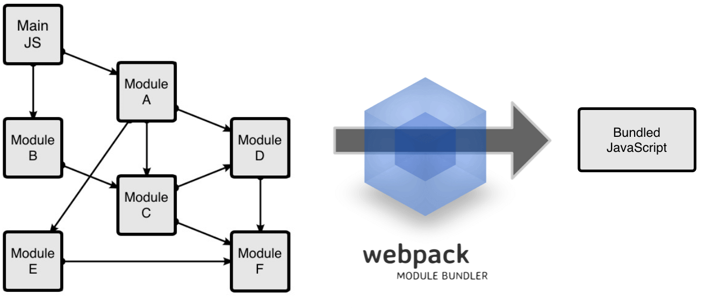

# Module Bundler

## 1. Penjelasan Module Bundler

**Module bundler** membantu kita dalam mengelolah file javascript beserta segala modul yang ada di dalamnya, dan kemudian file - file javascript tersebut akan di paketkan ke dalam sebuah file dengan ukuran yang lebih kecil.

Ilustrasinya seperti berikut :



Seperti yang kita lihat, disana terdapat banyak file javascript yang saling berkaitan satu sama lain, sehingga apabila tidak di bundle maka kita harus mengimport mereka satu per satu kedalam file HTML. Dengan melakukan bundle, maka file - file javascript tersebut akan menjadi satu, dan kita cukup mengimport satu file tersebut kedalam HTML kita.

## 2. Penjelasan Webpack

**Webpack** merupakan salah satu tool yang digunakan untuk melakukan bundling terhadap file - file javascript.

Selain sebagai module bundler, dengan berbagai loader dan plugin yang sudah disediakan untuk webpack, kita bisa menggunakan webpack untuk :

1.  Mengubah ES6 menjadi ES5
2.  Mengubah preprocessor CSS menjadi file CSS
3.  Minify file css dan html

Sehingga selain sebagai module bundler, webpack juga bisa menjadi task runner, tentu saja dengan bantuan loader dan pluginnya. Webpack juga digunakan pada Framework Front-end seperti ReactJS, VueJS, Angular dan sejenisnya.

## 3. Cara Menggunakan Webpack

### 3.1. Membuat file yang akan dibundling

```javascript
// src/index.js
const chart = require("chart.js")
const moment = require("moment")
```

Disini kita akan menggunakan [moment](https://momentjs.com/) dan [chart js](https://www.chartjs.org/) sebagai contoh module yang akan dibundle

### 3.2. Install webpack

```bash
npm install webpack webpack-cli
```

### 3.3. Buat Config File

```javascript
// webpack.config.js

module.exports = {
  entry: "./src/index.js",
  output: {
    path: __dirname + "/dist",
    filename: "bundle.js"
  }
}
```

`entry` menentukan lokasi file javascript yang akan dibundle, file ini merupakan file utama yang mengimport semua module yang dibutuhkan oleh aplikasi, sedangkan `output` menentukan lokasi bundling dan nama file yang akan dibuat

### 3.4. Bundling

Untuk melakukan proses bundling kita tinggal menjalankan perintah berikut pada terminal

```bash
webpack
```

Setelah perintah tersebut dijalankan, maka pada folder `dist` akan dibuat sebuah file bernama `bundle.js` yang sudah berisi dua module yaitu `chart js` dan `moment`, sehingga `bundle.js` sekarang bisa kita import ke file html tanpa perlu mengimport library lain

## 4. Webpack Loader

Secara default webpack hanya bisa melakukan bundling pada javascript, namun dengan bantuan loader kita dapat membundle aset lain seperti css dan image kedalam file javascript

### 4.1. Bundling CSS

Berikut merupakan contoh penerapan salah satu loader webpack yang digunakan untuk memasukkan styling pada file css kedalam javascript

#### 4.1.1. Install Loader

```bash
npm install style-loader css-loader
```

#### 4.1.2. Terapkan Loader ke Config

```javascript
// webpack.config.js

module.exports = {
  entry: "./src/index.js",
  output: {
    path: __dirname + "/dist",
    filename: "bundle.js"
  },
  module: {
    rules: [
      {
        test: /\.css$/,
        use: ["style-loader", "css-loader"]
      }
    ]
  }
}
```

`test` menentukan jenis file apa yang akan kita terapkan loader, sedangkan `use` menentukan loader apa yang akan digunakan untuk file tersebut

#### 4.1.3. Buat File CSS dan Import ke File Javascript (File Entry)

```css
/* src/index.css */
body {
  background-color: black;
}
```

```javascript
// src/index.js
require("index.css")
```

#### 4.1.4. Bundling

Setelah selesai melakukan langkah - langkah diatas maka kita bisa menjalankan perintah berikut pada terminal

```bash
webpack
```

kemudian secara otomatis akan muncul file `bundle.js` yang didalamnya sudah berisi styling dari file css yang kita bundle, kita hanya perlu mengimport `bundle.js` ke html tanpa perlu mengimport file css sebelumnya

## 5. Zero Configuration Webpack

Setelah webpack merilis versi terbarunya yaitu webpack 4, kita tidak perlu lagi membuat file config `webpack.config.js` untuk menggunakan webpack, berikut tutorialnya

https://www.valentinog.com/blog/webpack-tutorial/
