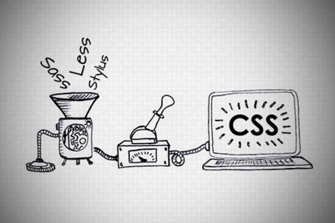

# Pengenalan Preprocessor CSS



## 1. Penjelasan

**Preprocessor CSS** adalah tools yang menyediakan fitur-fitur yang tidak terdapat pada CSS. Fitur-fitur tersebut banyak mengadopsi konsep-konsep pemograman seperti operasi matematika dasar, variabel, perulangan dan fungsi.

Cara kerjanya adalah kita menulis script pada file berekstensi lain, lalu dengan memasukan baris perintah pada terminal atau command prompt, preprocessor akan menerjemahkan sintaks-sintaks tersebut ke dalam bentuk CSS dan menghasilkan file CSS yang siap untuk digunakan.

## 2. Penerapan Preprocessor CSS dengan SASS


**Sass** merupakan kepanjangan dari _Syntactically Awesome Style Sheets_ yang termasuk dalam salah satu tools preprocessor css.

### 2.1. Cara Install

Untuk menginstall sass, kita perlu menginstallnya secara global menggunakan npm

```bash
npm install -g sass
```

### 2.2. Cara Mengcompile SASS menjadi CSS

Seperti yang sudah dijelaskan sebelumnya, sebelum menggunakan file sass pada browser, kita perlu mengcompilenya menjadi css biasa terlebih dahulu

**Mengcompile file sass**

```bash
# Mengcompile index.sass menjadi index.css
sass index.sass
```

**Merubah nama file css setelah dicompile**

```bash
# Mengcompile index.sass menjadi styles.css
sass index.sass:styles.css
```

**Mengcompile semua file sass didalam suatu folder**

```bash
# Mengcompile semua file sass didalam folder namaFolder
sass namaFolder
```

**Mengcompile semua file sass didalam suatu folder dan meletakkan hasilnya di folder lain**

```bash
# Mengcompile semua file sass didalam folder namaFolder dan meletakkan semua file cssnya didalam folder namaFolderTujuan
sass namaFolder:namaFolderTujuan
```

### 2.3. Fitur SASS

Berikut beberapa fitur yang bisa digunakan pada sass

1. Variable
2. Nesting
3. Import
4. Partial
5. Extends
6. Mixins
7. Condition
8. Loop

**Beberapa tutorial Sass:**

- [Situs Resmi SASS](https://sass-lang.com)
- [Sekolah Koding](https://www.youtube.com/playlist?list=PLCZlgfAG0GXBIi8ZDcuN658AzNAzFN0Kv)
- [Petani Kode](https://www.petanikode.com/sass-untuk-pemula)
