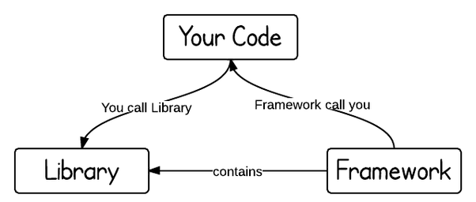

# Pengenalan React JS

## 1. Apa itu React JS

Seperti yang sudah dijelaskan pada website resmi react, react merupakan library javascript untuk membangun sebuah user interface

> A Javascript library for building user interfaces

React dibuat oleh facebook dan menjadi salah satu tool frontend populer karena penggunaan JSX dan konsep component based architecture nya

**Selengkapnya tentang react :**

**Official Website -** https://reactjs.org/

## 2. React Bukan Framework

Banyak yang membandingkan react dengan angular, vue atau framework lain, sedangkan react sendiri bukanlah framework melainkan hanyalah sebuah library

**Apa perbedaan framework dan library ?**

**Framework** dibuat untuk **menyelesaikan banyak masalah**, misalnya kita ambil contoh framework angular, dalam angular terdapat banyak fitur yang dapat menyelesaikan banyak permasalahan seperti :

- rendering UI
- state manager
- routing
- Ajax calling
- dan masih banyak lagi...

framework juga mempengaruhi kita dalam membuat struktur aplikasi, artinya kita tidak bisa seenaknya membuat struktur aplikasi, kita harus mengikuti aturan yang sudah disediakan oleh framework yang kita gunakan.

Sedangkan **library** hanya **fokus untuk memecahkan sebuah masalah**, misalnya react hanya fokus terhadap pembangunan sebuah user interface, sehingga apabila kita ingin membangun fitur routing misalnya, kita bisa menggabungkan react dengan library lain (misalnya react-router)

**Selengkapnya tentang perbedaan framework dan library :**
https://medium.com/datafire-io/libraries-vs-frameworks-626cdde799a7

## 3. Virtual DOM

React menggunakan **virtual DOM** untuk mempercepat proses perubahan node pada **DOM**

**Virtual DOM** merupakan **DOM** yang disalin kedalam bentuk JSON.

Cara kerja dari **Virtual DOM** adalah sebagai berikut :

1.  **Virtual DOM** menyalin semua node yang ada pada **DOM** kedalam bentuk JSON
2.  React mengubah state aplikasi
3.  **Virtual DOM baru** dibuat oleh react berdasarkan **Virtual DOM lama**, namun dengan mengikuti perubahan state (**Virtual DOM lama** tetap ada)
4.  **Virtual DOM lama** dan **Virtual DOM baru** dibandingkan untuk mengetahui letak node yang berubah
5.  Setelah mengetahui node mana yang berubah, maka **Virtual DOM baru** menyalin node yang berubah ke **DOM**

**Untuk lebih memahami cara kerja Virtual DOM, silahkan simak video berikut :**

https://www.youtube.com/watch?v=RquK3TImY9U

## 4. Component Based Architecture

React menggunakan konsep component based architecture yang membuat dia menjadi populer seperti sekarang, namun apa itu component based architecture ?

**Component based architecture** merupakan teknik pembuatan UI yang memecah sebuah halaman besar menjadi beberapa component - component kecil yang memiliki logic sendiri - sendiri, sehingga apabila ada satu component yang error maka kita tidak perlu membuka sebuah halaman besar melainkan hanya perlu fokus kepada satu component kecil itu saja.

Kebalikan dari component based architecture adalah **template based architecture**, arsitektur ini biasa digunakan sebelum component based populer, dimana kita akan memiliki sebuah halaman dengan logic yang ditumpuk pada satu halaman tersebut, kelemahannya yaitu apabila ada sebagian fitur yang error, maka kita perlu membuka keseluruhan halaman untuk menangani error tersebut.

**Selengkapnya tentang component based architecture :**

**Penjelasan component based architecture -** https://medium.com/@dan.shapiro1210/understanding-component-based-architecture-3ff48ec0c238

**Kelebihan component based architecture -**
https://www.tandemseven.com/technology/6-reasons-component-based-ui-development/
