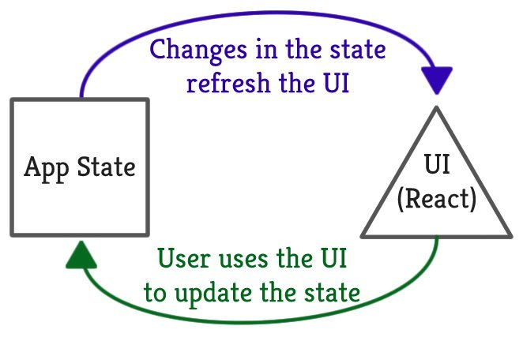

# State

## 1. Penjelasan State

State merupakan data yang dimiliki oleh suatu component yang dapat kita ubah nilainya, untuk lebih jelasnya, silahkan simak penjelasan berikut

## 1. Masalah

Sebelumnya kita sudah mengenal props, props merupakan nilai yang diberikan kepada suatu component ketika component tersebut digunakan. Setelah props diterima, maka component tersebut tidak bisa mengubah nilai yang ada di dalam props.

Namun terkadang suatu component perlu melakukan update pada data yang dimilikinya. Beberapa contoh data yang perlu diupdate yaitu :

1. `textValue` pada component `TextInput`
2. `time` pada component `Timer`
3. `clickCount` pada component `Button`

## 2. Solusi

State merupakan data suatu component yang boleh diubah. Nilai dari state ditentukan sendiri oleh suatu component, berbeda dengan props yang datanya ditentukan oleh component lain.

Setelah nilai dari state diinisialisasi oleh suatu component, maka nilai dari state tersebut bisa diubah - ubah oleh component itu sendiri.

## 3. Hubungan Antara State dan Component



State dan component memiliki keterkaitan satu sama lain, yaitu :

1.  Component akan menginisialisasi nilai dari state yang dimilikinya
2.  User akan mentrigger event untuk mengupdate nilai dari state
3.  Saat nilai dari state berubah, maka component yang memiliki state tersebut akan dirender ulang dengan nilai dari state yang sudah terupdate.

Kesimpulannya adalah, tampilan dari suatu component akan berubah apabila statenya berubah

## 4. Cara Menggunakan State

### 4.1. Membuat State

Sebelum state dapat digunakan, kita perlu membuatnya terlebih dahulu

```Javascript
import React, {Component} from 'react'

export default class MyComponent extends Component {

  // membuat attribute state pada class MyComponent
  state = {
    namaState1: 'nilai state',
    namaState2: 5
  }

  render() {
    return <div>My Component</div>
  }
}
```

### 4.2. Mengakses State

Untuk mengakses nilai suatu state, kita dapat mengaksesnya secara langsung menggunakan `this`

```javascript
this.state.namaState1
this.state.namaState2
```

### 4.3. Mengupdate State

Untuk mengupdate state kita menggunakan method `setState()`

```Javascript
this.setState({
  namaState1: value,
  namaState2: value
})
```

Setelah kita menjalankan `setState()` maka component tersebut akan langsung dirender ulang secara otomatis

## 5. Contoh Penggunaan State

Disini kita akan merubah component `Button` yang sudah pernah kita buat sebelumnya dengan menambahkan state `clickCount` yang akan bertambah setiap kali component `Button` diklik

```javascript
// Button.js

import React, { Component } from 'react'

class Button extends Component {
  // inisiasi state
  state = {
    clickCount: 0
  }

  // update state clickCount
  addClickCount = () => {
    this.setState({
      clickCount: this.state.clickCount + 1
    })
  }

  // tampilkan state clickCount
  render() {
    return (
      <div>
        <p>Jumlah klik : {this.state.clickCount}</p>
        <button onClick={addClickCount}>Klik Saya</button>
      </div>
    )
  }
}

export default Button
```
