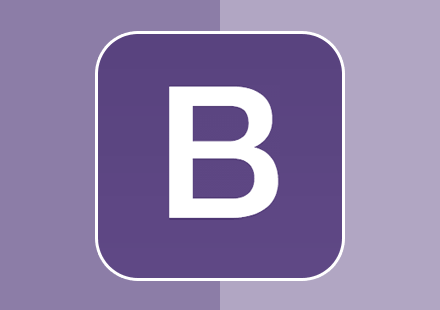

# Pengenalan Framework CSS

###Apa itu Framework?

**Framework** merupakan kerangka kerja yang memudahkan untuk membuat aplikasi atau web. Dengan menggunakan framework, sebuah aplikasi akan tersusun dengan rapi.

###Apa itu CSS?

**CSS** (Cascading Stylesheet) merupakan aturan yang digunakan untuk mengatur komponen - komponen web sehingga lebih terstruktur dan seragam. 

###Pernah mendengar istilah framework CSS?

**Framework CSS** sendiri tak lepas kaitannya dengan tampilan website. **Framework CSS** merupakan sebuah kerangka kerja yang digunakan untuk mempermudah dalam membuat tampilan website.

Terdapat berbagai macam **Framework CSS**, diantaranya :

- ###**Bootstrap**

  

  **Bootstrap** dianggap sebagai framework CSS responsive terbaik. **Bootstrap** dirancang untuk pengembangan front-end secara khusus untuk membantu membangun konsep desain web, proyek seluler pertama, sistem grid, tipografi, tombol dan sebagainya.

  Fitur **Bootstrap** sudah terbilang lengkap. CSS Framework ini sudah dilengkapi dengan fitur seperti UI, grid system, responsiveness, dropdown menu, dan lain sebagainya. 

  

  **Terdapat beberapa komponen yang dapat digunakan dalam bootstrap :**

  **1. Button**

  `<button type="button" class="btn btn-success">Success</button>`

  Hasil :

  

  

  **2. Navigation**

  Right-aligned menggunakan `.justify-content-end`

  

  **3. dan masih banyak lagi**

  

  **Untuk mempelajarinya lebih lanjut, klik link berikut :**

  [https://getbootstrap.com/](https://getbootstrap.com/)

  [https://www.w3schools.com/bootstrap4/](https://www.w3schools.com/bootstrap4/)

  

- ###**Bulma**

  

  **Bulma** merupakan free dan open source framework. **Bulma** sangat mudah dipelajari dan digunakan. 

  **Kelebihannya :**

  Pertama, Bulma berisi **komponen UI yang hebat**, seperti tab, bilah navigasi, kotak, panel, dan banyak lagi karena kerangka ini dirancang untuk memberi Anda UI yang jelas dan menarik.

  Kedua, Bulma sangat **modular** artinya Anda hanya dapat mengimpor fitur-fitur yang dibutuhkan dan Anda dapat memulai pekerjaan Anda.

  Ketiga, framework ini memiliki **kelas yang sangat mudah dibaca**.

  Keempat, framework ini **modern** karena built with flexbox.

  

  **Terdapat beberapa komponen yang dapat digunakan dalam bulma :**

  **1. Card**

  - `card` : kontainer utama.
    - `card-header` : horizontal bar dengan bayangan (shadow).
    - `card-image` : fullwitdth container untuk gambar responsive.
    - `card-content` : multi-purpose container untuk beberapa elemen lainnya. 

  **2. Dropdown**

  - `dropdown` : kontainer utama.
    - `dropdown-trigger` : kontainer untuk button.
    - `dropdown-menu` : untuk toggable menu.

  **3. dan masih banyak lagi**

  

  **Untuk mempelajarinya lebih lanjut, klik link berikut :**

  [https://bulma.io/](https://bulma.io/)

  [https://github.com/jgthms/bulma](https://github.com/jgthms/bulma)

- ###**Semantic UI**

  

  Seperti pada namanya, **semantic UI** adalah framework yang bertujuan untuk membuat proses pembuatan situs web lebih cantik dan menarik. Fitur utamanya adalah memanfaatkan prinsip-prinsip bahasa alami hingga membuat **kode lebih mudah dibaca dan dipahami**.

  **Kelebihan :**

  pertama, **Debugging Sederhana** dengan pencatatan kinerja yang memungkinkan melacak error tanpa menggali melalui jejak tumpukan.

  kedua, **HTML ringkas** . Semantic UI memperlakukan kata dan kelas sebagai konsep yang dapat dipertukarkan. Kelas menggunakan sintaks dari bahasa alami seperti hubungan nomina / pengubah, susunan kata, dan kemajemukan untuk menghubungkan konsep secara intuitif.

  

  **Terdapat beberapa komponen yang dapat digunakan dalam semantic :**

  **1. Input**

  - `
...
` : untuk efek fokus pada input.
  - `
 ...
` : untuk efek loading pada sebelah kanan input.
  - `
...
` : untuk warning color pada input.

  **2. Button**

  - `
 ...
` : untuk animasi biasa pada button.
  - `
 ...
` : untuk animasi tampil arah vertikal.

  **3. dan masih banyak lagi**

​	**Untuk mempelajarinya lebih lanjut, klik link berikut :**

​	[https://semantic-ui.com/](https://semantic-ui.com/)

- ### **Materialize**

  

  **Materialize** adalah bahasa desain yang dirancang dan dibuat oleh **google** . **Materialize** menggabungkan prinsip-prinsip klasik dari desain yang sukses bersama dengan inovasi dan teknologi. Tujuan Google adalah mengembangkan sistem desain yang memungkinkan pengalaman pengguna terpadu di semua produk mereka di platform apa pun.

  

  **Terdapat beberapa komponen yang dapat digunakan dalam materialize :**

  **1. Button**

  - Membuat button add : 

    ` <a class="btn-floating btn-large waves-effect waves-light red">`

    `<i class="material-icons">add</i>`

    `</a>` 

  - Membuat button kirim :

    `<button class="btn waves-effect waves-light" type="submit" name="action">`

    `Submit`

    `<i class="material-icons right">send</i>`

    `</button>`

  **2. Card**

  - Menambahkan tab ke kartu dengan menambahkan `
` 

  **3. Dan masih banyak lagi**

  

  **Untuk mempelajarinya lebih lanjut, klik link berikut :**

​	[https://materializecss.com/](https://materializecss.com/)

​	[https://github.com/Dogfalo/materialize](https://github.com/Dogfalo/materialize)

- ### **Material Design Lite**

  

  Apabila kamu menggunakan *smartphone* dengan sistem operasi Android versi 5.1 Lollipop, mungkin sudah tidak asing lagi dengan **material desain**, bahasa desain baru buatan **Google** yang diperkenalkan semenjak tahun 2014 lalu. **Material Design Lite** memungkinkan Anda menambahkan tampilan dan nuansa Desain Material ke situs web Anda. Komponen tersebut terdiri dari seperangkat kode CSS, HTML, dan JavaScript. Serupa dengan *framework* lain, MDL memiliki sejumlah komponen yang siap digunakan. Aturan penggunaan MDL sangat sederhana, pertama kamu harus memulai dengan *tag* HTML, kemudian diikuti dengan komponen-komponen MDL di dalam *tag* tersebut. 

  

  **Terdapat beberapa komponen yang dapat digunakan dalam material design lite :**

  **1. Card**

  - `mdl-card`
  - `mdl-card--border`
  - `mdl-card__media`
  - `mdl-card__menu`

  **2. Tables**

  - `mdl-data-table`
  - `mdl-js-data-table`

  **3. Button**

  - `mdl-button`
  - `mdl-js-button`
  - `mdl-button--icon`

  **4. Dan masih banyak lagi**

  

  **Untuk mempelajarinya lebih lanjut, klik link berikut :**

  [https://getmdl.io/](https://getmdl.io/)

  [making material design](https://www.youtube.com/watch?v=rrT6v5sOwJg)

  [https://github.com/google/material-design-lite](https://github.com/google/material-design-lite)

  